# World Models Study Notes

**🌐 Language**: [中文](World-Model-学习笔记.md) · **English**

> Compiled from study discussions in April–May 2026, organized by the logic: "What it is → Why it matters → Schools comparison → How to get started"
>
> 💡 Each chapter uses collapsible blocks; click ▶ on the title to expand/collapse.

---

## Table of Contents

- [I. What Is a World Model](#i-what-is-a-world-model)
- [II. Why Are World Models Popular? What Is Their Practical Value?](#ii-why-are-world-models-popular-what-is-their-practical-value)
- [III. In-Depth Comparison of the Three Schools](#iii-in-depth-comparison-of-the-three-schools)
- [IV. Essential Papers](#iv-essential-papers)
- [V. Reference Materials](#v-reference-materials)

---

## I. What Is a World Model

<details>
<summary><b>Expand / Collapse</b></summary>

World Model is a prominent research direction in AI agent systems. Its central idea is to enable a model to **predict future states of the environment**, thereby supporting planning, decision-making, and imagination-based reasoning.

The field currently consists of three major schools (see [§3](#iii-in-depth-comparison-of-the-three-schools)):

| School | Representatives | Prediction Target |
|------|------|---------|
| **Generative / Video School** | Sora, Genie, GAIA | Pixels / video frames |
| **Latent Dynamics (RL School)** | Dreamer v1/v2/v3, PlaNet | latent state (with pixel reconstruction) |
| **JEPA (Predictive Representation School)** | I-JEPA, V-JEPA, V-JEPA 2 | Abstract embedding (without reconstruction) |

The relevant school should be identified first, because the learning paths differ substantially.

</details>

---

## II. Why Are World Models Popular? What Is Their Practical Value?

<details>
<summary><b>2.1 Why They Suddenly Became Popular</b></summary>

**1. LLMs have encountered bottlenecks and need a new narrative**
Pure language models perform poorly on physical reasoning, long-horizon planning, and embodied tasks. The industry consensus is that **predicting the next token from text alone does not yield genuine physical common sense**. LeCun has strongly argued that "LLMs are a dead end," and JEPA / World Model has become a flagship alternative route.

**2. Sora became a breakout example (early 2024)**
OpenAI positioned Sora as a "world simulator" rather than merely a video generator, which immediately pushed the concept into the mainstream. Capital markets and media attention followed rapidly.

**3. Embodied intelligence / robotics / autonomous driving accelerated**
Tesla FSD, Wayve, 1X, Figure, and Physical Intelligence all require one capability: **large-scale, low-cost simulation of the real world before deployment**. Collecting real-machine data is too expensive and too slow; world model is the only scalable solution.

**4. Technical conditions matured**
- Diffusion + Transformer brought video generation quality beyond a usable threshold
- Dreamer v3 first demonstrated that **one set of hyperparameters** can solve 150+ tasks, including Minecraft diamond collection (pure model-based, the first in the world)
- Compute and data scale became available

**5. Scaling Law needs a new battlefield**
Text data is approaching exhaustion, whereas video and interaction data are the next gold mine. world model is a natural architecture for absorbing such data.

</details>

<details>
<summary><b>2.2 Practical Value (Ordered by Deployment Maturity)</b></summary>

#### ✅ Already Commercially Valuable / Clearly Useful

**1. Autonomous-driving simulation**
- [Wayve GAIA-1](https://wayve.ai/thinking/scaling-gaia-1/) / [GAIA-2](https://wayve.ai/thinking/gaia-2/), [NVIDIA Cosmos](https://www.nvidia.com/en-us/ai/cosmos/), Tesla internal models
- Value: generating massive numbers of corner cases (heavy rain, suddenly emerging pedestrians), **reducing per-mile testing cost from several dollars to a few cents**
- Addresses the fundamental difficulty of collecting **long-tail data** in real road testing

**2. Model-based RL (robot control)**
- The [Dreamer family](https://danijar.com/project/dreamerv3/) has already enabled real robots to **learn new skills from only a few hours of real-machine data** (where traditional model-free methods require days)
- Google DeepMind, [1X](https://www.1x.tech/discover/1x-world-model), and [Physical Intelligence](https://www.physicalintelligence.company/) are all using related approaches
- Value: **1–2 orders of magnitude improvement in sample efficiency**, making real-machine training feasible

**3. Games / content generation**
- [Genie 2](https://deepmind.google/discover/blog/genie-2-a-large-scale-foundation-world-model/), [Oasis](https://oasis-model.github.io/) (real-time Minecraft generation), [DIAMOND](https://github.com/eloialonso/diamond)
- Value: interactive worlds can be generated **without a game engine**, potentially transforming game-development workflows in the long run

#### 🟡 Promising but Not Yet Scaled

**4. Agent planning / reasoning**
- Give an LLM agent a world model so that it can trial-and-error "in its head" before acting
- This is analogous to human "imagination" and is one of the key pieces toward AGI

**5. Scientific simulation**
- Fluids, weather, materials, and protein dynamics
- [GraphCast](https://deepmind.google/discover/blog/graphcast-ai-model-for-faster-and-more-accurate-global-weather-forecasting/) and [AlphaFold](https://alphafold.ebi.ac.uk/) can be viewed, in a sense, as domain-specific world model systems
- Value: 1000–10000× faster than traditional numerical simulation

**6. Video generation / film and media**
- [Sora](https://openai.com/sora/), [Kling](https://kling.kuaishou.com/), [Runway](https://runwayml.com/)
- Value: content-productivity tools, although "physical realism" remains below the required standard

#### 🔴 Still Speculative

- A general physical-reasoning engine
- A true "mind simulator" for general Agent systems
- Real-time edge-side world models

</details>

<details>
<summary><b>2.3 A Sober View: Real Limitations</b></summary>

1. **Evaluation is extremely difficult** — What does it mean for a model to "model the world well"? There is no accepted metric, and self-deception is easy.
2. **Long-horizon instability** — Current models begin to drift and violate physics after generating for tens of seconds.
3. **Compute is expensive** — Training a competent video world model costs more than training an LLM.
4. **LeCun's JEPA route has not yet been proven to scale** — It remains largely at the vision stage.
5. **The term "World Model" is susceptible to overuse** — Many companies repackage ordinary video generation as world model to inflate valuation narratives.

</details>

<details>
<summary><b>2.4 TL;DR</b></summary>

> **The short-term value lies in simulation-based training for robotics and autonomous driving (already monetized); the long-term value is that it may become the next-generation AI infrastructure after LLMs — enabling models to truly "understand" rather than merely "memorize" the world.**

</details>

---

## III. In-Depth Comparison of the Three Schools

<details>
<summary><b>3.1 Overview of the Three World Model Schools</b></summary>

| School | Representatives | Prediction Target | Goal |
|------|------|---------|------|
| **Generative World Model** | Sora, Genie, GAIA, DIAMOND | **Pixels / video frames** | Generate a visualizable future |
| **Latent Dynamics (RL School)** | Dreamer v1/v2/v3, PlaNet | **latent state** (still with reconstruction loss) | Serve model-based RL planning |
| **JEPA (Predictive Representation)** | I-JEPA, V-JEPA, V-JEPA 2 | **Abstract embedding**, without pixel reconstruction | Learn structured representations of the world |

</details>

<details>
<summary><b>3.2 Core Claims of JEPA</b></summary>

JEPA is LeCun's strongly advocated **third route**, forming its own school: "Predictive Embedding" representation learning.

LeCun's view is explicit:

> **"Do not predict pixels; predict representations."**

**Rationale**:
- Pixel-level prediction wastes compute on irrelevant details (cloud shapes, leaf motion)
- The world is intrinsically not fully predictable; forcing reconstruction leads to learning noise
- The human brain is not "rendering 4K video internally"; it predicts at an abstract level

**Method**:
- Use an encoder to map observations to latent
- Use a predictor to predict the embedding of masked or future parts in **latent space**
- Use **stop-gradient + EMA target encoder** to prevent collapse (similar to BYOL / DINO)
- **No decoder and no pixel reconstruction**

</details>

<details>
<summary><b>3.3 Key Differences Between JEPA and Dreamer (Easy to Confuse)</b></summary>

Both predict in latent space, but:

| | Dreamer | JEPA |
|---|---------|------|
| Pixel reconstruction? | **Yes** (reconstruction loss is a core supervision signal) | **No** (pure embedding prediction) |
| Training signal | Reconstruction + reward + KL | Embedding distance + collapse prevention |
| Objective | model-based RL, using the world model for rollout planning | **Self-supervised representation learning**, followed by downstream tasks |
| Can it "imagine" images? | Yes (has a decoder) | **No** (intentionally) |

Strictly speaking, therefore, **Dreamer is "latent but still generative," whereas JEPA is truly "non-generative."**

</details>

<details>
<summary><b>3.4 Current Status of JEPA (2024–2026)</b></summary>

**Progress**
- I-JEPA (images, 2023), V-JEPA (video, 2024), and **V-JEPA 2 (late 2024)** — solid performance on action prediction and physical-understanding benchmarks
- Meta has invested heavily; this is LeCun's flagship project

**Concerns**
- It has not yet produced a **striking demo** at the level of Sora / Dreamer (because there is no decoder, the demo is less intuitive)
- Whether it scales remains unresolved
- Most of the community is still competing along the generative route

**In one sentence**:

> **JEPA is LeCun's "anti-Sora" bet: model the world using abstract representations rather than pixels. The theory is elegant, but engineering evidence remains insufficient. At present, it has high academic visibility and limited industrial deployment.**

</details>

---

## IV. Essential Papers

<details>
<summary><b>4.0 Background Concept: Model-Free vs Model-Based RL</b></summary>

Understanding the World Model requires first situating it within the RL family.

### What Is "the Environment"

The environment is a **"black box" that turns actions into next states and rewards**. Mathematically it is defined by two functions:

```
state transition:  P(s_{t+1} | s_t, a_t)    "what happens after taking this action"
reward function:   R(s_t, a_t)               "how many points this action earns"
```

### Two Learning Paradigms

**🔴 Model-Free — does not learn the environment**

The agent treats the environment as a **pure black box**: it can try actions and receive feedback, but **does not predict** "what happens if I do X" — it only learns "**which action yields the highest score in this state**".

- Analogy: playing Mario for the first time, failing 1000 times, memorizing 1000 "winning patterns" — but never studying jump physics
- What DQN does: image → Q-values for 18 actions → argmax. **Never predicts the next frame.**

**🟢 Model-Based / World Model — learns the environment**

The agent actively learns a **copy of the environment** (a world model) and then mentally simulates with it.

- Analogy: learning "press A → jump 4 squares", "touch goomba → die" — these rules let one simulate ahead
- What Dreamer does: train RSSM to predict next latent + reward, then "dream" inside the virtual env to train an actor-critic

### Key Clarification: Model ≠ Policy ≠ Value

Three easily confused terms:

| Concept | What it learns | Who has it |
|---------|---------------|------------|
| **Environment model** | `P(s' ∣ s,a)` and `R(s,a)` — **physical laws** | model-based only |
| **Value function** | `V(s)` or `Q(s,a)` — **how good a state is** | both can have it |
| **Policy** | `π(a ∣ s)` — **what action to take in a state** | both can have it |

→ **Model-free learns "what to do" (policy/value) but not "how the world works" (model)**
→ **Model-based learns "how the world works" (model), then derives "what to do"**

### Overall Comparison

| Dimension | Model-Free | Model-Based |
|-----------|-----------|-------------|
| Learns env model? | ❌ | ✅ |
| Sample efficiency | **Low** (massive interaction) | **High** ("dream training" possible) |
| Compute-for-performance at inference | ❌ Fixed | ✅ Linearly scalable |
| Cross-task transfer | ❌ Almost none | ✅ Mostly preserved |
| Engineering complexity | Relatively simple | Complex (must train world model) |
| Training stability | Relatively stable | Vulnerable to model errors (model exploitation) |
| Representative algorithms | DQN, PPO, SAC | World Models, Dreamer, MuZero |

### Family Tree of Model-Free Algorithms

```
┌─ Value-based ─────────────────────────┐
│  Q-learning → DQN → Rainbow → R2D2    │
└───────────────────────────────────────┘

┌─ Policy-based ────────────────────────┐
│  REINFORCE → TRPO → PPO ⭐ most used  │
└───────────────────────────────────────┘

┌─ Actor-Critic ────────────────────────┐
│  A3C → DDPG → TD3 → SAC ⭐ cont. ctrl │
└───────────────────────────────────────┘
```

### 🚀 The True Value of Model-Based: It's Not "Saving Data", It's "Learning Laws"

Many people focus on a single Model-Based advantage — sample efficiency — **but this is only the surface**.

**Fundamental difference**:
- Model-Free learns "**what to do in this task**" (task answer)
- Model-Based learns "**how the world works**" (physical laws)

This single fundamental difference yields **three independent external manifestations**:

```
        Model-Based learns world laws
                  │
        ┌─────────┼─────────┐
        ▼         ▼         ▼
  ① Sample efficiency  ② Test-time compute scaling  ③ Cross-task transfer
       100–1000×              No ceiling              Mostly preserved
```

Each is detailed below.

---

#### Advantage ①: 100–1000× More Sample-Efficient

| Task | Model-Free | Model-Based | Speedup |
|------|-----------|-------------|---------|
| Atari Breakout | DQN/Rainbow **200 M frames** | DreamerV3 **20 M frames** | 10× |
| Atari 100k | Rainbow very poor | EfficientZero near-human | huge |
| Crafter | PPO tens of millions of steps, ~10 score | DreamerV3 **1 M steps**, ~14 SOTA | 30×+ |
| Real-robot grasping | PPO months of real data | Dreamer-like **hours** | 1000× |

**Why so efficient?** Compound effect of five fundamental mechanisms:

| # | Mechanism | One-line explanation |
|:---:|-----------|---------------------|
| **1** | **Laws vs data points** | Network weights store "physical laws" (extrapolatable), not "state values" (only interpolatable) |
| **2** | **Dream data augmentation** | 1 real experience → train world model → roll out hundreds of virtual experiences in dreams → policy training signal amplified hundreds of times |
| **3** | **Free-start exploration** | Real environment can only reset to initial state; dreams can reset to any latent state (zero-cost trial-and-error) |
| **4** | **Analytic gradient backprop** ⭐ | The entire imagination chain is differentiable; gradients propagate exactly (O(1) samples) vs Monte-Carlo estimates with high variance (O(N) samples) |
| **5** | **Long-horizon rollout** | A 15-step latent rollout on GPU takes 1.5 ms — substituting for 1000 real-environment steps |

💡 **Intuitive analogy — learning to drive**:
- 🔴 Model-Free: want to learn snow driving? **Wait for snow**; want to learn rollover recovery? **Roll over for real**
- 🟢 Model-Based: **drive 100 hours to learn steering/braking/friction laws**, then **mentally rehearse 10,000 corner cases**

→ Engineering details of each mechanism are further unpacked in [§4.3 Dreamer](#43-dreamer-v1--v2--v3-2020–2023).

---

#### Advantage ②: Test-Time Compute Scaling ⭐ Most Underrated

**Model-Free** compute allocation:
```
Training: massive compute to train Q / policy network
Inference: one forward pass → output action (milliseconds)
```
→ Inference compute is **fixed**: whether given 1 second or 1 minute, **the action is the same**. Performance is capped.

**Model-Based** compute allocation:
```
Training: train world model
Inference: roll out with world model
  - Given 1 second  → CEM runs 10 iterations, picks a decent action
  - Given 1 minute  → CEM runs 600 iterations, picks a better action
  - Given 1 hour    → almost finds the optimum
```
→ **More inference compute directly translates to better performance** (as long as the world model is accurate enough).

##### Classic Case: AlphaGo

The core insight from Silver 2017 (the reference cited in PlaNet's paragraph 2):
- Once the network is trained, **the number of MCTS rollouts at inference time determines playing strength**
- 1 second → amateur strong
- 1 minute → professional player
- 1 hour → beyond human world champion

##### Modern Significance: o1 / o3 and "the new compute scaling curve"

In 2024–2025 this idea exploded into the LLM world:

| Trend | Manifestation |
|-------|---------------|
| **OpenAI o1 / o3** | Longer chain-of-thought at inference → continuously rising performance |
| **Q\* / MCTS + LLM** | Bring search into LLM inference |
| **Test-time compute scaling** | Has become a keyword for the 2025+ AGI roadmap |

→ Training-time scaling (GPT-3/4) has limits; **inference-time scaling is the next growth curve** — and it **necessarily requires some form of world model + search**.

→ The Model-Based paradigm **natively supports "compute → performance"**; Model-Free cannot.

---

#### Advantage ③: Cross-Task Transferability

**Why can't Model-Free transfer?**

Model-Free learns `Q(s, a)` or `π(a|s)` — the Q function is **tightly coupled to the reward**. Change the task or reward function, and Q becomes useless: **train from scratch**.

**Why can Model-Based transfer?**

Model-Based learns `P(s' | s, a)` — **the transition function only concerns physical laws and is independent of rewards**. Switch tasks, and **the transition function still holds**.

##### Concrete Examples

| New task | Model-Free | Model-Based |
|----------|-----------|-------------|
| "Grasp a cup" → "fold clothes" | **Retrain Q from scratch** | **World model unchanged**; only retrain the reward head |
| "Walk flat" → "climb stairs" | **Retrain Q from scratch** | **World model unchanged** (leg physics identical) |
| Change reward shape (sparse → dense) | **Retrain Q** | **Zero modification** |

##### Modern Significance: Robot Foundation Models + LLM Agents

This property is being realized in 2024–2026:

| Direction | Manifestation |
|-----------|---------------|
| **Robot foundation models** (Octo / OpenVLA / RT-X) | Train one universal dynamics → deploy to many tasks |
| **LLM Agent** | LLMs are a kind of semantic-level world model; one model handles coding/reasoning/planning |
| **LeCun's JEPA roadmap** | Core thesis: "learn world laws → transfer across tasks" |

---

#### These Three Are Fundamentally One Thing

Back to the fundamental difference:

```
                 Model-Based learns "world laws"
                          │
              Not "task answers" — physics / transitions
                          │
        ┌─────────────────┼─────────────────┐
        ▼                 ▼                 ▼
   ① Sample-efficient    ② Inference scaling   ③ Cross-task transfer
   One experience yields  Laws roll out         Laws hold for any task
   more supervision       arbitrarily; more
   signals                compute = better
```

**Core insight**: **the three advantages are not three independent things — they are three manifestations of the single fundamental difference: "learning world laws vs learning task strategies"**. Once you see this, you see why World Model is a critical route to AGI (rather than merely "a sample-efficiency trick").

---

### Costs (No Free Lunch)

| Dimension | Model-Free | Model-Based |
|-----------|-----------|-------------|
| ✅ Strengths | Simple, stable, low engineering bar | Three advantages above |
| ❌ Costs | Sample-hungry, fixed inference compute, non-transferable | GPU compute ↑, engineering complex, vulnerable to model errors (model exploitation) |

→ Model-Based **saves real data, spends GPU compute + engineering complexity**.

### Current Consensus

- **Data is cheap** (simulators, games, LLM RLHF) → model-free remains mainstream
- **Data is expensive / planning needed / imagination needed** (real robots, autonomous driving, agents) → world model is the future
- **AGI roadmap**: nearly everyone (Sutton, LeCun, Hassabis) agrees that general intelligence **must include a world model**

### 🎯 One-Sentence Summary

> **Model-Free RL learns "what to do in this task"; Model-Based learns "how the world works". This single fundamental difference yields three root advantages: ① 100–1000× sample efficiency, ② test-time compute scaling, ③ cross-task transfer — all three are manifestations of one and the same thing. Simple and stable Model-Free remains dominant where data is cheap, but Model-Based / World Model is the necessary path for robotics, autonomous driving, and AGI.**

</details>

<details>
<summary><b>4.1 World Models (Ha & Schmidhuber, 2018)</b></summary>

> **Paper**: [arxiv.org/abs/1803.10122](https://arxiv.org/abs/1803.10122) · **Interactive site** (highly recommended): <https://worldmodels.github.io/>
>
> **TL;DR**: The classic starting point — VAE + MDN-RNN + a tiny controller. First clear demonstration that an agent can be trained inside its own dream and transferred back to the real environment.

This paper is the **starting point and intellectual totem** of modern World Model research. Its influence does not come from overwhelming performance, but from the first clear demonstration that **an Agent can learn to play games inside its own "dream."**

<p align="center">
  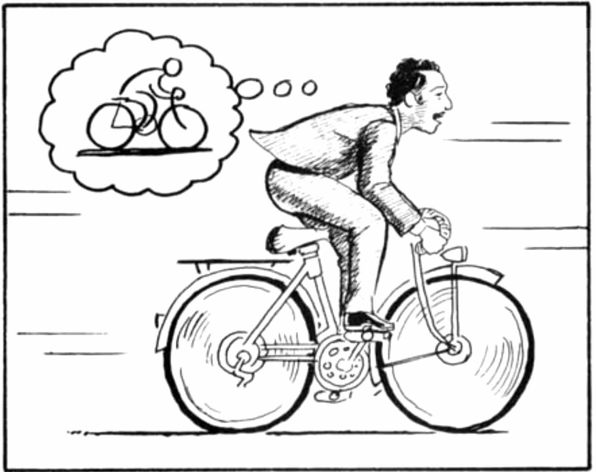<br/>
  <i>Opening example: the "mental model" from Scott McCloud's Understanding Comics</i>
</p>

### 📖 Core Ideas

#### Decomposing the Agent into Three Parts

<p align="center">
  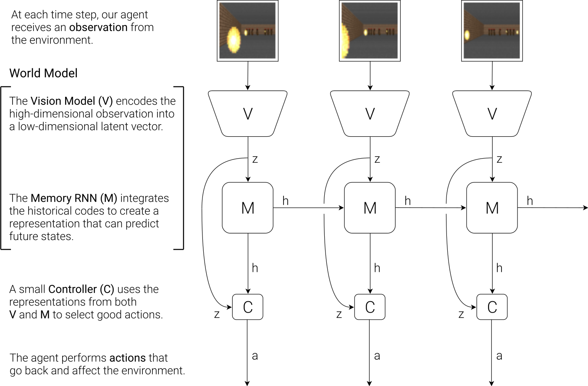<br/>
  <i>Overall architecture: V (Vision) → M (Memory) → C (Controller)</i>
</p>

```
   Observation ─►  V (Vision)  ─►  M (Memory)  ─►  C (Controller)  ─►  Action
                  compresses the present   predicts the future   decides (very small)
```

| Module | Role | Implementation | Parameter Count |
|------|------|------|--------|
| **V** — Vision | Compress high-dimensional images into low-dimensional representations | **VAE** (variational autoencoder) | ~4M |
| **M** — Memory | Learn temporal dynamics of the world and predict the next latent | **MDN-RNN** (mixture density network + LSTM) | ~400K |
| **C** — Controller | Choose actions based on information from V and M | **Single-layer linear network** | ~1K |

<p align="center">
  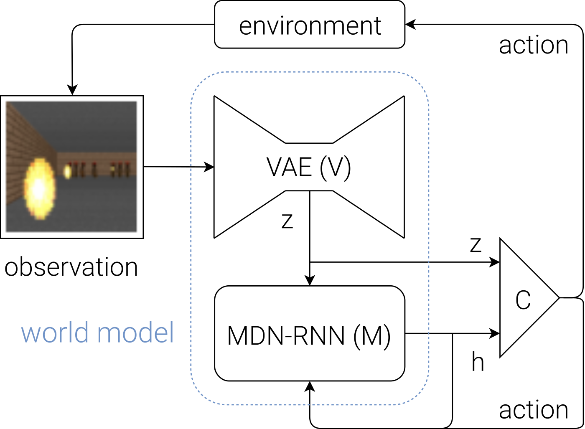<br/>
  <i>Internal Agent data flow: observation → z → action; h loops inside M</i>
</p>

🔑 **Key insight**: make "perception" and "memory" large models, and make "decision-making" **extremely small**. The decision-maker is small enough to be optimized by an **evolutionary algorithm (CMA-ES)** rather than backpropagation.

#### Module Breakdown

**V: VAE Compresses Vision**

<p align="center">
  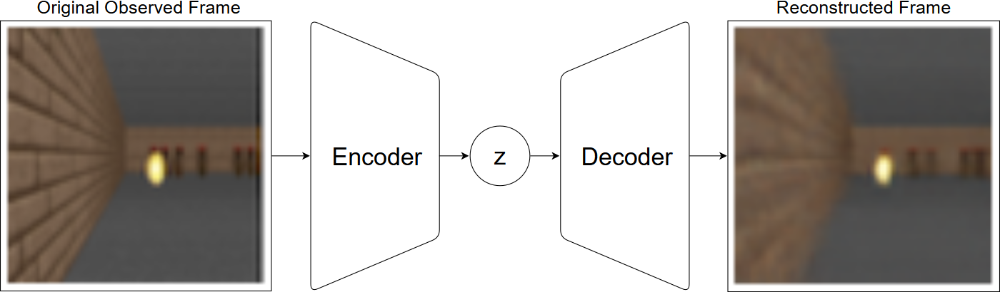<br/>
  <i>VAE pipeline: image → encoder → latent z → decoder → reconstructed image</i>
</p>

- Input 64×64×3 game frames → output **32-dimensional latent `z`**
- Frames are collected with a random policy, followed by self-supervised training (standard VAE: reconstruction + KL)

**M: MDN-RNN Learns Dynamics**

<p align="center">
  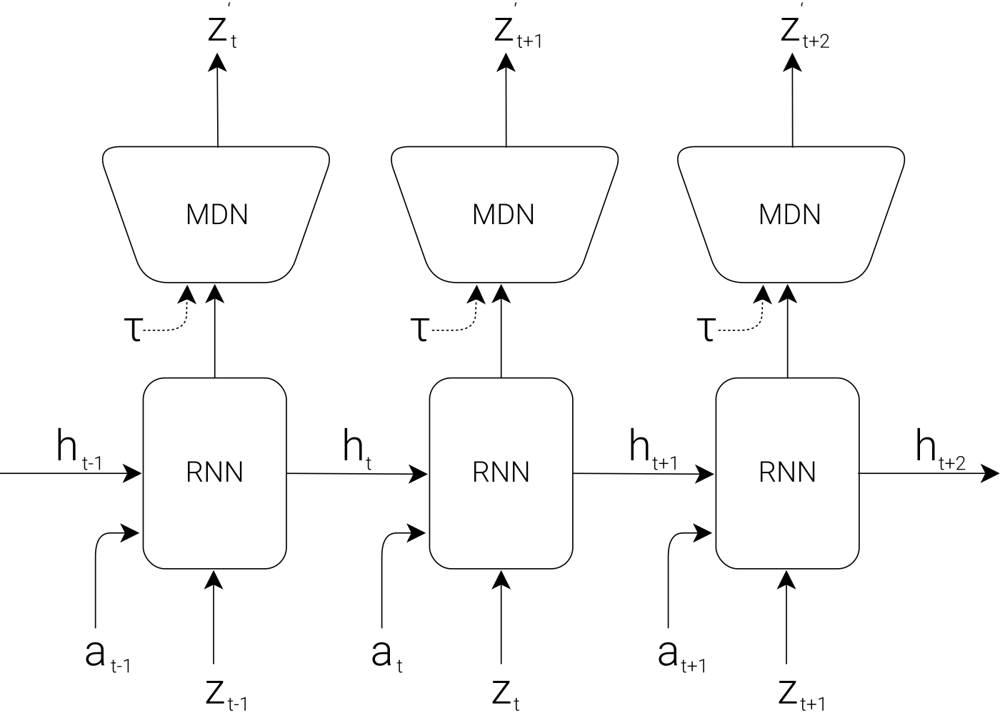<br/>
  <i>MDN-RNN: LSTM outputs parameters of a Gaussian mixture distribution, and sampling yields the next z</i>
</p>

**One forward pass of M**:
```
Input:  (z_t, a_t, h_t)        ← current latent + action + previous LSTM hidden state
Output:
  ① (π, μ, σ)                 ← Gaussian-mixture parameters of z_{t+1} (MDN component)
                                 after sampling, the next-frame latent is obtained: z_{t+1} ~ Σ π_k · N(μ_k, σ_k²)
  ② h_{t+1}                   ← new LSTM hidden state (used at the next step)
  ③ done_logit                ← probability of termination (after sigmoid)
```

- Why a distribution? The real world is not fully predictable; **MDN (Gaussian mixture)** captures multimodal uncertainty
- **Temperature τ** controls sampling randomness: higher τ makes the dream more chaotic; lower τ makes it more deterministic
- The same MDN-RNN idea is also used in SketchRNN (predicting the next pen stroke):

  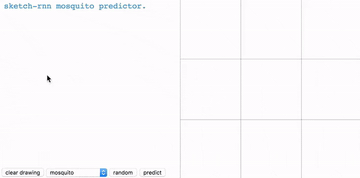

> 💡 **Clarification on z vs h**: In World Models, **z and h are in a "principal-subordinate" relationship, not equal partners** — z is the output of a separately pre-trained VAE (learning only visual reconstruction), and h is just an internal "working memory" of the MDN-RNN that helps predict the next z. The Controller can take either z alone or `[z, h]` (the paper's ablation shows `[z, h]` improves CarRacing score by 40%). This is **a different design philosophy** from PlaNet's later **RSSM dual-path state** (joint training, where z learns both visual and dynamic information, and (h, z) jointly form a unified environment state) — see the comparison table in §4.2.

**C: Ultra-Small Controller**
```python
a_t = W_c · [z_t, h_t] + b_c    # just one linear layer
```
- **CMA-ES** is used for black-box optimization of a few hundred parameters; no backpropagation is required
- Philosophical implication: **complex cognition can be delegated to the world model, while decision-making itself can be simple** (as in human driving)

<p align="center">
  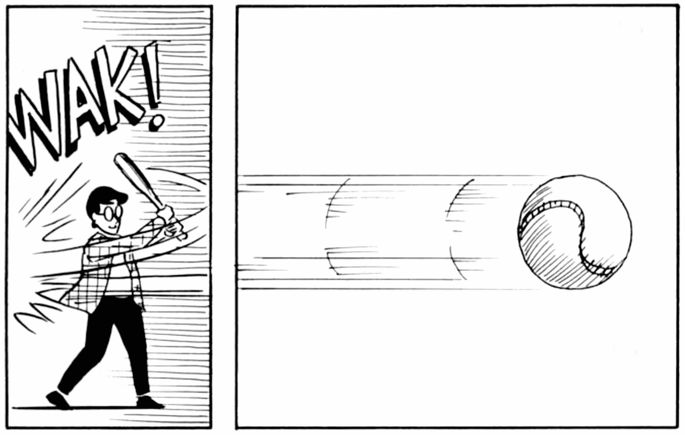<br/>
  <i>Analogy: a baseball batter reacts within milliseconds using an "internal predictive model," rather than explicit planning</i>
</p>

#### Training Pipeline (Three Stages, Fully Decoupled)

World Models uses a **staged, non-end-to-end** training pipeline. Each stage is completed independently before moving to the next.

**🗺️ Three-Stage Overview** (with core formulas):

**Stage 1**: collect replay data from 10,000 episodes with random actions

<p align="center">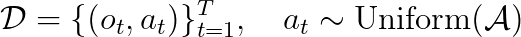</p>

**Stage 2(a)**: train VAE (images only) → V

<p align="center">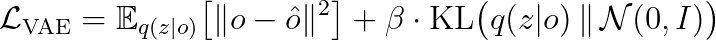</p>

**Stage 2(b)**: train MDN-RNN (sequences of z and a) → M

<p align="center">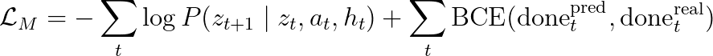</p>

**Stage 3**: freeze V and M; train Controller with CMA-ES

<p align="center">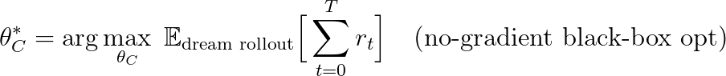</p>

**Stage 4** (Deployment / Inference): place the trained C back into the real environment

<p align="center">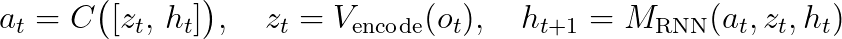</p>

The stages are explained in detail below.

##### Stage 1: Collect Real Data with a Random Policy

**🎯 Objective**: expose the world model to as many diverse states as possible (including death, collision, and other edge cases), so a **random policy** is used rather than a strong policy.

**Core formula**:
<p align="center"></p>

That is, sample in the real environment under a uniformly random policy and collect (observation, action) sequences.

**Concrete code**:
```python
data = []
for episode in range(10000):
    obs = env.reset()
    done = False
    while not done:
        a = env.action_space.sample()    # random action
        obs_next, reward, done = env.step(a)
        data.append((obs, a))            # store only observations and actions
        obs = obs_next
```

- **Scale**: VizDoom collects ~10,000 episodes; each has several hundred frames → several million frames in total
- **Storage**: VAE training only needs `obs`; M training needs `(obs, a)` sequences
- **No reward is required**: Stage 1 is entirely independent of reward signals (a flexibility of the World Models paradigm)

##### Stage 2(a): Train VAE → Obtain V

**🎯 Objective**: learn a **compression-reconstruction** model that compresses 64×64×3 pixels into a 32-dimensional latent z, used as input features for M and C.

**Core formula** (VAE ELBO):
<p align="center">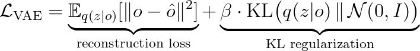</p>

- Encoder: `q(z|o) = N(μ_φ(o), σ_φ(o)²)` — encodes the image into a Gaussian distribution
- Decoder: `p(o|z)` — reconstructs the image from z
- **Result**: `encode: o → z` (32 dimensions) + `decode: z → o`

**Concrete code**:
```python
for epoch in range(N):
    for batch in shuffle(data):
        obs = batch.obs                  # 64×64×3 pixels
        mu, sigma = VAE.encoder(obs)     # output latent distribution parameters
        z = mu + sigma * randn()         # reparameterization
        obs_recon = VAE.decoder(z)       # reconstruct image

        loss = MSE(obs_recon, obs) + KL(mu, sigma)
        loss.backward()
```

- **Purely unsupervised** — uses only obs and never uses action / reward
- **Freeze V** — it is no longer updated in the next stage

##### Stage 2(b): Train MDN-RNN → Obtain M

**🎯 Objective**: learn a **temporal prediction** model so that M can predict the **probability distribution of the next z** and whether the episode terminates from `(current z, current action, historical memory h)`.

**Core formula**:
<p align="center">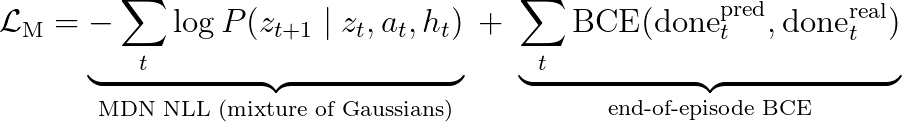</p>

The predicted distribution of z is a mixture of K Gaussians:
<p align="center">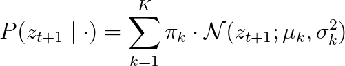</p>

- LSTM outputs `(π, μ, σ)` as mixture-distribution parameters
- Training objective: maximize the likelihood of the real `z_{t+1}` under this distribution

**Concrete code**:
```python
# First use V to encode all obs into z sequences
for episode in data:
    z_seq = [VAE.encode(obs) for obs in episode.obs]
    a_seq = episode.actions

for epoch in range(N):
    for (z_seq, a_seq) in episodes:
        h = zeros(256)
        for t in range(len(z_seq) - 1):
            (π, μ, σ), h, done_logit = M(z_seq[t], a_seq[t], h)
            loss_z = -log_mixture_gaussian(z_seq[t+1], π, μ, σ)
            loss_done = BCE(done_logit, real_done[t])
            loss = loss_z + loss_done
            loss.backward()
```

- **Freeze M** — it is no longer updated in the next stage

##### Stage 3: Train C with CMA-ES Inside the Dream

**🎯 Objective**: train the Controller to learn a Policy that achieves high reward "inside the dream" — without touching the real environment, using only the virtual world formed by V+M. This is the method used for **VizDoom Take Cover** (CarRacing trains in the real environment, discussed below).

**Core formula**:
<p align="center">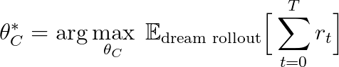</p>

- Objective: find Controller parameters that maximize **cumulative reward in the dream**
- `r_t = +1` (reward rule in VizDoom: +1 for each surviving frame)
- Use **CMA-ES** (gradient-free black-box optimization) rather than backpropagation

**Dream rollout function**:
```python
def dream_rollout(controller_params):
    """Run one episode entirely inside M and return fitness"""
    z = sample_initial_z()           # draw a starting z from real data
    h = rnn.initial_state()
    cumulative_reward = 0
    while True:
        a = C_apply(controller_params, [z, h])         # ← compute action with candidate parameters
        (π, μ, σ), h, done_logit = M(z, a, h)           # ← M acts as the virtual environment
        z = sample_mdn(π, μ, σ, temperature=1.15)       # ← temperature prevents cheating
        if sigmoid(done_logit) > random():
            break
        cumulative_reward += 1                          # surviving one frame gives +1
    return cumulative_reward
```

**CMA-ES evolutionary optimization loop**:
```python
es = CMAES(initial_mean=zeros(C.param_count), sigma=0.1)
for generation in range(800):
    # 1. CMA-ES generates a batch of candidate parameters (population_size=64)
    candidates = es.ask()
    # 2. Each candidate runs N dream episodes; fitness is averaged
    fitnesses = [
        mean([dream_rollout(c) for _ in range(16)])
        for c in candidates
    ]
    # 3. Feed fitness back to CMA-ES; it updates the distribution
    es.tell(candidates, fitnesses)

best_C = es.best_solution()           # trained Controller
```

- **Gradient-free**: CMA-ES is black-box optimization; it only observes fitness, not gradients
- **Parallel-friendly**: 64 candidates can run dream episodes simultaneously (GPU batch)
- **Repeated evaluation**: each candidate runs 16 rollouts and uses the mean, reducing noise from dream stochasticity

<details>
<summary><b>📌 Concept Supplement: CMA-ES Explained + Why Not Backpropagation / Bellman?</b></summary>

**CMA-ES** = Covariance Matrix Adaptation Evolution Strategy, proposed by Nikolaus Hansen in 1996. It is one of the most successful evolutionary algorithms for **black-box continuous optimization**.

> ⚠️ **Notation convention**: standard CMA-ES literature uses **C** for the covariance matrix, but in the World Models paper **C** is already taken as the symbol for the **Controller**. To avoid confusion, this section uses **Σ** (the standard symbol from probability/statistics) for the covariance matrix. So "Controller C" and "covariance Σ" are two completely different objects.

---

### Part 1: What Is CMA-ES? — The Principle in Three Sentences

1. **Maintain a multivariate Gaussian distribution** $\mathcal{N}(m, \sigma^2 \Sigma)$ describing "where the currently estimated optimum is likely located"
2. **Sample λ candidates each generation and select the best μ candidates** (μ ≈ λ/2)
3. **Update mean m, covariance Σ, and step size σ**, so the distribution gradually "aims" at the optimal region

**Analogy — finding a mountain summit while blindfolded**: scatter a group of people around the current location → have them report altitude → identify the direction of the highest few people → move the group in that direction → meanwhile adjust the scattering shape (ellipsoid) and range (step size).

#### 🖼️ Intuitive View: How Does CMA-ES Converge?

<p align="center">
  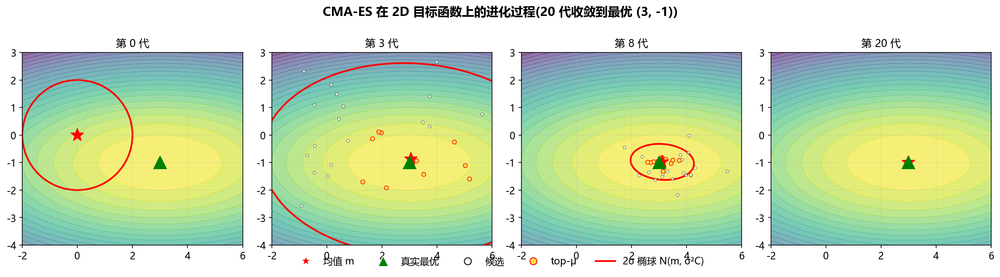<br/>
  <i>Evolution of CMA-ES on the 2D objective function f(x,y) = −((x−3)² + 5(y+1)²). The green triangle is the true optimum (3, −1), the red star is the current mean m, the red ellipse is the current 2σ range of N(m, σ²Σ), white dots are sampled candidates, and yellow circles are the selected top-μ candidates. It converges reliably to the optimum within 20 generations.</i>
</p>

Observe:
- **Generation 0**: m is at (0, 0); the ellipse is a circle (C = I), with a large range
- **Generation 3**: m has already been "pulled" down and to the right (top-μ are in that direction), and the ellipse begins to flatten
- **Generation 8**: m is close to the true optimum; the ellipse continues shrinking and becomes elongated (because the y-direction gradient is steeper)
- **Generation 20**: nearly perfect convergence

#### Five-Step Loop per Generation

<p align="center">
  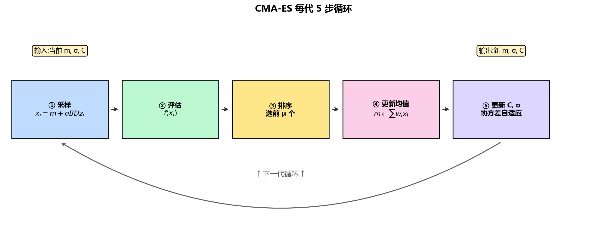<br/>
  <i>The five-step loop of each CMA-ES generation</i>
</p>

```
① Sampling:   x_i = m + σ·B·D·z_i,  z_i ~ N(0, I)
② Evaluation: compute f(x_i)
③ Sorting:    sort by fitness and select the top μ
④ Mean update: m_new = Σ w_i · x_i
⑤ Update covariance Σ and step size σ (using evolution paths)
```

Key hyperparameters: **λ** (population) = 16~64, **μ** = λ/2, initial **σ** = 0.1, number of generations = hundreds to thousands.

#### 🔍 What Are B and D in Step ①?

$B$ and $D$ are the **eigendecomposition** of covariance matrix $\Sigma$:
<p align="center">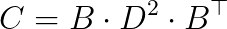</p>

- **B**: orthogonal matrix (eigenvectors of Σ) — geometrically a **rotation** that turns standard coordinate axes to the principal-axis directions of the Σ ellipsoid
- **D**: diagonal matrix (square roots of Σ's eigenvalues) — geometrically **scaling along coordinate axes**

**Why decompose Σ into B·D²·Bᵀ?** Because computers can only generate standard normal noise $z \sim \mathcal{N}(0, I)$; this noise must be transformed into samples following the $\mathcal{N}(m, \sigma^2 \Sigma)$ distribution. The figure below decomposes the full process into four intuitive steps:

<p align="center">
  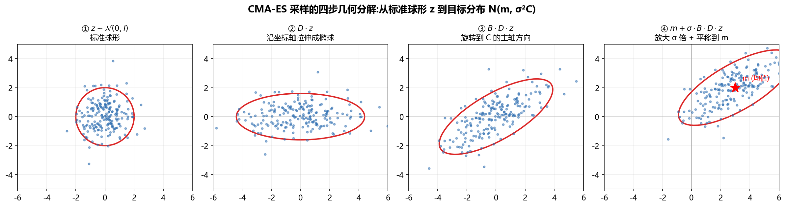<br/>
  <i>Geometric decomposition of the sampling formula x = m + σ·B·D·z: ① start from standard spherical noise z → ② D stretches it along coordinate axes into an ellipsoid → ③ B rotates it to the principal-axis direction of Σ → ④ σ scales it and translates it to position m. Blue dots are 200 samples; the red ellipse is the 2σ range.</i>
</p>

**Tip**: B and D are recomputed only once per generation after Σ is updated (`eigendecompose(Σ)`), then reused for all λ samples in that generation, which is computationally efficient.

#### Adaptation of Covariance Σ (the Core of CMA)

> ⚠️ **Clarifying a common confusion**: this subsection is about **how to update Σ**, which is **a different step** from the earlier "`Σ = B·D²·Bᵀ` eigendecomposition":
> - **Sampling phase** (per-generation steps ①②): extract B, D from Σ, and use `x = m + σ·B·D·z` to generate candidates
> - **Update phase** (per-generation step ⑤, this subsection): use the feedback from the current generation to **modify Σ itself**
> - The two phases connect sequentially: use the old Σ's B, D to sample → evaluate → update Σ → next generation decomposes the new Σ

CMA-ES does not update Σ arbitrarily. Instead, it collects **two independent pieces of evidence** and combines them to make a small adjustment to Σ.

##### Signal 1: Rank-μ Update — "Where are the top-μ candidates of this generation concentrated?"

**Intuition**: Look at the μ best candidates selected in the current generation. In which direction are they concentrated? Make Σ wider along that direction.

**Math**:
<p align="center">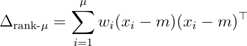</p>

- $x_i$: the i-th top candidate
- $(x_i - m)(x_i - m)^\top$: **outer product**, turning a direction into a matrix
- $w_i$: rank weight (highest for top-1, decreasing)

##### Signal 2: Rank-1 Update — "In which direction has the mean been moving historically?"

**Intuition**: Beyond the current generation, also look at the **accumulated direction of historical mean movement** (evolution path $p_c$). If several consecutive generations move in the same direction, this is a strong signal → reinforce Σ along that long-term direction.

**Math** — first maintain the evolution path (exponential moving average):
<p align="center">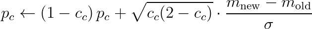</p>

Then take its outer product as C's contribution:
<p align="center">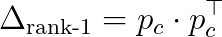</p>

##### The Two Signals Are Complementary

| Signal | Pros | Cons |
|--------|------|------|
| **Rank-μ** | Uses μ samples, **rich information / good for width** | High per-generation noise, can chase randomness |
| **Rank-1** | **Historical accumulation, smooth and stable** | Uses only 1 direction (the evolution path), limited width info |

→ **Combined**: Rank-μ provides "width", Rank-1 provides "long-term directional stability"; together they complement each other.

##### 🖼️ Geometric Meaning of the Two Signals

<p align="center">
  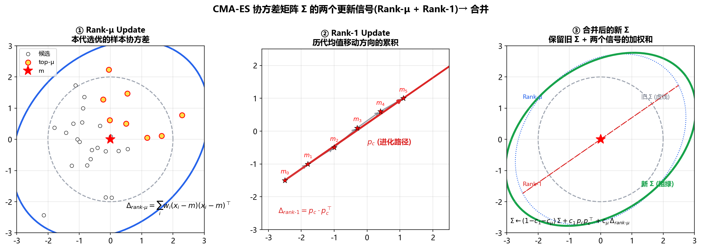<br/>
  <i>① Left: Rank-μ uses the sample covariance of top-μ candidates (yellow circles) to construct an ellipse (blue), making Σ wider along that concentration direction; ② Middle: Rank-1 accumulates historical mean movements m₀ → m₅ into the evolution path p_c (thick red arrow); its outer product yields a "rod-shaped" contribution along that direction; ③ Right: new Σ (thick green) = old Σ (dashed) + Rank-μ (blue dotted) + Rank-1 (red dash-dotted), weighted fusion of all three.</i>
</p>

##### Full Update Formula for Σ

<p align="center">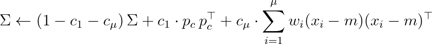</p>

- First term $(1 - c_1 - c_\mu) \Sigma$: **preserves most of the old Σ** (prevents drastic oscillations)
- Second term $c_1 \cdot p_c p_c^\top$: Rank-1 contribution
- Third term $c_\mu \cdot \sum w_i (x_i - m)(x_i - m)^\top$: Rank-μ contribution
- $c_1, c_\mu$ are small weights (typically on the order of 0.01), ensuring the sum remains positive-definite

##### 🖼️ Complete Per-Generation 6-Step Flow

Connecting the "sampling" and "update" phases, CMA-ES actually has 6 steps per generation (the earlier 5-step diagram was a simplification; here is the complete version):

<p align="center">
  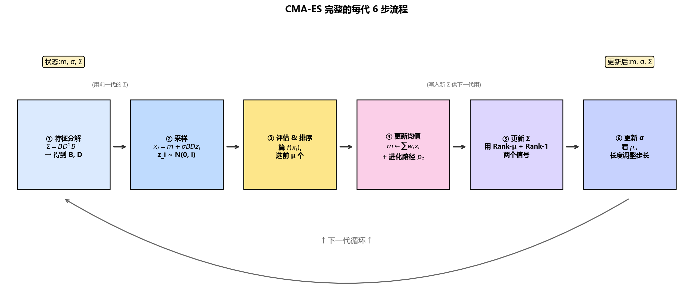<br/>
  <i>Full per-generation flow: ① Eigendecompose Σ → obtain B, D ② Use B, D to sample λ candidates ③ Evaluate and rank ④ Update mean m and evolution path p_c ⑤ Use Rank-μ + Rank-1 to update Σ ⑥ Update global step size σ. The next generation returns to ① and decomposes the new Σ.</i>
</p>

**Key insight**: **"the B, D for sampling" and "the Σ being updated" are two faces of the same matrix** — the update phase modifies Σ itself, and the next generation's sampling phase extracts B, D from the new Σ for candidate generation. `Σ = B·D²·Bᵀ` is a "translation tool", whereas `Σ ← ...` is the actual "learning behavior".

---

### Part 2: Why Did World Models Choose CMA-ES? (Clarifying a Common Misunderstanding)

#### ⚠️ Misunderstanding: "The dream is not differentiable"

Strictly speaking, **the dream can be made fully differentiable mathematically**:

| Component | Differentiability |
|------|-------|
| C (linear Controller) | ✅ differentiable |
| LSTM part of M | ✅ differentiable |
| MDN output layer (MLP) | ✅ differentiable |
| **Sampling z from MDN** | ⚠️ Not differentiable by default; **reparameterization can make it differentiable** (as shown by VAE) |
| **done sampling** | ⚠️ Bernoulli is not differentiable by default; **Gumbel-Softmax can make it differentiable** |

**Conclusion**: Ha 2018 chose CMA-ES **not because differentiability was impossible, but as an engineering trade-off** — choosing CMA-ES naturally removes the need to make the entire chain differentiable.

#### ✅ Real Reason: Five Conditions Fit CMA-ES Perfectly

| Condition | Actual Situation in World Models Stage 3 | This Means... |
|------|------------------------------|----------|
| **Parameter count of C** | Extremely small (hundreds to thousands) | Under ~100 dimensions, black-box search is sufficient and gradients have limited advantage |
| **Dream stochasticity** | MDN sample + τ=1.15, high fitness noise | Gradient algorithms suffer from noise; evolutionary algorithms are naturally noise-resistant |
| **Model exploitation** | C searches for dream bugs to exploit | **Gradients amplify cheating** (they directly reveal how C can exploit loopholes optimally) |
| **Long-sequence RNN gradients** | One episode may contain hundreds of frames | Exploding/vanishing gradients; LSTM only mitigates the problem |
| **Engineering simplicity** | The 2018 goal was to "first demonstrate feasibility" | CMA-ES requires only a few lines of code |

→ **This is the true motivation for Ha 2018 choosing CMA-ES**, not a technical limitation.

---

### Part 3: Can the Bellman Equation Be Used for Backward Solution?

A common confusion must first be clarified:

#### ⚠️ The Bellman equation is a Q-learning tool, not an actor tool

```
Bellman: Q(s,a) = r + γ · max_{a'} Q(s', a')
```

It is used to **learn the value function Q**, not to learn the Policy directly. Concretely:

| Algorithm | What Bellman Is Used For |
|------|------------------|
| **DQN** (model-free) | Uses Bellman error as the loss for the Q network; argmax Q selects actions |
| **MuZero** (model-based) | Uses Bellman to train Q; Policy is obtained through MCTS search |
| **Dreamer V1/V2/V3** | ⭐ **Does not use Bellman**; it fits the critic with λ-return + uses analytic gradient backpropagation for the actor |

#### What if Bellman were forced into World Models?

**Option A: Change C into a Q network**
- This becomes "model-based DQN": learn $Q(z, h, a)$ and select actions by argmax
- But CarRacing has **continuous actions**, making `max Q(s', a')` difficult to compute
- Moreover, the training target is fitting Q rather than directly maximizing reward, adding an indirect layer

**Option B: Make the dream differentiable + let the actor directly maximize imagined return** ← the path taken by Dreamer
- No Bellman; **backpropagate directly through ∂Return/∂θ_actor**
- This is the more modern and more efficient method

→ **The idea of Option B** (differentiable dream + backpropagation) is exactly the path implemented by Dreamer in 2020.

---

### Part 4: How Dreamer Implements "Differentiable Dream + Backpropagation" (Later Evolution)

```
World Models (2018)               Dreamer V1 (2020)
─────────────────────             ──────────────────
V (VAE) + M (MDN-RNN) trained in stages → V + M merged into RSSM, end-to-end
Tiny C + CMA-ES                 →  actor + critic (hundreds of thousands of parameters each)
Dream not intentionally differentiable → ⭐ make the dream fully differentiable + backpropagation
No critic                       →  ⭐ critic fits λ-return and provides the actor target
```

**Core training loop of Dreamer V1**:
```python
# rollout in the dream (H=15 steps)
s = sample_initial_state()
returns = 0
for t in range(H):
    a = actor(s)                            # actor network outputs action
    s_next = world_model.transition(s, a)   # ✅ differentiable transition
    r = world_model.reward(s_next)          # ✅ differentiable reward
    returns += γ**t * r
returns += γ**H * critic(s_H)               # critic estimates subsequent residual value

# ⭐ backpropagate directly to actor (no Bellman, no sampling estimate)
actor_loss = -returns.mean()
actor_loss.backward()
```

Key difference: **Bellman error is not used**; instead, **analytic gradient ∂Return/∂θ_actor** directly maximizes imagined return.

---

### Part 5: CMA-ES vs Backpropagation (Summary Comparison)

| Dimension | CMA-ES (World Models) | Backpropagation (Dreamer) |
|------|---------------------|------------------|
| Requires gradients? | ❌ No | ✅ Must be differentiable |
| Suitable parameter count | Hundreds ~ thousands | Arbitrarily large (hundreds of millions) |
| Information utilization | λ × M evaluations per generation | One forward pass + backprop obtains the full gradient |
| Convergence speed | Slow | Fast (dense gradient information) |
| Robustness (noise) | Strong (selection rather than averaging) | Weak (noise enters gradients directly) |
| model exploitation risk | Medium (only sees fitness) | High (gradients directly exploit loopholes) |
| Suitable setting | Small black-box networks | Large differentiable networks |

**The 2018 → 2020 turning point**: Dreamer made the chain differentiable and enlarged actor parameters → backpropagation became far more efficient than CMA-ES → **CMA-ES exited the historical stage of model-based RL**.

---

### Part 6: Practical Entry Point

```python
pip install cma
import cma

def rosenbrock(x):
    return sum(100*(x[i+1] - x[i]**2)**2 + (1 - x[i])**2 for i in range(len(x)-1))

es = cma.CMAEvolutionStrategy(x0=[0.0]*10, sigma0=0.5, inopts={'popsize': 30})
es.optimize(rosenbrock)
print(es.result.xbest)
```

Alternatively, use Ha's own [**estool**](https://github.com/hardmaru/estool) — the official evolutionary toolkit for the World Models paper, including CMA-ES, OpenAI ES, PEPG, and others.

**Recommended resources**:
- [pycma official documentation](https://github.com/CMA-ES/pycma) — includes visualization and tutorials
- [Hansen — CMA-ES Tutorial](https://arxiv.org/abs/1604.00772) — written by the original author; essential reading
- [David Ha — Visual Guide to Evolution Strategies](https://blog.otoro.net/2017/10/29/visual-evolution-strategies/) ⭐ — beautifully visualized explanation
- [OpenAI ES paper (Salimans 2017)](https://arxiv.org/abs/1703.03864) — large-scale ES experiments on Atari

---

### 🎯 Overall Summary

> **The dream is technically fully differentiable, but Ha 2018 chose CMA-ES as an engineering trade-off: the Controller is tiny, the dream is noisy, model exploitation might be amplified by gradients, long RNN gradients are difficult, and demo feasibility was the priority. The Bellman equation is a Q-learning tool, not the best choice for actor optimization; the true paradigm of "differentiable dream + backpropagated actor" was implemented by Dreamer 2020, after which CMA-ES receded from model-based RL. The intuition of "solving with gradients" is exactly the core idea of the Dreamer family — but it uses policy gradient rather than Bellman.**

</details>

##### Stage 4: Deployment / Inference (Validation in the Real Environment)

**🎯 Objective**: run the trained C in the real environment and test whether transfer succeeds. At this stage, **V and M are no longer updated, but they continue to be used online** (V provides perceptual compression; M provides temporal memory h).

**Core formula**:
<p align="center">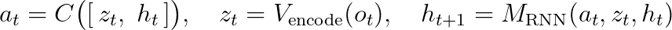</p>

- Note: **real $z_t$** is used to update $h$ (not the sampled $\hat{z}$ from M)
- This is equivalent to M "running alongside" the real environment and maintaining expectations about the future

**Concrete code** (paper Algorithm 1):
```python
def rollout(controller):
    """Run one episode in the real environment; used both for evaluation and actual deployment"""
    obs = env.reset()                      # ← real environment!
    h = rnn.initial_state()
    done = False
    cumulative_reward = 0
    while not done:
        z = vae.encode(obs)                # real obs → z
        a = controller.action([z, h])      # C decides
        obs, reward, done = env.step(a)    # real environment advances
        cumulative_reward += reward
        h = rnn.forward([a, z, h])         # ⭐ update h with real z
                                           # (rather than the ẑ sampled from M)
    return cumulative_reward
```

**Two key details**:
1. **`obs` comes from the real environment** (`env.step`, not `M(...)`) — during deployment, the Controller sees the real game
2. **`h` is still maintained by M**, but its input uses **real z** (not sampled ẑ)
   - C receives `[real z, h maintained by M]`, meaning it perceives the present and has "memory/expectation"

**Dream rollout vs real rollout**:

| Step | Dream rollout (when training C) | Real rollout (deployment / CarRacing training) |
|------|------------------------|--------------------------------------|
| Where does obs come from? | No obs needed; directly operate on z | `env.reset()` / `env.step()` |
| Where does z come from? | `sample_mdn(M output)` (virtual) | `vae.encode(real_obs)` (real) |
| h update | Updated inside M's LSTM | The same M via `rnn.forward([a, z, h])` |
| reward | Derived from done_logit +1 | Returned by `env.step` |
| Purpose | CMA-ES evolutionary fitness | Evaluation / actual gameplay |

✨ **Key insight**: V and M are **still used during deployment**, not merely as training auxiliaries. At inference time, they perform "perceptual compression + temporal memory," enabling the tiny C to make good decisions.

##### CarRacing Special Case: Training C in the Real Environment

Because CarRacing has complex rewards, the **Controller was not trained inside the dream**:

```python
# Directly use the same rollout() function to evaluate fitness
# Only difference: env is the real CarRacing environment
es = CMAES(...)
for gen in range(N):
    candidates = es.ask()
    fitnesses = [rollout(C_apply(c)) for c in candidates]   # use real env!
    es.tell(candidates, fitnesses)
```

- V and M are still trained in Stage 2 (using random rollout data)
- But C is trained directly in real CarRacing, using `[z, h]` as C's input (improving score by 40% compared with z alone)

##### Advantages and Disadvantages of Three-Stage Independent Training

✅ **Advantages**:
- Simple and clear; each stage can be debugged independently
- V and M are trained on unlabeled data, substantially reducing the need for real-environment interaction
- C is extremely small (hundreds of parameters), CMA-ES can solve it, and **no backpropagation is needed**

❌ **Disadvantages** (later addressed by Dreamer):
- Features learned by V are **not necessarily optimal for decision-making** (only for reconstructing obs)
- Independent three-stage training → no joint optimization
- Random rollout data in Stage 1 **may not cover critical states** (the iterative training issue mentioned in Section 5 of the paper)

→ These limitations directly led to **PlaNet's end-to-end training** and Dreamer's **imagination + backpropagation** route.

✨ Three modules are trained independently and do not rely on shared gradients — a distinctive 2018 design.

### 🧪 Key Experiments

#### Learning to Play Doom Inside the Dream

**CarRacing-v0**: the first method to solve the task (score > 900; previous best ~600).

🎬 **CarRacing demo video**:

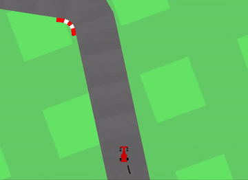

**VizDoom: Take Cover — the soul of the paper**: the Agent is trained **entirely inside M, without touching the real environment**.

🎬 **Doom real-environment demo**:

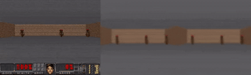

1. Run a random policy in the real environment to collect data
2. Train V and M
3. Treat M as the "dream environment"; the Controller **has never seen the real game**
4. Deploy the trained Controller directly into real Doom — **it can play, reaching the completion threshold of 750 surviving frames**

🤯 **This was the first clear historical demonstration that an Agent can learn inside its own world model and transfer to the real environment** — the core paradigm of today's model-based RL.

> 💡 For full interactive demos (VAE reconstruction, real-time Doom dream generation), visit the official website: <https://worldmodels.github.io/>

**Interesting "cheating" behavior**: the Agent learned to exploit dream bugs (making fireballs disappear out of nowhere). The authors **increased τ to make the dream harder**, forcing a robust Policy. This foreshadowed a later central challenge: **model exploitation** (Policies exploiting model errors).

### 🔧 Implementation Details Deep-Dive

This section clarifies three engineering details that are **particularly easy to confuse**; understanding them is necessary for a precise understanding of World Models.

---

##### Detail ①: The Real Structural Difference Between World Model and Model-Free

Common misunderstanding: "World Model merely adds an M network, and the Controller receives the predicted state."
**Reality**: the difference has **four layers**, and the most important one is not network structure.

| Dimension | Model-Free (DQN) | World Models (Ha 2018) |
|------|------------------|----------------------|
| **① Number of network modules** | 1 (Q network) | **3** (V + M + C) |
| **② Controller input** | Raw observation $o_t$ (or stacked frames) | $[z_t, h_t]$ — compressed observation + RNN hidden state |
| **③ Source of Controller training data** | **Real-environment `(s, a, r, s')`** | **Virtual sequences generated by M inside the dream** ⭐ the real revolution |
| **④ Optimization method** | Gradient descent + Bellman error | **CMA-ES** (evolutionary algorithm) |

**Data-flow comparison**:

First examine the **input and output of Q-net** (the basis for understanding DQN):

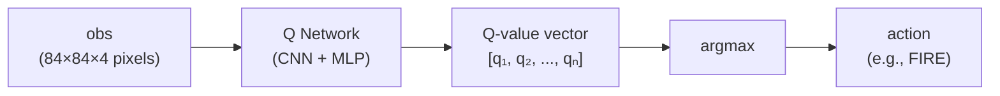
```mermaid
flowchart LR
    obs["obs<br/>(84×84×4 pixels)"] --> Qnet["Q Network<br/>(CNN + MLP)"]
    Qnet --> Qvals["Q-value vector<br/>[q₁, q₂, ..., qₙ]"]
    Qvals --> argmax["argmax"]
    argmax --> action["action<br/>(e.g., FIRE)"]
```

Q-net **learns only one thing** — "the expected total reward of each action under the current obs." **It never predicts the next frame.**

**Complete DQN data flow**:

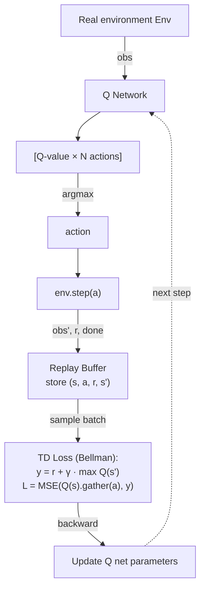
```mermaid
flowchart TD
    Env["Real environment Env"] -->|obs| QNet["Q Network"]
    QNet --> Qvals["[Q-value × N actions]"]
    Qvals -->|argmax| action
    action --> step["env.step(a)"]
    step -->|"obs', r, done"| Buffer["Replay Buffer<br/>store (s, a, r, s')"]
    Buffer -->|sample batch| Loss["TD Loss (Bellman):<br/>y = r + γ · max Q(s')<br/>L = MSE(Q(s).gather(a), y)"]
    Loss -->|backward| Update["Update Q net parameters"]
    Update -.->|next step| QNet
```

**Characteristic**: **one network; all data flows through the real environment**.

**Complete World Models data flow** (four stages):

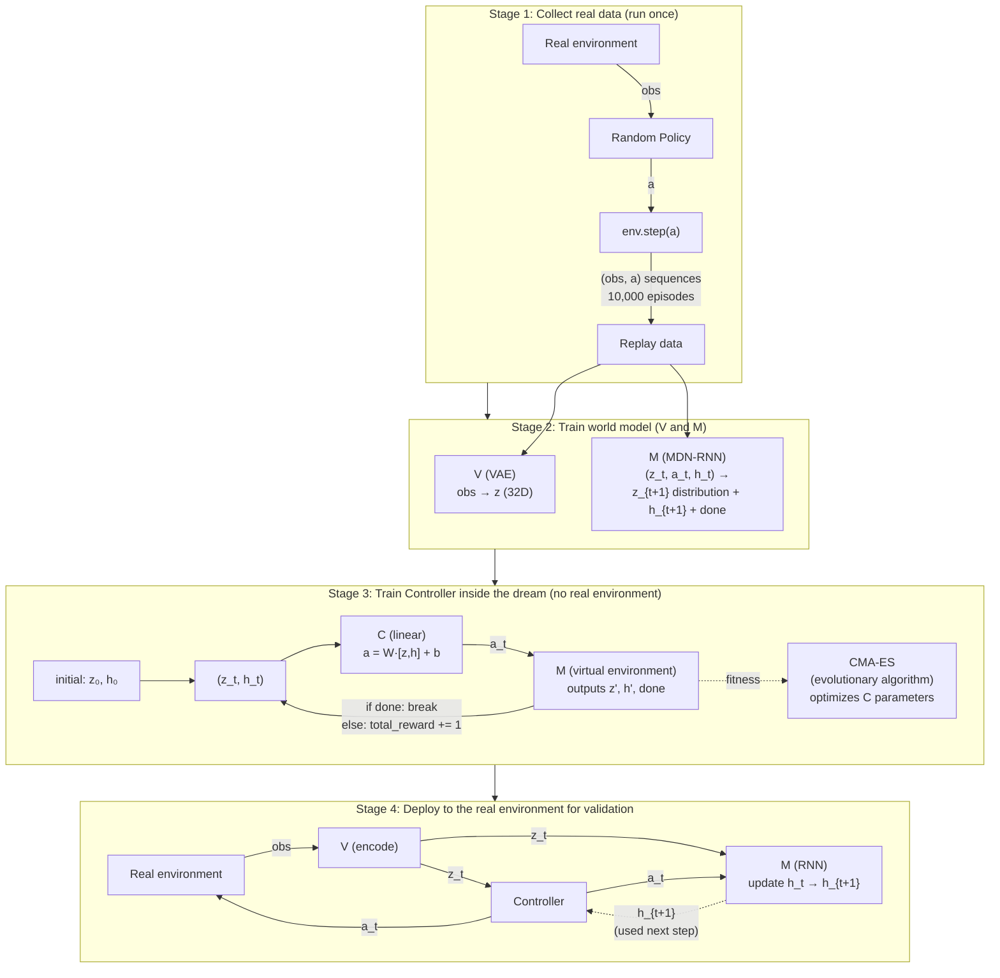
```mermaid
flowchart TD
    subgraph S1["Stage 1: Collect real data (run once)"]
        Env1["Real environment"] -->|obs| Random["Random Policy"]
        Random -->|a| Step1["env.step(a)"]
        Step1 -->|"(obs, a) sequences<br/>10,000 episodes"| Data["Replay data"]
    end

    subgraph S2["Stage 2: Train world model (V and M)"]
        Data --> V["V (VAE)<br/>obs → z (32D)"]
        Data --> M["M (MDN-RNN)<br/>(z_t, a_t, h_t) →<br/>z_{t+1} distribution + h_{t+1} + done"]
    end

    subgraph S3["Stage 3: Train Controller inside the dream (no real environment)"]
        Init["initial: z₀, h₀"] --> State["(z_t, h_t)"]
        State --> C["C (linear)<br/>a = W·[z,h] + b"]
        C -->|a_t| MDream["M (virtual environment)<br/>outputs z', h', done"]
        MDream -->|"if done: break<br/>else: total_reward += 1"| State
        MDream -.->|fitness| CMAES["CMA-ES<br/>(evolutionary algorithm)<br/>optimizes C parameters"]
    end

    subgraph S4["Stage 4: Deploy to the real environment for validation"]
        Env4["Real environment"] -->|obs| V2["V (encode)"]
        V2 -->|"z_t"| C2["Controller"]
        V2 -->|"z_t"| M2["M (RNN)<br/>update h_t → h_{t+1}"]
        C2 -->|"a_t"| Env4
        C2 -->|"a_t"| M2
        M2 -.->|"h_{t+1}<br/>(used next step)"| C2
    end

    S1 --> S2
    S2 --> S3
    S3 --> S4
```

**Core insight**: **where the Controller is trained (dream vs real environment)** is the soul of the World Model paradigm, not "having one additional M network."

---

##### Detail ②: Precise Distinction Among the Three "State" Concepts z, h, and o

World Models contains three related vectors with entirely different roles, which are easy to confuse:

| Symbol | Name | Source | Dimension (VizDoom) | Role |
|------|------|------|---------------|------|
| $o_t$ | **Observation** | Image provided by the real environment | 64×64×3 | Visible signal from the real world |
| $z_t$ | **Latent** (latent variable) | VAE compresses $o_t$ | 64 | **"Compressed representation of the current frame"** (space) |
| $h_t$ | **RNN Hidden State** | Maintained inside M (LSTM) | 256 | Summary of **"history + future expectation"** (time) |

**Key distinction**:
- $z$ ≈ looking at a single photograph — only indicates what the scene looks like
- $h$ ≈ watching the first 5 seconds of a video — enables prediction of what will happen in the next second
- **Only the combination $(z, h)$ supports correct decisions**

**Complete one-step transition in the dream**:
```
(z_t, h_t, a_t) ──[M]──► (z_{t+1}, h_{t+1})
                          │           │
                     MDN sample     LSTM update
```

M **outputs two things simultaneously**:
1. A Gaussian-mixture distribution over $z_{t+1}$ (the compressed next-frame representation obtained via MDN sampling)
2. $h_{t+1}$ (the new memory vector naturally updated inside LSTM)

**Key ablation experiment in the paper** (CarRacing):

| Controller Input | Score |
|-----------------|---:|
| $z$ only | 632 ± 251 |
| **$z + h$** | **906 ± 21** ⭐ |

→ Adding $h$ substantially improves performance, proving that $h$ carries "dynamical information" absent from $z$. **This two-path $(z, h)$ design was directly inherited by RSSM in the Dreamer family**.

---

##### Detail ③: How Is Reward $\hat{r}_{t+1}$ Generated Inside the Dream?

This is a **particularly counterintuitive point** — intuition suggests that M should predict reward, but **World Models 2018 did not explicitly predict continuous reward at all on VizDoom**.

**Actual method in VizDoom Take Cover**:
```python
# Output of M
M(z_t, a_t, h_t) → (π, μ, σ), h_{t+1}, done_logit
                       ↑           ↑          ↑
                  distribution of next z   hidden state  probability of termination
# Note: no reward head!
```

**Reward is entirely derived implicitly from `done`** (because Take Cover has a very simple rule: surviving gives +1):
```python
total_reward = 0
while True:
    a = C([z, h])
    (π, μ, σ), h, done_logit = M(z, a, h)
    z = sample_mdn(π, μ, σ, temperature=1.15)
    if sigmoid(done_logit) > random():
        break              # dead, stop
    total_reward += 1      # still alive, reward implicitly +1
```

**CarRacing uses a more "compromised" treatment** (complex rewards make dream training ineffective):
- The **Controller was not trained inside the dream**
- Instead, after V+M were trained, C was trained **directly in the real environment** with CMA-ES using z+h as features

| Task | Train C inside the dream? | Where does reward come from? |
|------|-----------|----------------|
| **VizDoom Take Cover** | ✅ Entirely trained inside the dream | Derived from done as +1 |
| **CarRacing** | ❌ Trained in the real environment | Provided by the real environment |

→ **The most spectacular paradigm, "learning inside the dream," was fully demonstrated by Ha 2018 only on VizDoom, whose reward rule is extremely simple**. This is an **easily overlooked limitation** of the paper.

**How the Dreamer family upgrades this**: add a **reward head** (MLP) to explicitly predict continuous reward:

```python
# Dreamer's World Model output
RSSM(s_t, a_t) → s_{t+1}, r̂_{t+1}, done
                     ↑          ↑          ↑
                 next state  predicted reward  termination

# Training: supervise the reward head with real experiences
loss_reward = MSE(reward_head(s_pred), batch.real_reward)

# During dream rollout, accumulate r̂
for t in range(H=15):
    a = actor(s)
    s, r_hat, done = world_model.step(s, a)
    total_value += γ**t * r_hat   # use r̂ to accumulate return
```

→ This is the key upgrade that enables Dreamer to handle **general tasks** (DMC, Atari, Minecraft): **reward is no longer derived from done, but explicitly modeled**.

---

##### Relationship Among the Three Details

```
① Structural difference ─► Controller trained inside the dream (the soul)
                            │
                            ▼
② z + h dual pathway ─► lets the Controller observe the full "space + time" state
                            │
                            ▼
③ Reward handling ─► implicit from done (VizDoom) or explicit reward head (Dreamer)
```

After these three layers of detail are understood, it becomes possible to:
- Understand why RSSM in the Dreamer papers uses a dual `(h, z)` pathway
- Understand why Dreamer must add a reward head to scale to general tasks
- Avoid mistaking "World Model" for "just model-free with multiple networks"

### 💭 Reflections

#### Contributions and Historical Status

✅ **Contributions**
1. First systematic engineering of the World Model paradigm (decoupling V+M+C)
2. First demonstration that a policy trained purely in a latent dream can transfer to the real environment
3. Probabilistic world model (MDN) foreshadowed today's stochastic generative models
4. Elegant combination of evolutionary algorithms and neural networks
5. Strong visualization and narrative, attracting many researchers to the field

⚠️ **Limitations**
1. Three-stage independent training; features learned by V may not be optimal for decision-making (only for reconstruction)
2. CarRacing / Doom are relatively simple
3. MDN-RNN has limited capacity, and long-horizon prediction drifts
4. Once V is trained, it is frozen and cannot adapt online

🌳 **Subsequent Influence**
- **PlaNet (2019)**: merges V and M into RSSM and trains end-to-end
- **Dreamer v1/v2/v3**: performs actor-critic in latent, replacing evolution
- **DreamerV3**: solves 150+ tasks with one set of hyperparameters, including Minecraft diamond collection
- **DIAMOND / Genie / Sora**: replace M with diffusion / transformer

The Dreamer family is a direct descendant of this paper.

#### Reading Suggestions

1. **Start with the interactive website** <https://worldmodels.github.io/> (all demos are animated and faster than reading the paper)
2. The paper is short (~25 pages), but the **appendix is extremely detailed** and worth careful reading
3. Focus on: VAE latent dimensionality comparisons, the role of MDN-RNN temperature τ, and the methodology of "training inside the dream"
4. Code: [estool](https://github.com/hardmaru/estool) · [WorldModelsExperiments](https://github.com/hardmaru/WorldModelsExperiments)

#### In One Sentence

> **This paper first turned "an Agent learning through imagination" from philosophy into a reproducible algorithm. Every module has since been replaced by later work, but the perception–memory–decision triad still dominates the entire model-based RL / world model field.**

<details>
<summary><b>📚 Learning Resources (Expand)</b></summary>

**🎬 Video Explanations**

By the author:
- [**David Ha — NeurIPS 2018 Talk**](https://youtu.be/HzA8LRqhujk) ⭐ — presented by the first author, ~30 minutes, highest information density; **strongly recommended as the first video**
- David Ha also has Stanford and workshop versions; searching YouTube for "David Ha World Models" will find them

Third-party explanations:
- [**Two Minute Papers — "Google's New Dreaming AI"**](https://www.youtube.com/results?search_query=two+minute+papers+world+models) — 5-minute popular explanation for intuition
- [**Arxiv Insights — World Models**](https://www.youtube.com/results?search_query=arxiv+insights+world+models) — roughly 10 minutes, clear explanation
- [**Yannic Kilcher channel**](https://www.youtube.com/@YannicKilcher) — search "World Models" for a line-by-line paper walkthrough

**📝 English Text-and-Figure Explanations**

- [**Official interactive website**](https://worldmodels.github.io/) ⭐ — **best introductory resource**; all demos are animated and far more intuitive than the PDF
- [**Lilian Weng — RL surveys and related posts** (Lil'Log)](https://lilianweng.github.io/tags/reinforcement-learning/) — RL tag page covering policy gradient, exploration, meta-RL, etc.; model-based content appears across surveys and [A (Long) Peek into RL](https://lilianweng.github.io/posts/2018-02-19-rl-overview/)
- [**The Gradient**](https://thegradient.pub/) — situates World Models within a broader AI narrative

**📝 Chinese Explanations**

- **Machine Heart**: [search "World Models Great Dreamer"](https://www.jiqizhixin.com/search?keywords=World%20Models) — detailed Chinese coverage was published when the paper appeared
- **PaperWeekly**: WeChat account paperweekly; search "World Models" for a paper guide
- **Zhihu**:
  - Search "World Models Ha Schmidhuber" — multiple highly liked explanations
  - Search "learning in dreams" / "world model survey" for additional useful notes
- **Bilibili**: search "World Models paper close reading" and the "Mu Li reinforcement learning" series for related content
- **CSDN / Jianshu**: many paper notes exist; quality varies, so prioritize posts with >100 saves

**💻 Code and Reproduction**

- [**hardmaru/WorldModelsExperiments**](https://github.com/hardmaru/WorldModelsExperiments) — official implementation by the authors (TensorFlow; complete but older)
- [**hardmaru/estool**](https://github.com/hardmaru/estool) — CMA-ES implementation (used for Controller training)
- [**ctallec/world-models**](https://github.com/ctallec/world-models) ⭐ — **PyTorch reproduction** with clean code, recommended for study
- [**zacwellmer/WorldModels**](https://github.com/zacwellmer/WorldModels) — another concise PyTorch version

**🎓 Courses**

- [**UC Berkeley CS 285: Deep RL**](https://rail.eecs.berkeley.edu/deeprlcourse/) — Sergey Levine, model-based RL lectures
- [**DeepMind x UCL RL Course**](https://www.deepmind.com/learning-resources/reinforcement-learning-lecture-series-2021) — model-based RL module
- [**Stanford CS 234: RL**](https://web.stanford.edu/class/cs234/)

**📚 Further Reading**

Prehistory (intellectual origins in Schmidhuber's 1990s work):
- [Schmidhuber 1990 — *Making the World Differentiable*](http://people.idsia.ch/~juergen/FKI-126-90ocr.pdf)
- [Schmidhuber 1991 — *Curious Model-Building Control Systems*](http://people.idsia.ch/~juergen/curiositysab/curiositysab.html)

Subsequent work (read immediately after World Models):
- [PlaNet](https://arxiv.org/abs/1811.04551) — end-to-end version
- [DreamerV3](https://arxiv.org/abs/2301.04104) — synthesis and strongest baseline

**🎯 Recommended Learning Order**

```
1. Browse worldmodels.github.io first       (1 hour, intuitive experience)
2. Watch David Ha NeurIPS 2018 talk         (30 minutes, author's perspective)
3. Read Lil'Log [RL Overview](https://lilianweng.github.io/posts/2018-02-19-rl-overview/) (1 hour, mathematical organization)
4. Run the ctallec/world-models code once   (half a day to one day, hands-on)
5. Read the full paper + appendix           (1 day, details)
6. Move on to PlaNet / DreamerV3            (understand the evolution)
```

</details>

> 📁 Supporting materials have been downloaded to `asset/world-models-2018/` (architecture diagrams, VAE/MDN-RNN diagrams, CarRacing & Doom demo videos). Image source: [worldmodels.github.io](https://worldmodels.github.io/), © Ha & Schmidhuber, 2018, for study reference only.


</details>

<details>
<summary><b>4.2 PlaNet (2019)</b></summary>

> **Paper**: [arxiv.org/abs/1811.04551](https://arxiv.org/abs/1811.04551) (Hafner et al., ICML 2019)
> **Code**: <https://github.com/google-research/planet> · **Project page**: <https://planetrl.github.io/>
>
> **TL;DR**: **Learns an end-to-end latent world model (RSSM) and uses CEM to "imagine" future rollouts in latent space for action selection.** Turns World Models' staged training into end-to-end, achieving 50× sample efficiency over model-free.

This paper is the **direct predecessor of the Dreamer series** and Hafner's first model-based RL work. The RSSM dual-path latent architecture introduced here remains (as of 2026) the standard for model-based RL.

<p align="center">
  <br/>
  <i>PlaNet in action on DeepMind Control Suite (6 continuous-control tasks, learned directly from pixels)</i>
</p>

### 📖 Core Ideas

#### Solving the Core Pain Points of World Models

| World Models Pain Point / Limitation | PlaNet Response |
|------------------------|-----------------|
| Vague formalization, partial observability handled only implicitly | Explicitly modeled as a **POMDP**; the world model is learning this POMDP's dynamics and observation function |
| V and M trained separately in stages → VAE features may not be useful for decision-making | **End-to-end joint training** (encoder / transition / decoder / reward share a single ELBO loss) |
| MDN-RNN unstable over long horizons; deterministic memory and stochastic prediction not decoupled | **RSSM**: deterministic GRU (h) + stochastic Gaussian (z) **coexisting in dual paths**, distinct from purely deterministic RNNs and purely stochastic SSMs |
| Only one-step prediction is trained; multi-step errors compound without explicit constraints | **Latent overshooting**: KL regularization on multi-step predictions of all distances in latent space, **without decoding back to images** |
| Decision depends on a CMA-ES-evolved Controller; switching tasks requires retraining | **No policy network**; uses the learned world model directly with **CEM online planning in latent space** (MPC) |
| One-shot random data collection, unable to improve with the model | **Online data collection**: actively explores using current model + planning while training; data distribution improves as the model improves |
| Only demoed on toy environments like Doom / CarRacing | **DeepMind Control Suite** (6 continuous-control tasks from pixels) |

#### Overall Architecture

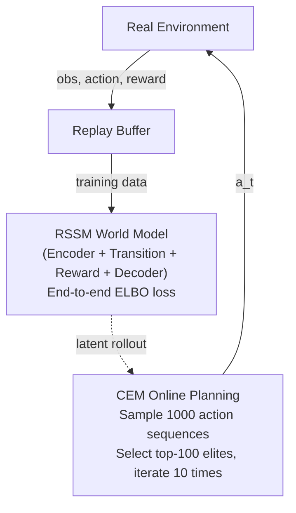
```mermaid
flowchart TD
    Env["Real Environment"] -->|obs, action, reward| Buffer["Replay Buffer"]
    Buffer -->|training data| RSSM["RSSM World Model<br/>(Encoder + Transition + Reward + Decoder)<br/>End-to-end ELBO loss"]
    RSSM -.->|"latent rollout"| CEM["CEM Online Planning<br/>Sample 1000 action sequences<br/>Select top-100 elites, iterate 10 times"]
    CEM -->|"a_t"| Env
```

**Note**: **PlaNet has no actor / policy network** — each action is derived from CEM real-time planning (this is the biggest difference from Dreamer).

<p align="center">
  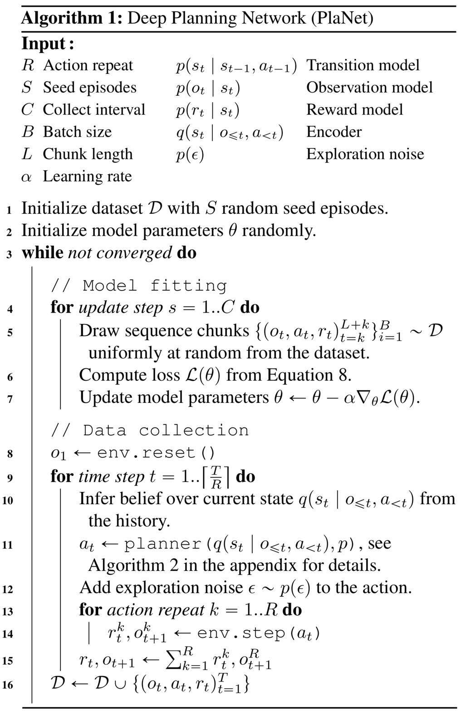<br/>
  <i>PlaNet overall algorithm (paper Figure 2). Left: training phase collects data from the real env and trains RSSM with end-to-end ELBO. Right: planning phase rolls out multiple trajectories in latent space from the current state and uses CEM to pick the best first action</i>
</p>

#### Decision Loop (MPC inference loop)

At deployment time, PlaNet executes three steps per time step, forming a standard **receding-horizon MPC** loop:

| Step | What it does | Component used |
|---|---|---|
| **① Observe** | Feed current observation $o_t$ together with history into the encoder; obtain the current belief $q(s_t \mid h_t, o_t)$ | Encoder + RSSM's h |
| **② Predict & Plan** | Starting from the belief, use CEM to roll out 1000 candidate action sequences in latent space, refine over 10 iterations, and pick the one with the highest cumulative reward | Transition + Reward (runs in latent, **never touches the real env**) |
| **③ Act** | Execute only the **first action** $a_t$ of the optimal sequence, then return to ① and replan | — |

> ⚠️ **Key: replanning happens at every step**, the remaining sequence from the previous step is not reused — this is the essence of MPC vs open-loop control (executing $a_t$ yields a new observation, and that fresh information lets the next plan be even better).

##### Action Repeat (R) trick

In practice, PlaNet **repeats each action** $a_t$ **R times** (typically R = 2–4 on DMC):
- Sums the rewards over those R steps as the "effective reward" of the decision
- Uses the observation at step R as the next $o_{t+1}$

**Purpose**: effectively compresses the planning horizon by R× (from 50 raw steps down to 12–25), making CEM computationally feasible while preserving physical time resolution. This is a **"paper does not emphasize, but the code must have"** engineering practice — and the Dreamer family inherits it.

#### Key Innovations Compared

| Dimension | World Models (2018) | **PlaNet (2019)** | Dreamer (2020+) |
|-----------|--------------------|-----|---|
| Training | Three stages, separate | **End-to-end ELBO** | End-to-end |
| Latent structure | VAE produces z + MDN-RNN's h as by-product (**separate**, staged training) | **(h, z) as a unified state** (**dual-path RSSM**, joint training) | Same as PlaNet |
| What z learns | Only visual reconstruction (VAE trained alone) | **Visual reconstruction + dynamics prediction** (KL constraint) | Same as PlaNet |
| Decision | CMA-ES trains Controller | **CEM online planning** | Actor-Critic + analytic gradients |
| Main testbed | CarRacing / VizDoom | **DMC (6 tasks)** | DMC / Atari / Minecraft |

> 💡 **Note**: World Models' M does have an LSTM hidden state h internally, but it is only a "working memory" by-product, **conceptually separate** from VAE's z and trained in different stages (z only learns reconstruction; h only assists in predicting z). PlaNet's RSSM is the first to **treat (h, z) as a unified environment state**, trained jointly, so that z simultaneously captures both visual and dynamic information — this is the truly revolutionary aspect of RSSM.

### 🧭 PlaNet's POMDP perspective: problem setup + comparison with World Models

#### 1. Problem Setup

The "true state" of the real environment includes positions, velocities, masses, joint angles, etc.; what the agent actually receives is just an RGB image — a single static frame **loses velocity, depth, what's behind occlusion, and numerical precision**. So **whenever an agent learns control from pixels, the problem is necessarily a POMDP**: it must maintain an internal latent representation to "fill in" what cannot be observed. This is dictated by physics, not by modeling choice.

The actual environment is assumed to be a **POMDP** (Partially Observable Markov Decision Process):

<p align="center">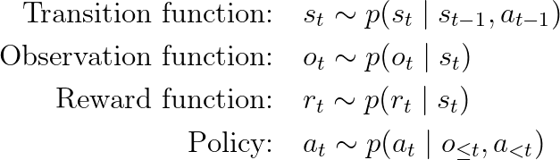</p>

- **Transition function**: The real environment's latent state $s_t$ is determined stochastically by the previous state and action
- **Observation function**: The agent cannot access $s_t$ — it only receives a frame of observation $o_t$ (a pixel image) — this is what "partial observability" means
- **Reward function**: Reward depends only on the latent state $s_t$, not directly on the agent's action
- **Policy**: Since $s_t$ is hidden, the policy must decide based on **observation and action history** $(o_{\le t}, a_{<t})$

The goal is to learn a policy that maximizes expected cumulative return $\mathbb{E}\big[\sum_t r_t\big]$.

> 💡 **What's special about PlaNet**: it does NOT **explicitly learn** a policy. Instead, it first learns a world model that simulates the POMDP (transition / observation / reward — three networks), then uses **CEM real-time planning** in latent space to compute $a_t$ on the spot — effectively replacing the traditional policy network with "world model + planner".

#### 2. Side-by-side architecture: World Models' "implicit" vs PlaNet's "explicit"

| POMDP Component (theory) | World Models (implicit / incomplete) | PlaNet (explicit / 1:1 mapped) |
|---|---|---|
| **Transition T**: p(s_t ∣ s_{t-1}, a_{t-1}) | MDN-RNN: p(z_{t+1} ∣ z_t, a_t, h_t) — h is a side-channel memory; **what counts as "the state" — z or (z, h) — is never specified** | RSSM (Eq. 4): paper says "splitting the state into a stochastic part s_t and a deterministic part h_t", **the state is explicitly decomposed into (h_t, s_t)**, all four networks take this pair as input — no ambiguity |
| **Observation Z**: p(o_t ∣ s_t) | VAE Decoder: p(o_t ∣ z_t) — **just a by-product of "finding a compression code for the image"; not the POMDP's observation function** | Decoder: p(o_t ∣ s_t) — **is the POMDP's observation function**, jointly trained as one term of the ELBO |
| **Reward R**: r(s_t) | ❌ **Does not exist**. Reward comes from the real environment (CarRacing track judgment / Doom survival flag) | Reward model: r̂(s_t), a small MLP — because CEM rolls out inside the head without touching the real env, **the model itself must predict reward** |
| **Belief**: b(s_t ∣ o_{≤t}, a_{<t}) | VAE encoder q(z ∣ o_t) **only sees the current frame**; history goes through MDN-RNN's deterministic h as a side channel; **[z, h] is never combined into "a probabilistic belief over the true state"** | Encoder/Posterior q(s_t ∣ h_t, o_t), where h_t carries the history — **a genuine POMDP belief**: a Gaussian distribution pulled toward the prior via KL |
| **Training Objective**: max ln p(o_{1:T}, r_{1:T} ∣ a_{1:T}) | **VAE's ELBO + MDN-RNN's NLL**, two independent losses trained in separate stages — **never combined into "a lower bound on the POMDP joint likelihood"** | **Single ELBO** (lower bound on the log-likelihood of the entire trajectory), **naturally derived** from the POMDP joint likelihood via variational inference; reconstruction / reward / KL live in the same formula with coupled gradients |

#### 3. Component-by-component deep dive: why "implicit vs explicit"

<details>
<summary>(click to expand — 5 components, one by one)</summary>

**🔹 Component 1: Transition**

- **World Models — implicit**: MDN-RNN maintains a hidden state h via an LSTM, and the transition is written as p(z_{t+1} ∣ z_t, a_t, h_t). The problem — **what is "the POMDP state"? The paper never answers**. If the state is z, why does h appear in the conditioning? If the state is (z, h), why is h not part of reconstruction or KL? This is a **formally non-closed** design.
- **PlaNet — explicit**: The state is **formally decomposed into two parts** — deterministic h_t and stochastic z_t — and all 4 networks (observation, reward, prior, posterior) take (h_t, z_t) jointly as input; none of them uses only h or only z. This pins down the POMDP state formally: it is this pair of variables, each with a defined role, trained jointly. There is no World-Models-style ambiguity of "why does h show up here?".

> 📝 **Notation note**: PlaNet's paper uses `s_t` for the *stochastic part*, which differs from the subsequent Dreamer-family convention (followed in this note): `z_t = stochastic part`, `(h_t, z_t) together = the full state`. When cross-referencing the paper, keep this symbol mismatch in mind.

**🔹 Component 2: Observation**

- **World Models — implicit**: The VAE decoder is trained **separately**, with the goal of "reconstructing the image from this frame's code z" — an image-compression task, not a POMDP observation function. In fact, if z lacks information useful for dynamics (e.g., velocity), the VAE does not care because it does not affect reconstruction.
- **PlaNet — explicit**: Decoder p(o_t ∣ s_t) is one term of the ELBO and is **jointly trained with the transition, reward, and KL**. If s_t is missing some information, the reconstruction loss pushes it back into s_t — the decoder is driven by its role as the POMDP's observation function.

**🔹 Component 3: Reward**

- **World Models — implicit**: **This component simply does not exist**. Reward depends on the real environment throughout — when training the Controller with CMA-ES, it is run inside the real CarRacing / Doom environment and evaluated against the real reward. So World Models' "world model" is strictly **incomplete**: it has learned the dynamics but not the reward.
- **PlaNet — explicit**: The reward model r̂(s_t) is part of the world model, trained together with the other components. **Necessity**: when CEM rolls out hundreds of candidate action sequences in latent space without touching the real env, the model must predict reward for selection. **Side benefit**: the reward loss also forces the encoder to embed "which visual features are reward-relevant" into s_t — something the World Models' VAE can never learn.

**🔹 Component 4: Belief update (posterior)**

- **World Models — implicit**: VAE's q(z ∣ o_t) **only looks at the current frame**, so it cannot be a "belief over the environment state" — only an encoding of this single frame. History flows through another path: MDN-RNN's h (deterministic, point estimate). **The two paths are never merged into "a single probability distribution over the true state"**. What the Controller receives — [z, h] — is just the latest slice of two parallel paths concatenated; it is neither a distribution nor a belief.
- **PlaNet — explicit**: The encoder takes (h_t, o_t) jointly and outputs q(s_t ∣ h_t, o_t) = N(μ, σ²). h_t carries history, o_t is the current observation, and together they determine "the posterior over the current latent state". This is a **genuine probability distribution**, and is pulled via KL[q ∥ p] toward "the prediction propagated forward by the dynamics", **forcing belief consistency with the dynamics** — exactly the definition of a POMDP belief update.

**🔹 Component 5: Training Objective**

- **World Models — implicit**: loss = VAE's ELBO **+** MDN-RNN's NLL, **two independent losses trained sequentially in separate stages**. The two losses share no common probabilistic foundation — the VAE ELBO is a lower bound on the image likelihood p(o), and the MDN-RNN NLL is a lower bound on the z-sequence likelihood p(z_{1:T} ∣ a_{1:T}); **these two were never combined into "a lower bound on the POMDP joint likelihood"**. As a result, to add a new constraint one must heuristically tack on yet another loss with hand-tuned weighting — **there is no theory to tell what to add or how to weight it**.
- **PlaNet — explicit**: loss = ELBO over the entire trajectory

  <p align="center">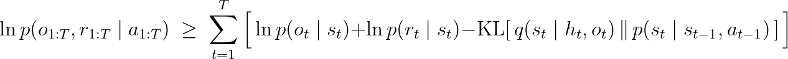</p>

  This **is precisely the result of treating the POMDP as a latent variable model and applying variational inference**. Reconstruction, reward, and belief–dynamics alignment all live in the **same formula**, with gradients automatically coupled — the encoder is forced to embed into s_t whatever is useful for both dynamics and reward prediction. **Want to add a new constraint?** Just continue the variational derivation: **Latent Overshooting is precisely what you get by generalizing from "single-step ELBO" to "multi-step ELBO" (§4)** — a single theoretical lineage with no heuristic patches.

</details>

#### 4. The real value of explicit formalization (not just terminology)

- 🎯 **Loss has a source**: World Models = "VAE loss + MDN-RNN loss" in two independent stages; PlaNet = ELBO derived in one step. When adding new constraints (e.g., latent overshooting), the derivation can be extended naturally — every term still has theoretical meaning.
- 🎯 **Responsibilities are diagnosable**: Decoder degrades → reconstruction loss rises; Transition degrades → KL rises — locatable. In World Models, a bad z could be the VAE's fault or the MDN-RNN's, because responsibilities weren't split along POMDP lines.
- 🎯 **Modules are loosely coupled — only one can be replaced**: Dreamer 1/2/3 fully reuse PlaNet's RSSM (those 4 POMDP components unchanged) and only swap "CEM planning" for "Actor-Critic + analytic gradients". This "swap the decision layer without touching the world model" flexibility would not be possible without POMDP formalization.
- 🎯 **Apples-to-apples comparison**: All model-based RL methods (POMCP / DVRL / SLAC / Dreamer ...) can be compared under the POMDP framework — how do you approximate Z? What form is the belief? What planning algorithm?

#### 5. One-sentence summary

> **World Models** treats "partial observability" as **an engineering problem to work around** (stack VAE + RNN to cobble together a representation).
> **PlaNet** treats it as **a scientific problem to model head-on** (write down the POMDP; let all architectures and losses derive naturally).
>
> The same network components — the former is **engineering assembly**, the latter is **theoretical implementation**. This is precisely why Dreamer 1/2/3 all inherit PlaNet's formalization, and why no one ever returned to World Models' three-stage paradigm.

### ⚙️ End-to-End Joint Training: One ELBO to Train Them All

#### 1. World Models' problem: the VAE has no idea what z will be used for

World Models trains in three independent stages: Stage 1 trains the VAE, Stage 2 freezes the VAE and trains the MDN-RNN, Stage 3 freezes V + M and evolves the Controller. **Each stage's loss only cares about its own goal — gradients cannot flow back to a previous stage.**

**Key defect**: The VAE's training objective is solely "reconstruct a single frame". If some visual feature is **irrelevant for reconstruction** (e.g., the speed of a ball — invisible from one static frame), the VAE will not encode it into z. Later, when the MDN-RNN tries to predict the next state, **that information is already gone, beyond recovery**.

> Analogy: have a JPEG-compression expert compress an image, then ask a physicist to predict the object's motion from the compressed code. The compression expert has no idea the physicist needs things like "velocity".

#### 2. PlaNet's fix: joint optimization

##### Step 1 - Starting point: vanilla latent variable sequence model (Latent State-Space Model, SSM)

To end-to-end learn a world model that simulates the POMDP, the simplest form is a **latent variable sequence model**:

<p align="center">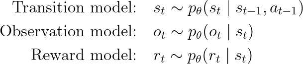</p>

> 📝 **Notation convention**: this note uses **upright p** (e.g., `p(s_t | ...)`, as in §🧭 Problem Setup) for the real-environment distribution (the POMDP), and **italic p_θ** (e.g., `p_θ(s_t | ...)`) for PlaNet's learned world model — training amounts to making p_θ ≈ p.

> Analogous to the VAE: first put up the "latent + Gaussian decoder" skeleton, then talk about training. Same idea here — define the model form first.

On top of this, PlaNet adds an **encoder** (to infer latent s_t from observations; details in §3), and places all 4 networks (encoder / transition / decoder / reward) under the **same objective function, jointly trained**:

<p align="center"></p>

| Loss term | Trains whom | What it tells the encoder (backward) |
|---|---|---|
| Reconstruction ln p(o_t ∣ s_t) | decoder + encoder | "s_t must be enough to reconstruct the image" |
| Reward ln p(r_t ∣ s_t) | reward model + encoder | "s_t must be enough to predict reward" |
| KL[q ∥ p] | transition + encoder | "s_t must make the next step predictable" |

**All gradients flow back to the encoder through the shared variable s_t** — the encoder has to satisfy all three downstream tasks simultaneously, and any unmet loss pushes back: "pack more information into s_t".

#### 3. The inference difficulty: intractable posterior → variational encoder

§2 mentioned that one of the 4 networks is an encoder. **Why is this encoder needed?**

Training requires inferring s_t from observations; in theory one should sample from the true posterior p(s_t ∣ o_{≤t}, a_{<t}). But this posterior is **intractable** (transition / observation are NNs — nonlinear, no closed-form integration). The fix is to introduce an **approximate posterior** q, also NN-parameterized:

q(s_{1:T} ∣ o_{1:T}, a_{1:T}) = ∏_t q(s_t ∣ s_{t-1}, a_{t-1}, o_t)

Three key points:
1. This is the VAE's **encoder**, but in **trajectory form**
2. It is the **filtering posterior** (only sees o_{≤t}, not the future), since deployment also only has access to the past
3. **Mean-field** assumption: q is factorized into per-step q(s_t ∣ ...)

> 🔑 With this encoder in place, the ELBO in §2 above becomes actually trainable — the expectation E_q is taken over q, and gradients flow via reparameterization. Every variational inference method goes through this step — "true posterior won't do, use an approximation".

#### 4. Why this concretely solves the problem

| Information type | World Models VAE | PlaNet encoder |
|---|---|---|
| Static appearance (color, shape) | ✅ Needed for reconstruction, learned | ✅ |
| Velocity (frame difference) | ❌ Not needed for single-frame reconstruction, not learned | ✅ Transition must predict the next frame; pulled back via KL |
| Reward-relevant features | ❌ Not needed for reconstruction, not learned | ✅ Pulled back by the reward term |
| Physical regularities (inertia, collision) | ❌ Not learned | ✅ Pulled back by transition consistency |

#### 5. Side benefits: diagnosability + extensibility

- **Diagnosability**: decoder degrades → reconstruction loss rises; transition degrades → KL rises — **the failing component is locatable** (in World Models, a bad z could be the VAE's fault or the MDN-RNN's; responsibilities aren't split, hard to localize)
- **Extensibility**: to add a new constraint (e.g., latent overshooting), just append a new term to the ELBO — **there is a theoretical basis** (continue the variational derivation), rather than World Models' "just slap on another loss and weight it"

#### 6. One-sentence summary

> **The World Models VAE has no idea what z will be used for — it just wants to reconstruct this frame well.**
> **The PlaNet encoder knows: my s_t will be rolled forward by the transition, used to predict reward, and decoded into images — the gradients from these three downstream tasks will force me to pack into s_t whatever is useful for all of them.**

### 🧬 RSSM: Dual-Path Latent Architecture

> Expansion of row 3 in the §4.2 pain-points table: "MDN-RNN unstable over long horizons; deterministic memory and stochastic prediction not decoupled" → **RSSM (deterministic + stochastic dual path)**

RSSM (Recurrent State-Space Model) is the core architecture of PlaNet — a dual-path latent dynamics model that **stitches together** "deterministic RNN memory" and "stochastic SSM uncertainty".

#### Problem: long-range info in a purely stochastic SSM is washed out by noise

In the bare latent SSM from §⚙️ End-to-End Joint Training, **all information is carried across time through the stochastic s_t**. But s_t is sampled at every step — **sampling injects noise** — so long-range information is quickly washed out; the model cannot remember "what happened 5 steps ago".

#### Fix: add a deterministic path → RSSM

Add a **purely deterministic parallel path** h_t, dedicated to memory:

<p align="center">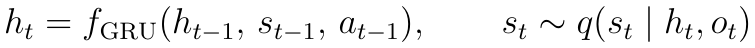</p>

**Dual-path division of duties**:

| Part | Role | Analogy |
|---|---|---|
| **h_t** (deterministic) | Long-range memory, lossless information transport | RNN's hidden state |
| **s_t** (stochastic) | Express environmental uncertainty, multiple possible futures | VAE's latent |

This is where the name **RSSM** comes from: **R**ecurrent NN (deterministic) + **S**tate-**S**pace **M**odel (stochastic), **stitched together**.

> 🔑 Figure 2 in the paper says it all: **(a) pure deterministic RNN** = remembers but cannot express uncertainty | **(b) pure stochastic SSM** = expresses uncertainty but cannot remember | **(c) RSSM = a + b** = best of both worlds

#### One-sentence summary

> **RSSM = the bare latent SSM augmented with a deterministic memory path** — h carries long-range information losslessly, while s preserves the ability to express uncertainty.

#### Common pitfalls when cross-referencing the paper's notation

| Sticking point | The truth |
|---|---|
| "Is s_t the POMDP state or the stochastic part?" | **The same symbol shifts meaning subtly between Eq. 2 and Eq. 4** — in Eq. 2, s_t is the whole latent; in Eq. 4, s_t is only the **stochastic part**, and the full state is (h_t, s_t). This note follows the Dreamer convention: z_t = stochastic part, to avoid the ambiguity. |
| "Why is the KL's prior p(s_t ∣ s_{t-1}, a_{t-1}) instead of p(s_t)?" | Because it is a **conditional prior**: the previous step rolled forward through the transition model. Unlike static VAE where p(s) = N(0, I) — here the prior itself is something the model has to learn. |
| "How is the expectation in the ELBO computed?" | Reparameterize a single sample of s_{t-1} and substitute. **Single-sample estimate + reparameterization** is enough. |
| "Why not just use an RNN as the transition?" | As explained above: RNNs are deterministic, **they cannot express 'I don't know what comes next'**. In model-based RL, letting the planner know how uncertain the model is **matters a lot**. |

### 🧪 Key Experiments

#### Beats Model-Free by 50× on DeepMind Control Suite (Pixel Input)

| Algorithm | Samples for fixed performance | Type |
|-----------|------------------------------|------|
| A3C | 50 M frames | model-free |
| D4PG | 100 M frames | model-free SOTA |
| **PlaNet** | **2 M frames** | **model-based** ⭐ |

→ **Order-of-magnitude (50×) sample-efficiency improvement**, the first time model-based RL **comprehensively beat model-free** on pixel tasks.

<p align="center">
  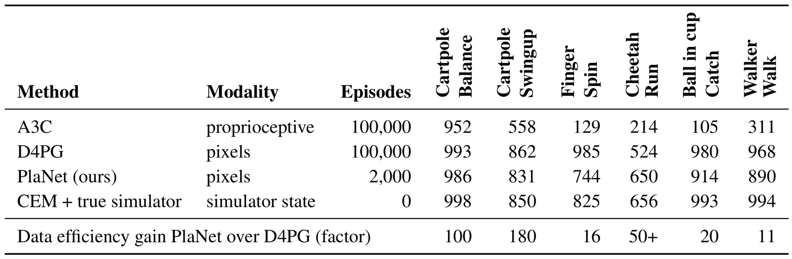<br/>
  <i>Paper Table 1: PlaNet uses <b>2,000 episodes</b> to reach the performance of D4PG with <b>100,000 episodes</b> — per-task efficiency gains of 11×–180×</i>
</p>

#### Key Ablations

**Necessity of RSSM dual-path**:
- Only deterministic h (pure RNN) → cannot express uncertainty, mediocre performance
- Only stochastic z (pure VAE-RNN) → **untrainable**, long-term info washed out by noise
- **h + z dual path** → **best** ⭐

<p align="center">
  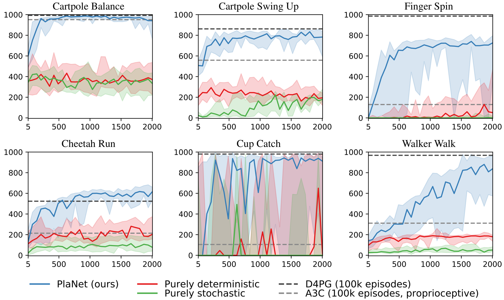<br/>
  <i>Paper Figure 5: RSSM ablation. <b>Blue = PlaNet (h+z dual path)</b>, red = pure deterministic, green = pure stochastic. On all 6 tasks, pure-RNN and pure-VAE-RNN variants are clearly worse than the dual-path RSSM</i>
</p>

**Effect of latent overshooting**:
- Only 1-step KL → short-term predictions OK, severe long-term drift
- Adding D=50 step overshooting → **long-term predictions significantly more stable**

**World model vs true simulator (quality upper bound)**:
- CEM + **true simulator** (oracle, upper bound) → best
- CEM + **PlaNet world model** → **only slightly below oracle**

→ This comparison is **the most direct evidence of world-model quality**: PlaNet's learned latent dynamics is good enough that "planning in the head" ≈ "planning in the real env". If the world model were poor, these two curves would differ by an order of magnitude.

**Effect of planning horizon H**:
- H=1 → degenerates to greedy, poor
- **H=12 → sweet spot** ⭐
- H=50 → model errors accumulate, performance drops

→ "**The world model cannot imagine too far ahead**" is an eternal pain point of model-based RL.

### 🔧 Implementation Details Deep-Dive

#### Detail ①: RSSM State Decomposition (PlaNet's Most Important Contribution)

<p align="center"></p>

```
state s_t = (h_t, z_t)
            ↑    ↑
       deterministic  stochastic
       (GRU)          (Gaussian)
```

| Variable | Type | Produced By | Role |
|----------|------|-------------|------|
| `h_t` | **Deterministic** | GRU hidden state: `h_t = GRU(h_{t-1}, z_{t-1}, a_{t-1})` | **Long-term memory**, stable |
| `z_t` | **Stochastic Gaussian** | Sampled from Encoder or Prior | **Captures uncertainty / multi-modal futures** |

**Why dual-path?** (Key insight)

| Single-path Design | Problem |
|--------------------|---------|
| **Pure deterministic** | Cannot express noise, multi-modal futures |
| **Pure stochastic** | Unstable training, long-term info washed out by noise |
| **Dual path h + z** | ✅ h guarantees stable memory, z expresses uncertainty |

→ This is the **core mathematical intuition** of RSSM: separate "stable memory of the past" and "uncertainty about the future" into two independent variables.

<p align="center">
  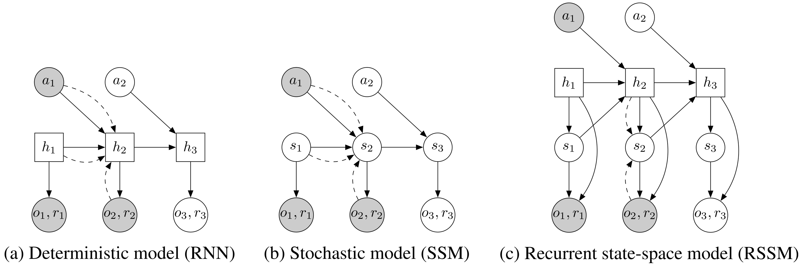<br/>
  <i>Paper Figure 1: Probabilistic graphical comparison of three dynamics models. <b>(a) RNN</b>: only deterministic h, cannot express uncertainty; <b>(b) SSM</b>: only stochastic s, long-term info easily washed out by noise; <b>(c) RSSM</b>: h (squares, deterministic) + s (circles, stochastic) coexist with distinct roles — this is PlaNet's core innovation</i>
</p>

#### Detail ②: Roles of the Four Sub-Networks

| Network | Form | When Used |
|---------|------|-----------|
| **Encoder** (Posterior) | $q(z_t \mid h_t, o_t)$ | **Training**: sees real obs, outputs posterior z |
| **Transition** (Prior) | $p(z_t \mid h_t)$ | **Planning / imagination**: predicts z without seeing obs ⭐ |
| **Reward** | $p(r_t \mid h_t, z_t)$ | Predicts reward (accumulated for return during planning) |
| **Decoder** | $p(o_t \mid h_t, z_t)$ | Reconstructs obs (**training only**, not used at deployment) |

🔑 **Core mechanism**: **At training time, use the Encoder's posterior z (supervised by obs); at planning time, use the Transition's prior z (no obs available)** — this is what enables RSSM to "imagine the future in latent space".

#### Detail ③: End-to-End ELBO Loss

PlaNet **merges World Models' separately-trained V and M into a single objective**:

<p align="center">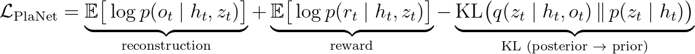</p>

Three terms optimized jointly:
- **Reconstruction term**: enables decoder to reconstruct obs from (h, z) (VAE-style)
- **Reward term**: enables reward head to predict true reward
- **KL term**: makes posterior `q(z|h, o)` close to prior `p(z|h)` (VAE-style regularizer)

→ A single gradient optimizes all 4 sub-networks, so **features automatically become decision-useful** (unlike World Models' V which only learns reconstruction).

#### Detail ④: Latent Overshooting (Long-Horizon Stability Trick)

Standard ELBO only considers "single-step prediction", but PlaNet does H=12 step planning → **multi-step predictions must all be accurate**.

<p align="center">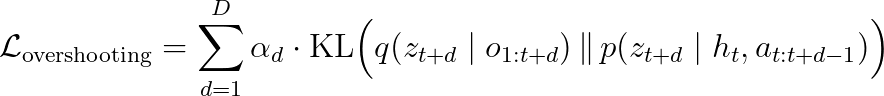</p>

Intuition:
- Make "prior prediction of z d steps ahead from time t" close to "posterior encoding of z at time t+d"
- Not only single-step accurate, **but multi-step prediction distributions must also align**
- `α_d` is the weight at each step (typically uniform)

→ This is key to PlaNet's long-horizon stability. DreamerV1 simplified to single-step KL + critic for residual values, which actually works better.

<p align="center">
  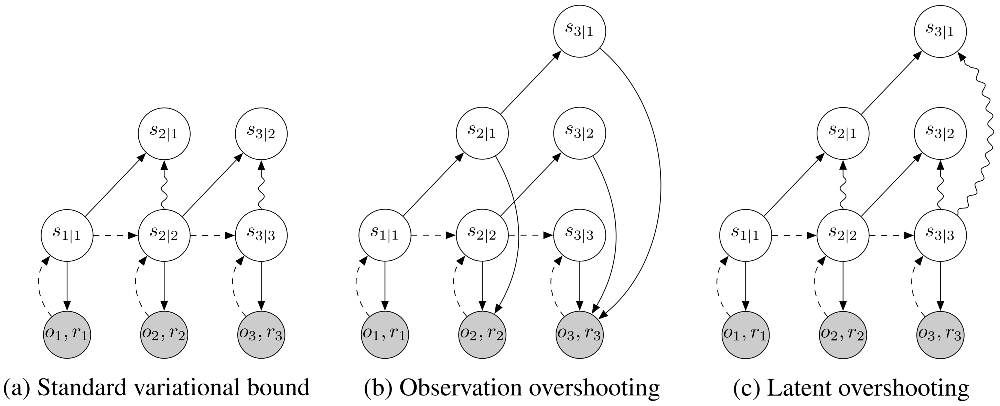<br/>
  <i>Paper Figure 3: Three training-objective variants. <b>(a) Standard ELBO</b>: only constrains adjacent steps (1-step KL); <b>(b) Observation Overshooting</b>: reconstructs observations across multiple steps (expensive); <b>(c) Latent Overshooting</b> ⭐: aligns prior and posterior KL across multiple steps in latent space — balancing accuracy and compute cost</i>
</p>

#### Detail ⑤: CEM Online Planning (No Actor!)

PlaNet **does not learn a policy network**; instead it **plans in real time** at each step:

<p align="center">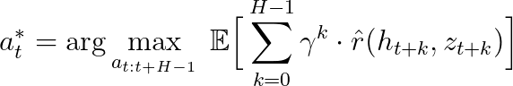</p>

```python
def plan_action(world_model, current_state):
    # Maintain a distribution over action sequences: independent Gaussian per step
    μ = zeros(H, action_dim)        # H = 12 planning horizon
    σ = ones(H, action_dim)

    for iteration in range(I):       # I = 10 CEM iterations
        # 1. Sample J candidate action sequences (J = 1000)
        action_seqs = sample_normal(μ, σ, J)

        # 2. Roll out each sequence with the world model, accumulate reward
        returns = []
        for seq in action_seqs:
            z, h = current_state
            R = 0
            for t in range(H):
                z, h = world_model.transition(z, h, seq[t])  # use prior
                R += world_model.reward(z, h)
            returns.append(R)

        # 3. Select top-K elites (K = 100)
        elite_idx = argsort(returns)[-K:]
        elite_seqs = action_seqs[elite_idx]

        # 4. Update distribution using elite mean and std
        μ = elite_seqs.mean(axis=0)
        σ = elite_seqs.std(axis=0)

    return μ[0]   # Execute only the first action, replan at the next step
```

**Key parameters**:

| Parameter | Value | Meaning |
|-----------|-------|---------|
| H (planning horizon) | 12 | Imagine 12 steps ahead |
| J (candidate sequences) | 1000 | 1000 sequences sampled per iteration |
| K (elite count) | 100 | Select top 100 |
| I (CEM iterations) | 10 | 10 convergence iterations |

**Per-step compute**: `10 × 1000 × 12 = 120,000 transition forward passes` — tens of milliseconds on GPU, but **real-time control on physical robots is challenging**. This is one of the key reasons PlaNet was superseded by Dreamer.

<p align="center">
  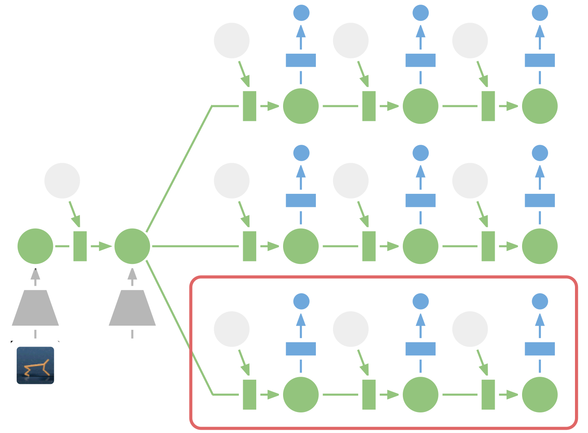<br/>
  <i>Paper Figure 4: CEM planning in latent space. Starting from the current state, multiple trajectories are rolled out in latent space (each generation of candidate action sequences); the world model predicts cumulative reward, elites are selected to update the action distribution, and the procedure iterates — <b>all without touching the real environment</b></i>
</p>

#### CEM vs CMA-ES (used by World Models)

| Dimension | CMA-ES (World Models) | CEM (PlaNet) |
|-----------|----------------------|--------------|
| Optimization target | **Controller parameters θ** | **Action sequence a_{1:H}** |
| When optimized | **Training time**, then deployed | **Each step in real-time** (online planning) |
| Covariance adaptation | Yes (Σ) | No (independent Gaussian per step) |
| Needs actor network? | Yes (linear controller) | **No!** |

### 💭 Reflections

#### Contributions and Historical Position

✅ **Contributions**

1. **RSSM dual-path latent** — the standard architecture in modern model-based RL, inherited by Dreamer V1/V2/V3
2. **End-to-end ELBO training of world models** — replaced World Models' staged training, used by countless follow-ups
3. **Latent overshooting** — long-horizon stability trick
4. **50× sample efficiency on DMC** — first time model-based comprehensively beat model-free on visual control
5. **Open-source code** — baseline for the subsequent Dreamer series

⚠️ **Limitations** (directly led to Dreamer)

1. **CEM online planning is very slow** — 120k forwards per step, hard for real-time robot control
2. **Cannot learn implicit long-term policies** — planning only 12 steps, struggles on long-horizon tasks
3. **Only solves continuous control** — CEM does not handle discrete actions elegantly
4. **Still has model exploitation** — weaker defense than World Models' τ trick

🌳 **Subsequent Impact**

- **DreamerV1 (2020)**: CEM → actor-critic + analytic gradient backprop, **tens of times faster inference + better performance**
- **DreamerV2 (2021)**: RSSM's z made discrete categorical, conquered Atari
- **DreamerV3 (2023)**: same architecture + symlog normalization, general across 150+ tasks
- **MuZero family**: borrows RSSM ideas + MCTS search
- **TWM / IRIS / DIAMOND**: transformer / diffusion variants of RSSM

#### Evolutionary Lineage

```
World Models (2018)
        │ Three stages, separate / VAE + MDN-RNN / CMA-ES
        ▼
PlaNet (2019)           ← we are here
        │ End-to-end / RSSM dual-path / CEM online planning
        ▼
Dreamer V1 (2020)
        │ Same RSSM / Actor-Critic replaces CEM / analytic gradients
        ▼
Dreamer V2/V3 (2021–2023)
        │ Discrete z / symlog / general across 150+ tasks
```

#### Reading Suggestions

1. **Watch the project page demos first**: <https://planetrl.github.io/> (2 minutes, builds intuition)
2. **Read paper Sections 3–4** (RSSM architecture + ELBO loss)
3. Skip implementation details, just run the official `cartpole-swingup` (half a day)
4. For deeper understanding, read Section 5 (latent overshooting)
5. **Immediately jump to DreamerV1** (natural progression)

#### One-Sentence Summary

> **PlaNet = end-to-end RSSM world model + CEM online planning. It turned World Models' staged training into end-to-end and introduced the «deterministic h + stochastic z» dual-path latent architecture (inherited by all subsequent Dreamer variants), making model-based RL beat model-free by 50× on pixel-based DMC for the first time. However, CEM online planning is too slow, which directly led to DreamerV1 replacing it with actor-critic + analytic gradient backprop.**

### 📚 Learning Resources

**🎬 Video Explanations**
- [**Yannic Kilcher — PlaNet paper review**](https://www.youtube.com/results?search_query=yannic+kilcher+planet) — line-by-line paper walkthrough
- [**Hafner's official intro on Google AI Blog**](https://blog.research.google/2019/02/introducing-planet-deep-planning.html)

**💻 Code & Reproductions**
- [**google-research/planet**](https://github.com/google-research/planet) — official TensorFlow implementation
- [**Kaixhin/PlaNet**](https://github.com/Kaixhin/PlaNet) ⭐ — PyTorch reproduction, recommended for learning
- [**cross32768/PlaNet_PyTorch**](https://github.com/cross32768/PlaNet_PyTorch) — another PyTorch version

**📝 Related Reading**
- Predecessor: [World Models (2018)](https://arxiv.org/abs/1803.10122) ← essential prerequisite
- Successor: [DreamerV1 (2020)](https://arxiv.org/abs/1912.01603) ← essential read
- DMC environment: [dm_control](https://github.com/google-deepmind/dm_control)

</details>

<details>
<summary><b>4.3 Dreamer v1 / v2 / v3 (2020–2023)</b></summary>

> **Papers**: [DreamerV1](https://arxiv.org/abs/1912.01603) · [DreamerV2](https://arxiv.org/abs/2010.02193) · [**DreamerV3**](https://arxiv.org/abs/2301.04104)
>
> **TL;DR**: Currently the strongest baseline in the RL school. Introduces the paradigm of «training actor-critic via latent imagination + analytic gradient backpropagation». **V3 is essential reading** — same set of hyperparameters works on 150+ tasks, Minecraft diamond from scratch.

_📝 Detailed deep-dive to be added_

</details>

<details>
<summary><b>4.4 GAIA-1 (Wayve, 2023)</b></summary>

> **Paper**: [arxiv.org/abs/2309.17080](https://arxiv.org/abs/2309.17080) · **Official blog**: <https://wayve.ai/thinking/scaling-gaia-1/>
>
> **TL;DR**: Autonomous-driving world model. Wayve uses GAIA to generate driving videos as corner-case augmentation data.

_📝 Detailed deep-dive to be added_

</details>

<details>
<summary><b>4.5 Genie / Genie 2 (DeepMind, 2024)</b></summary>

> **Papers**: [Genie](https://arxiv.org/abs/2402.15391) · **Genie 2 blog**: <https://deepmind.google/discover/blog/genie-2-a-large-scale-foundation-world-model/>
>
> **TL;DR**: Interactive generative environments. Learns action-conditioned worlds from internet videos; can generate interactive worlds without any game engine.

_📝 Detailed deep-dive to be added_

</details>

<details>
<summary><b>4.6 Sora Technical Report (OpenAI, 2024)</b></summary>

> **Technical report**: <https://openai.com/index/video-generation-models-as-world-simulators/>
>
> **TL;DR**: The narrative of «video generation as a world simulator». Catapulted the concept into the spotlight; capital and media followed rapidly.

_📝 Detailed deep-dive to be added_

</details>

<details>
<summary><b>4.7 V-JEPA / V-JEPA 2 (Meta / LeCun)</b></summary>

> **Papers**: [V-JEPA](https://arxiv.org/abs/2404.08471) · [V-JEPA 2 official page](https://ai.meta.com/vjepa/) · [I-JEPA](https://arxiv.org/abs/2301.08243)
>
> **TL;DR**: Non-generative, predictive-embedding route. LeCun's «anti-Sora» approach — do not predict pixels, only predict abstract representations.

_📝 Detailed deep-dive to be added_

</details>

<details>
<summary><b>4.8 Other Notable Work</b></summary>

- [**1X World Model**](https://www.1x.tech/discover/1x-world-model) (humanoid robots, 1X Technologies)
- [**Oasis**](https://oasis-model.github.io/) (Decart, real-time Minecraft generation)
- [**DIAMOND**](https://arxiv.org/abs/2405.12399) (NeurIPS 2024, [code](https://github.com/eloialonso/diamond)) — Atari visuals are stunning, clean codebase, a good starting point for replicating generative world models

</details>


---

## V. Reference Materials
<details>
<summary><b>5.1 Hands-On Practice</b></summary>

Minimum-cost path to a working run:
```bash
# Official Dreamer v3 implementation
pip install dreamerv3
# or clone: https://github.com/danijar/dreamerv3
```
- Start by running Dreamer v3 on [`CartPole`](https://gymnasium.farama.org/environments/classic_control/cart_pole/) / [`Crafter`](https://github.com/danijar/crafter)
- Then try [`MineRL`](https://github.com/minerllabs/minerl) or [Atari 100k](https://github.com/google-research/rliable)
- For the generative side, experiment with [**open-source Genie reproduction**](https://github.com/1x-technologies/1xgpt) or [**DIAMOND**](https://github.com/eloialonso/diamond) (stunning Atari visuals, clean code)

</details>

<details>
<summary><b>5.2 Filling in the Theoretical Foundations</b></summary>

- **Variational inference / VAE** (latent modeling) — [Kingma's original paper](https://arxiv.org/abs/1312.6114) · [Lil'Log tutorial](https://lilianweng.github.io/posts/2018-08-12-vae/)
- **RNN / Transformer / SSM (Mamba)** (temporal dynamics) — [Mamba paper](https://arxiv.org/abs/2312.00752)
- **Diffusion models** (essential for the generative school) — [DDPM](https://arxiv.org/abs/2006.11239) · [Lil'Log diffusion survey](https://lilianweng.github.io/posts/2021-07-11-diffusion-models/)
- **Model-based RL fundamentals** — [Sutton & Barto, *Reinforcement Learning*, Chapter 8 (free PDF)](http://incompleteideas.net/book/RLbook2020.pdf)

</details>


<details>
<summary><b>5.3 Core Readings</b></summary>

- [**A Path Towards Autonomous Machine Intelligence**](https://openreview.net/pdf?id=BZ5a1r-kVsf) — Yann LeCun white paper and JEPA worldview
- [**Danijar Hafner's homepage**](https://danijar.com/) — author of the Dreamer series; code, papers, and lectures are all available
- [Meta AI Blog: V-JEPA](https://ai.meta.com/blog/v-jepa-yann-lecun-ai-model-video-joint-embedding-predictive-architecture/)

</details>

<details>
<summary><b>5.4 Survey Papers</b></summary>

- [*World Models for Autonomous Driving: A Survey*](https://arxiv.org/abs/2403.02622) (2024)
- [*A Survey of World Models for Autonomous Driving*](https://arxiv.org/abs/2501.11260) (2025)
- [*General World Models: A Survey*](https://arxiv.org/abs/2405.03520) (2024)

</details>

<details>
<summary><b>5.5 Blog & Resource Collections</b></summary>

- [**Lil'Log**](https://lilianweng.github.io/) — Lilian Weng, with RL/world-model-related surveys
- [**The Gradient**](https://thegradient.pub/)
- [**Awesome-World-Model**](https://github.com/LMD0311/Awesome-World-Model) — continuously updated GitHub resource collection

</details>

---

_Last updated: 2026-05-03_
