# World Model 学习笔记

**🌐 Language**: **中文** · [English](World-Model-Study-Notes.md)

> 整理自 2026 年 4–5 月的学习讨论。按「是什么 → 为什么重要 → 流派对比 → 怎么入门」的逻辑组织。
>
> 💡 每章使用可折叠区块,点击 ▶ 标题即可展开/收起。

---

## 目录

- [一、World Model 是什么](#一world-model-是什么)
- [二、为什么 World Model 火?实际价值在哪?](#二为什么-world-model-火实际价值在哪)
- [三、三大流派深入对比](#三三大流派深入对比)
- [四、必读论文](#四必读论文)
- [五、参考资料汇总](#五参考资料汇总)

---

## 一、World Model 是什么

<details>
<summary><b>展开 / 收起</b></summary>

World Model(世界模型)是 AI agent 领域的热门方向,核心思想是让模型学会**预测环境未来状态**,从而支持规划、决策和想象式推理。

目前主要分三大流派(详见 [§3](#三三大流派深入对比)):

| 流派 | 代表 | 预测对象 |
|------|------|---------|
| **生成式 / 视频派** | Sora、Genie、GAIA | 像素 / 视频帧 |
| **Latent Dynamics(RL 派)** | Dreamer v1/v2/v3、PlaNet | latent state(带像素重建) |
| **JEPA(预测式表征派)** | I-JEPA、V-JEPA、V-JEPA 2 | 抽象 embedding(无重建) |

先明确所关心的流派,学习路径差别很大。

</details>

---

## 二、为什么 World Model 火?实际价值在哪?

<details>
<summary><b>2.1 为什么突然火起来</b></summary>

**1. LLM 撞墙了,需要新叙事**
纯语言模型在物理推理、长程规划、具身任务上表现差。业界共识:**光靠文本预测下一个 token,学不到真正的物理常识**。LeCun 带头喊「LLM 是死胡同」,JEPA / World Model 成了替代路线的旗帜。

**2. Sora 出圈(2024 初)**
OpenAI 把 Sora 定位为 "world simulator" 而不是视频生成器,直接把这个概念推成顶流。资本和媒体迅速跟进。

**3. 具身智能 / 机器人 / 自动驾驶爆发**
特斯拉 FSD、Wayve、1X、Figure、Physical Intelligence 都需要一个东西:**在部署前大规模、低成本地模拟真实世界**。真机采数据太贵太慢,world model 是唯一可扩展方案。

**4. 技术条件成熟**
- Diffusion + Transformer 让视频生成质量跨过可用门槛
- Dreamer v3 首次证明**同一套超参**能解 150+ 任务,包括 Minecraft 钻石(纯 model-based,世界首次)
- 算力和数据规模起来了

**5. Scaling Law 需要新战场**
文本数据快用完了,视频/交互数据是下一个金矿,world model 是消化这些数据的自然架构。

</details>

<details>
<summary><b>2.2 实际价值(按落地成熟度排序)</b></summary>

#### ✅ 已经在赚钱 / 明确有用

**1. 自动驾驶仿真**
- [Wayve GAIA-1](https://wayve.ai/thinking/scaling-gaia-1/) / [GAIA-2](https://wayve.ai/thinking/gaia-2/)、[英伟达 Cosmos](https://www.nvidia.com/en-us/ai/cosmos/)、特斯拉内部模型
- 价值:生成海量 corner case(暴雨、突然冲出的行人),**把单公里测试成本从几美元降到几分钱**
- 解决真实路测**长尾数据**采不到的根本问题

**2. Model-based RL(机器人控制)**
- [Dreamer 系](https://danijar.com/project/dreamerv3/)在真实机器人上已经能做到**几小时真机数据学会新技能**(传统 model-free 要几天)
- Google DeepMind、[1X](https://www.1x.tech/discover/1x-world-model)、[Physical Intelligence](https://www.physicalintelligence.company/) 都在用
- 价值:**样本效率提升 1–2 个数量级**,真机训练才可行

**3. 游戏 / 内容生成**
- [Genie 2](https://deepmind.google/discover/blog/genie-2-a-large-scale-foundation-world-model/)、[Oasis](https://oasis-model.github.io/)(Minecraft 实时生成)、[DIAMOND](https://github.com/eloialonso/diamond)
- 价值:**无需游戏引擎**就能生成可交互世界,长期看可能颠覆游戏开发流程

#### 🟡 有潜力但尚未规模化

**4. Agent 规划 / 推理**
- 给 LLM agent 一个 world model,让它"在脑子里"试错再行动
- 类似人类的"想象力",是通往 AGI 的关键拼图之一

**5. 科学仿真**
- 流体、天气、材料、蛋白动力学
- [GraphCast](https://deepmind.google/discover/blog/graphcast-ai-model-for-faster-and-more-accurate-global-weather-forecasting/)、[AlphaFold](https://alphafold.ebi.ac.uk/) 某种意义上就是领域专用 world model
- 价值:比传统数值模拟快 1000–10000 倍

**6. 视频生成 / 影视**
- [Sora](https://openai.com/sora/)、[可灵 Kling](https://kling.kuaishou.com/)、[Runway](https://runwayml.com/)
- 价值:内容生产力工具,但"物理真实"仍不达标

#### 🔴 还在画饼

- 通用物理推理引擎
- 真正的"心智模拟器"用于通用 Agent
- 端侧实时世界模型

</details>

<details>
<summary><b>2.3 冷静看待:真实的局限</b></summary>

1. **评估极难** — 什么叫"世界建模得好"?没有公认指标,容易自欺欺人
2. **长时序不稳定** — 目前生成几十秒后就开始漂移、违反物理
3. **算力贵** — 训一个像样的视频 world model 成本 > 训 LLM
4. **LeCun 的 JEPA 路线尚未证明能 scale** — 还是愿景阶段
5. **"World Model" 有被滥用嫌疑** — 很多公司把普通视频生成包装成 world model 炒估值

</details>

<details>
<summary><b>2.4 一句话总结</b></summary>

> **短期价值在机器人和自动驾驶的仿真训练(已经赚到钱);长期价值在于它可能是 LLM 之后的下一代 AI 基础架构 —— 让模型真正"理解"而不是"背诵"世界。**

</details>

---

## 三、三大流派深入对比

<details>
<summary><b>3.1 三大世界模型流派总览</b></summary>

| 流派 | 代表 | 预测对象 | 目标 |
|------|------|---------|------|
| **生成式 World Model** | Sora、Genie、GAIA、DIAMOND | **像素 / 视频帧** | 生成可视化的未来 |
| **Latent Dynamics(RL 派)** | Dreamer v1/v2/v3、PlaNet | **latent state**(但仍带重建损失) | 服务于 model-based RL 规划 |
| **JEPA(预测式表征)** | I-JEPA、V-JEPA、V-JEPA 2 | **抽象 embedding**,不重建像素 | 学习世界的结构化表征 |

</details>

<details>
<summary><b>3.2 JEPA 的核心主张</b></summary>

JEPA 是 LeCun 力推的**第三条路线**,自成一派 —— 「预测式表征学习(Predictive Embedding)」。

LeCun 的观点很鲜明:

> **"不要预测像素,预测表征。"**

**原因**:
- 像素级预测浪费算力在无关细节上(云的形状、树叶抖动)
- 世界本质上不可完全预测,强行重建会学到噪声
- 人脑也不是在"脑内渲染 4K 视频",而是在抽象层面预测

**做法**:
- 用 encoder 把观测映射到 latent
- 用 predictor 在 **latent 空间**预测被遮挡/未来部分的 embedding
- 用 **stop-gradient + EMA target encoder** 防止坍塌(类似 BYOL / DINO)
- **没有 decoder,不做像素重建**

</details>

<details>
<summary><b>3.3 JEPA vs Dreamer 的关键区别(容易混)</b></summary>

两者都在 latent 空间预测,但:

| | Dreamer | JEPA |
|---|---------|------|
| 是否重建像素 | **是**(reconstruction loss 是核心监督) | **否**(纯 embedding 预测) |
| 训练信号 | 重建 + 奖励 + KL | embedding 距离 + 防坍塌 |
| 目标 | model-based RL,会用 world model 做 rollout 规划 | **自监督表征学习**,下游再接任务 |
| 是否能"想象"出画面 | 能(有 decoder) | **不能**(这是有意为之) |

所以严格说:**Dreamer 是"latent 但仍生成式"**,JEPA 才是真正的"非生成式"。

</details>

<details>
<summary><b>3.4 JEPA 现状(2024–2026)</b></summary>

**进展**
- I-JEPA(图像,2023)、V-JEPA(视频,2024)、**V-JEPA 2(2024 末)** — 在动作预测、物理理解 benchmark 上表现不错
- Meta 押注很重,LeCun 本人的旗舰项目

**质疑**
- 尚未展示 Sora / Dreamer 级别的**惊艳 demo**(因为没 decoder,demo 不直观)
- Scaling 到底行不行还没定论
- 社区大部分还是在生成式路线上卷

**一句话定位**:

> **JEPA 是 LeCun 赌的"反 Sora"路线:用抽象表征而非像素来建模世界,理论优雅但工程证据还不够。目前属于「学术声量大、产业落地少」的阶段。**

</details>

---

## 四、必读论文

<details>
<summary><b>4.0 前置概念:Model-Free vs Model-Based RL</b></summary>

理解 World Model 的前提是先理解它在 RL 谱系里的位置。

### 「环境」是什么

环境(Environment)= **把动作变成下一状态和奖励的「黑盒」**。数学上由两个函数定义:

```
状态转移:  P(s_{t+1} | s_t, a_t)     "做了这个动作,下一步会变成什么"
奖励函数:  R(s_t, a_t)                "做了这个动作,得到多少分"
```

### 两种学习范式

**🔴 Model-Free —— 不学习环境**

Agent 把环境当**纯黑盒**:可以试动作、可以收到反馈,但**不去预测**"做 X 会怎样",只学"**这个状态下选哪个动作能拿高分**"。

- 类比:第一次玩马里奥,失败 1000 次,记住 1000 个"成功模式",但不研究跳跃物理
- DQN 的做法:输入画面 → 输出 18 个动作的 Q 值 → argmax,**从不预测下一帧**

**🟢 Model-Based / World Model —— 学习环境**

Agent 主动学一个**环境的副本**(世界模型),然后在脑子里推演。

- 类比:学会"按 A 键 → 跳 4 格"、"碰蘑菇头 → 死",可以在脑子里预演
- Dreamer 的做法:学 RSSM 预测下一个 latent + 奖励,在虚拟环境里"做梦"训 actor-critic

### 关键澄清:模型 ≠ 策略 ≠ 价值

容易混淆这三个词:

| 概念 | 学的是什么 | 谁有 |
|------|----------|------|
| **环境模型** (model) | `P(s' ∣ s,a)` 和 `R(s,a)` —— **物理规律** | 仅 model-based |
| **价值函数** (value) | `V(s)` 或 `Q(s,a)` —— **某状态有多好** | 两者都可有 |
| **策略** (policy) | `π(a ∣ s)` —— **在某状态选什么动作** | 两者都可有 |

→ **Model-free 学「该做什么」(策略/价值),但不学「世界怎么运作」(模型)**
→ **Model-based 学「世界怎么运作」(模型),然后推出「该做什么」**

### 全面对比

| 维度 | Model-Free | Model-Based |
|------|-----------|-------------|
| 是否学环境模型 | ❌ | ✅ |
| 样本效率 | **低**(需要海量交互) | **高**(可以"梦里训练") |
| 推理算力换性能 | ❌ 固定 | ✅ 可线性 scale |
| 跨任务迁移 | ❌ 几乎为零 | ✅ 大部分保留 |
| 工程复杂度 | 相对简单 | 复杂(要训世界模型) |
| 训练稳定性 | 较稳 | 易被模型误差坑(model exploitation) |
| 经典代表 | DQN、PPO、SAC | World Models、Dreamer、MuZero |

### Model-Free 代表算法谱系

```
┌─ Value-based ─────────────────────────┐
│  Q-learning → DQN → Rainbow → R2D2    │
└───────────────────────────────────────┘

┌─ Policy-based ────────────────────────┐
│  REINFORCE → TRPO → PPO ⭐ 最常用     │
└───────────────────────────────────────┘

┌─ Actor-Critic ────────────────────────┐
│  A3C → DDPG → TD3 → SAC ⭐ 连续控制   │
└───────────────────────────────────────┘
```

### 🚀 Model-Based 的真正价值:不是"省数据",是"学规律"

许多人理解 Model-Based 时只盯着「样本效率」一条优势,**但这只是表象**。

**根本差异**:
- Model-Free 学「**这个任务里该做什么**」(任务答案)
- Model-Based 学「**世界如何运作**」(物理规律)

这一个根本差异,带来**三个独立的外在表现**:

```
        Model-Based 学到世界规律
                  │
        ┌─────────┼─────────┐
        ▼         ▼         ▼
    ① 样本效率高   ② 推理算力可 scale   ③ 跨任务迁移
       100-1000×        无上限              几乎完全保留
```

下面逐一展开。

---

#### 优势 ①:样本效率高出 100-1000 倍

| 任务 | Model-Free | Model-Based | 提升 |
|------|-----------|-------------|-----|
| Atari Breakout | DQN/Rainbow **2 亿帧** | DreamerV3 **2000 万帧** | 10× |
| Atari 100k | Rainbow 很差 | EfficientZero 接近人类 | 巨大 |
| Crafter | PPO 几千万步,~10 分 | DreamerV3 **100 万步**,~14 分 SOTA | 30×+ |
| 真机机器人抓取 | PPO 几个月真机数据 | Dreamer 类 **几小时** | 1000× |

**为什么效率这么高?** 五个根本机制的复利效应:

| # | 机制 | 一句话说明 |
|:---:|------|----------|
| **1** | **学规律 vs 学数据点** | 网络权重存的是"物理规律"(可外推),不是"状态价值"(只能插值) |
| **2** | **梦境数据增强** | 1 条真实经验 → 训世界模型 → 梦里 rollout 几百次虚拟经验,policy 训练信号放大几百倍 |
| **3** | **自由起点探索** | 真实环境只能 reset 到初始,梦境可以任意 reset 到任何 latent state(零代价试错) |
| **4** | **解析梯度反传** ⭐ | 整条想象链可微,梯度精确反传(O(1) 样本)vs Monte Carlo 估计的高方差(O(N) 样本) |
| **5** | **长程预演** | GPU 上 15 步 latent rollout 只需 1.5ms,代替真实环境 1000 步的等待 |

💡 **直观类比 —— 学开车**:
- 🔴 Model-Free:想学下雪天开车?**必须等下雪**;想学侧翻救车?**必须真侧翻**
- 🟢 Model-Based:**真开 100 小时学会方向/刹车/摩擦力的规律**,然后**在脑中预演 10000 个 corner case**

→ 各机制的工程细节在 [§4.3 Dreamer](#43-dreamer-v1--v2--v3-2020–2023) 节会进一步展开。

---

#### 优势 ②:推理时算力换性能(Test-Time Compute Scaling)⭐ 最被忽视

**Model-Free** 的算力分配:
```
训练阶段:海量算力训 Q / Policy 网络
推理阶段:网络前向一次 → 出动作 (毫秒级)
```
→ 推理算力**固定**,给 1 秒还是 1 分钟,**输出动作相同**。性能上限就卡死。

**Model-Based** 的算力分配:
```
训练阶段:训世界模型
推理阶段:用世界模型 rollout
  - 给 1 秒  → CEM 跑 10 次迭代,选还行的动作
  - 给 1 分钟 → CEM 跑 600 次迭代,选更优的
  - 给 1 小时 → 几乎找到最优解
```
→ **推理时多花算力,性能直接更好**(只要世界模型够准)。

##### 经典案例:AlphaGo

Silver 2017(PlaNet 段 2 引用的这篇)的核心洞察:
- 训练好神经网络后,**推理时 MCTS 跑多少次直接决定棋力**
- 给 1 秒 → 业余高手
- 给 1 分钟 → 职业棋手
- 给 1 小时 → 超越人类世界冠军

##### 当代意义:o1 / o3 与"推理算力新增长曲线"

这个理念在 2024–2025 在 LLM 圈大爆发:

| 趋势 | 体现 |
|------|------|
| **OpenAI o1 / o3** | 推理时延长 chain-of-thought,性能持续提升 |
| **Q\* / MCTS + LLM** | 把 search 引入 LLM 推理 |
| **Test-time compute scaling** | 已成为 2025+ AGI 路线的关键词 |

→ 训练时 scaling(GPT-3/4)有上限;**推理时 scaling 是下一条增长曲线** —— 而它**必然需要某种 world model + search**。

→ Model-Based 范式**天然支持「算力换性能」**,Model-Free 给不了。

---

#### 优势 ③:跨任务迁移性

**为什么 Model-Free 不能迁移?**

Model-Free 学的是 `Q(s, a)` 或 `π(a|s)` —— Q 函数**和奖励紧密耦合**。换个任务、换个奖励,Q 完全作废,**从头学**。

**为什么 Model-Based 能迁移?**

Model-Based 学的是 `P(s' | s, a)` —— **转移函数只关心物理规律,和奖励无关**。换个任务,**转移函数仍然有效**。

##### 具体例子

| 新任务 | Model-Free | Model-Based |
|--------|-----------|-------------|
| "抓杯子" → "叠衣服" | **从头重训 Q** | **世界模型不变**,只需训新 reward head |
| "平地走" → "上楼梯" | **从头重训 Q** | **世界模型不变**(腿的物理一样) |
| 改 reward 形状(稀疏→密集) | **重训 Q** | **零修改** |

##### 当代意义:机器人基础模型 + LLM Agent

这个特性在 2024–2026 正在被兑现:

| 方向 | 体现 |
|------|------|
| **机器人基础模型**(Octo / OpenVLA / RT-X) | 训一个通用 dynamics → 部署到多任务 |
| **LLM Agent** | LLM 是某种语义级世界模型,同一模型做编程/推理/规划 |
| **LeCun JEPA 路线** | 核心论点正是「学世界规律 → 跨任务迁移」 |

---

#### 三者本质上是同一件事

回到根本差异:

```
                Model-Based 学「世界规律」
                          │
              不是"任务答案",是"物理 / 转移"
                          │
        ┌─────────────────┼─────────────────┐
        ▼                 ▼                 ▼
   ① 样本效率高      ② 推理 scale       ③ 跨任务迁移
   一条经验榨出      规律可任意推演,    规律对所有任务有效
   更多监督信号      算力越多越准
```

**核心洞察**:**三个优势不是三件独立的事,而是「学习世界规律 vs 学习任务策略」这一根本差异的三种表现**。理解了这点,就理解了为什么 World Model 是通向 AGI 的关键路线(而不只是"提升样本效率的技巧")。

---

### 代价(没有免费午餐)

| 维度 | Model-Free | Model-Based |
|------|-----------|-------------|
| ✅ 优势 | 简单、稳定、工程门槛低 | 三大优势(见上) |
| ❌ 代价 | 样本贪婪、推理算力固定、不可迁移 | GPU 算力 ↑、工程复杂、易被模型误差坑(model exploitation) |

→ Model-Based **省的是真实数据,花的是 GPU 算力 + 工程复杂度**。

### 当下共识

- **数据廉价**(模拟器、游戏、LLM RLHF) → model-free 仍然主流
- **数据昂贵 / 需要规划 / 需要想象**(真机机器人、自驾、Agent) → world model 是未来
- **AGI 路线**:几乎所有人(Sutton、LeCun、Hassabis)都认为通用智能**必须包含 world model**

### 🎯 一句话总结

> **Model-Free RL 学「这个任务里该做什么」,Model-Based 学「世界如何运作」。这一个根本差异带来三个根本优势:① 样本效率高 100-1000 倍 ② 推理时算力可换性能(test-time scaling)③ 跨任务迁移 —— 三者其实是同一件事的三种表现。简单稳定的 Model-Free 在数据廉价场景仍是主流,但 Model-Based / World Model 是机器人、自驾、AGI 的必经之路。**

</details>

<details>
<summary><b>4.1 World Models (Ha & Schmidhuber, 2018)</b></summary>

> **论文**:[arxiv.org/abs/1803.10122](https://arxiv.org/abs/1803.10122) · **交互式网站**(强烈推荐):<https://worldmodels.github.io/>
>
> **要点**:经典起点,VAE + MDN-RNN + 小 controller,第一次在梦境里训练 agent 并迁移到真实环境。

这篇论文是现代 World Model 研究的**起点和精神图腾**。影响力不在性能多炸裂,而在于第一次清晰展示了:**Agent 可以在自己"做的梦"里学会玩游戏。**

<p align="center">
  <br/>
  <i>开篇引子:Scott McCloud《Understanding Comics》中的"心智模型"</i>
</p>

### 📖 核心思想

#### 把 Agent 拆成三块

<p align="center">
  <br/>
  <i>整体架构:V (Vision) → M (Memory) → C (Controller)</i>
</p>

```
   观察 ─►  V (Vision)  ─►  M (Memory)  ─►  C (Controller)  ─►  动作
            压缩当下          预测未来          决策(很小)
```

| 模块 | 角色 | 实现 | 参数量 |
|------|------|------|--------|
| **V** — Vision | 把高维图像压成低维表示 | **VAE**(变分自编码器) | ~4M |
| **M** — Memory | 学习世界的时间动力学,预测下一步 latent | **MDN-RNN**(混合密度网络 + LSTM) | ~400K |
| **C** — Controller | 根据 V 和 M 的信息选动作 | **单层线性网络** | ~1K |

<p align="center">
  <br/>
  <i>Agent 内部数据流:观察 → z → action,h 在 M 内部循环</i>
</p>

🔑 **关键洞察**:把"感知"和"记忆"做成大模型,把"决策"做得**极小**。决策器小到可以用**进化算法(CMA-ES)** 而不是反向传播来优化。

#### 各模块拆解

**V:VAE 压缩视觉**

<p align="center">
  <br/>
  <i>VAE 流程:图像 → encoder → latent z → decoder → 重建图像</i>
</p>

- 输入 64×64×3 游戏画面 → 输出 **32 维 latent `z`**
- 用随机策略采集帧,自监督训练(标准 VAE:重建 + KL)

**M:MDN-RNN 学习动力学**

<p align="center">
  <br/>
  <i>MDN-RNN:LSTM 输出高斯混合分布的参数,采样得到下一步 z</i>
</p>

**M 的一次前向计算**:
```
输入:  (z_t, a_t, h_t)        ← 当前 latent + 动作 + 上一时刻 LSTM 隐藏状态
输出:
  ① (π, μ, σ)                 ← z_{t+1} 的高斯混合分布参数(MDN 部分)
                                 采样后得到下一帧 latent:z_{t+1} ~ Σ π_k · N(μ_k, σ_k²)
  ② h_{t+1}                   ← 新的 LSTM 隐藏状态(下一步用)
  ③ done_logit                ← 是否结束的概率(sigmoid 后)
```

- 为什么是分布?真实世界不可完全预测,用 **MDN(高斯混合)** 捕获多模态不确定性
- **温度 τ** 控制采样随机性:τ 越高梦境越混乱,τ 越低越确定
- 同样的 MDN-RNN 思路也用于 SketchRNN(预测下一笔笔画):

  

> 💡 **z 和 h 的关系澄清**:World Models 这里 **z 和 h 是「主从分离」关系** —— z 是 VAE 独立预训练的输出(只学视觉重建),h 只是 MDN-RNN 内部的「工作记忆」,辅助预测下一步 z。Controller 可选择只用 z、或用 [z, h](论文消融:CarRacing 上 [z, h] 提分 40%)。这与后来 PlaNet 的 **RSSM 双路 state**(联合训练、s 同时学视觉+动力学、(h, s) 共同构成统一环境状态)是**不同的设计哲学** —— 详见 §4.2 对比表。

**C:超小 Controller**
```python
a_t = W_c · [z_t, h_t] + b_c    # 就一个线性层
```
- 用 **CMA-ES** 黑盒优化几百个参数,无需反向传播
- 哲学意义:**复杂认知交给世界模型,决策本身可以很简单**(像人开车)

<p align="center">
  <br/>
  <i>类比:棒球击球手凭"内部预测模型"在毫秒内反应,而不是显式规划</i>
</p>

#### 训练流程(三阶段,完全解耦)

World Models 用一个**分阶段、不端到端**的训练流程,每个阶段单独训完才进下一阶段。

**🗺️ 三阶段速览**(含核心公式):

**阶段 1**:随机动作收集 10000 局回放数据

<p align="center"></p>

**阶段 2(a)**:训 VAE(只看图像)→ V

<p align="center"></p>

**阶段 2(b)**:训 MDN-RNN(看 z 和 a 的序列)→ M

<p align="center"></p>

**阶段 3**:冻结 V 和 M,CMA-ES 训 Controller

<p align="center"></p>

**阶段 4**(部署 / 推理):把训好的 C 放回真实环境

<p align="center"></p>

下面逐阶段详细解释。

##### 阶段 1:用随机策略收集真实数据

**🎯 目的**:让世界模型见过尽可能多样的状态(包括死亡、碰撞等边角情况),所以**用随机策略**而不是强策略。

**核心公式**:
<p align="center"></p>

即:在真实环境中按均匀随机策略采样,收集 (观察, 动作) 序列。

**具体代码**:
```python
data = []
for episode in range(10000):
    obs = env.reset()
    done = False
    while not done:
        a = env.action_space.sample()    # 随机动作
        obs_next, reward, done = env.step(a)
        data.append((obs, a))            # 只存观察和动作
        obs = obs_next
```

- **规模**:VizDoom 收集 ~10000 局,每局几百帧 → 总共几百万帧
- **存储**:VAE 训练只需要 `obs`,M 训练需要 `(obs, a)` 序列
- **不需要 reward**:阶段 1 完全不依赖奖励信号(这是 World Models 范式的灵活性)

##### 阶段 2(a):训 VAE → 得到 V

**🎯 目的**:学一个**压缩-重建**模型,把 64×64×3 像素压成 32 维 latent z,作为后续 M 和 C 的输入特征。

**核心公式**(VAE ELBO):
<p align="center"></p>

- 编码器:`q(z|o) = N(μ_φ(o), σ_φ(o)²)` —— 把图像编码成高斯分布
- 解码器:`p(o|z)` —— 从 z 重建图像
- **结果**:`encode: o → z`(32 维) + `decode: z → o`

**具体代码**:
```python
for epoch in range(N):
    for batch in shuffle(data):
        obs = batch.obs                  # 64×64×3 像素
        mu, sigma = VAE.encoder(obs)     # 输出 latent 分布参数
        z = mu + sigma * randn()         # reparameterization
        obs_recon = VAE.decoder(z)       # 重建图像

        loss = MSE(obs_recon, obs) + KL(mu, sigma)
        loss.backward()
```

- **单纯无监督** —— 只看 obs,完全不看 action / reward
- **冻结 V** —— 下阶段不再更新

##### 阶段 2(b):训 MDN-RNN → 得到 M

**🎯 目的**:学一个**时序预测**模型,让 M 能根据 `(当前 z, 当前动作, 历史记忆 h)` 预测**下一个 z 的概率分布**以及是否结束。

**核心公式**:
<p align="center"></p>

其中 z 的预测分布是 K 个高斯的混合:
<p align="center"></p>

- LSTM 输出 `(π, μ, σ)` 作为混合分布参数
- 训练目标:让真实的 `z_{t+1}` 在这个分布下概率最大

**具体代码**:
```python
# 先用 V 把所有 obs 编码成 z 序列
for episode in data:
    z_seq = [VAE.encode(obs) for obs in episode.obs]
    a_seq = episode.actions

for epoch in range(N):
    for (z_seq, a_seq) in episodes:
        h = zeros(256)
        for t in range(len(z_seq) - 1):
            (π, μ, σ), h, done_logit = M(z_seq[t], a_seq[t], h)
            loss_z = -log_mixture_gaussian(z_seq[t+1], π, μ, σ)
            loss_done = BCE(done_logit, real_done[t])
            loss = loss_z + loss_done
            loss.backward()
```

- **冻结 M** —— 下阶段不再更新

##### 阶段 3:用 CMA-ES 在梦境里训 C

**🎯 目的**:让 Controller 学会"在梦里能拿高分"的策略 —— 完全不碰真实环境,只用 V+M 构成的虚拟世界来训。这是 **VizDoom Take Cover** 的做法(CarRacing 用真实环境训,见下文)。

**核心公式**:
<p align="center"></p>

- 目标:找到使**梦境累积奖励**最大的 Controller 参数
- `r_t = +1`(每存活一帧,VizDoom 的奖励规则)
- 用 **CMA-ES**(无梯度黑盒优化)而非反向传播

**梦境 rollout 函数**:
```python
def dream_rollout(controller_params):
    """完全在 M 里跑一局,返回 fitness"""
    z = sample_initial_z()           # 从真实数据里抽一个起点 z
    h = rnn.initial_state()
    cumulative_reward = 0
    while True:
        a = C_apply(controller_params, [z, h])         # ← 用候选参数算动作
        (π, μ, σ), h, done_logit = M(z, a, h)           # ← M 当虚拟环境
        z = sample_mdn(π, μ, σ, temperature=1.15)       # ← 温度防作弊
        if sigmoid(done_logit) > random():
            break
        cumulative_reward += 1                          # 活一帧 +1
    return cumulative_reward
```

**CMA-ES 进化优化循环**:
```python
es = CMAES(initial_mean=zeros(C.param_count), sigma=0.1)
for generation in range(800):
    # 1. CMA-ES 生成一批候选参数(population_size=64)
    candidates = es.ask()
    # 2. 每个候选都跑 N 次梦境,平均 fitness
    fitnesses = [
        mean([dream_rollout(c) for _ in range(16)])
        for c in candidates
    ]
    # 3. 把 fitness 反馈给 CMA-ES,它会更新分布
    es.tell(candidates, fitnesses)

best_C = es.best_solution()           # 训好的 Controller
```

- **无梯度**:CMA-ES 是黑盒优化,只看 fitness 不看梯度
- **并行友好**:64 个候选可同时跑梦境(GPU batch)
- **多次评估**:每个候选 rollout 16 次取均值,降低梦境随机性带来的噪声

<details>
<summary><b>📌 概念补充:CMA-ES 详解 + 为什么不用反向传播 / Bellman?</b></summary>

**CMA-ES** = Covariance Matrix Adaptation Evolution Strategy(协方差矩阵自适应进化策略),Nikolaus Hansen 1996 年提出,是**黑盒连续优化**最成功的进化算法之一。

> ⚠️ **符号约定**:标准 CMA-ES 文献用 **C** 表示协方差矩阵,但 World Models 论文里 **C** 已经被用作 **Controller** 的代号。为避免混淆,本节用 **Σ**(标准统计学符号)表示协方差矩阵。所以"Controller C"和"协方差 Σ"是两个完全不同的对象。

---

### Part 1:CMA-ES 是什么 —— 三句话原理

1. **维护一个多元高斯分布** $\mathcal{N}(m, \sigma^2 \Sigma)$ 描述「当前估计的最优解可能位置」
2. **每一代撒 λ 个候选,选最好的 μ 个**(μ ≈ λ/2)
3. **更新均值 m、协方差 Σ、步长 σ**,让分布慢慢"瞄准"最优区域

**比喻 —— 蒙眼找山顶**:撒一群人到当前位置周围 → 让他们汇报海拔 → 看最高的几个人在哪个方向 → 集体往那边移动 → 同时调整撒人的形状(椭球)和范围(步长)。

#### 🖼️ 直观看一眼:CMA-ES 怎么收敛?

<p align="center">
  <br/>
  <i>CMA-ES 在 2D 目标函数 f(x,y) = −((x−3)² + 5(y+1)²) 上的进化过程。绿色三角是真实最优 (3, −1),红星是当前均值 m,红色椭圆是当前 N(m, σ²C) 的 2σ 范围,白点是采样的候选,黄色圈是选出来的 top-μ。20 代就稳稳收敛到最优。</i>
</p>

注意观察:
- **第 0 代**:m 在 (0, 0),椭圆是圆(C = I),范围大
- **第 3 代**:m 已经被往右下方向"拖"走(top-μ 都在那边),椭圆开始变扁
- **第 8 代**:m 接近真实最优,椭圆继续缩小、变成扁长形(因为 y 方向梯度更陡)
- **第 20 代**:几乎完美收敛

#### 每代 5 步循环

<p align="center">
  <br/>
  <i>CMA-ES 每代的 5 步流程图</i>
</p>

```
① 采样:x_i = m + σ·B·D·z_i,  z_i ~ N(0, I)
② 评估:计算 f(x_i)
③ 排序:按 fitness 排,取前 μ 个
④ 更新均值:m_new = Σ w_i · x_i
⑤ 更新协方差 Σ 和步长 σ(看进化路径)
```

关键超参:**λ** (population) = 16~64,**μ** = λ/2,**σ** 初始 = 0.1,代数 = 几百到几千。

#### 🔍 步骤①里的 B 和 D 是什么?

$B$ 和 $D$ 是协方差矩阵 $\Sigma$ 的**特征分解**:
<p align="center"></p>

- **B**:正交矩阵(Σ 的特征向量) —— 几何上是**旋转**,把标准坐标轴转到 Σ 椭球的主轴方向
- **D**:对角矩阵(Σ 特征值的平方根) —— 几何上是**沿坐标轴方向缩放**

**为什么要拆 Σ 成 B·D²·Bᵀ?** 因为计算机只能生成标准正态噪声 $z \sim \mathcal{N}(0, I)$,需要将其变换成符合 $\mathcal{N}(m, \sigma^2 \Sigma)$ 分布的样本。下图把整个过程拆成 4 步直观展示:

<p align="center">
  <br/>
  <i>采样公式 x = m + σ·B·D·z 的几何分解:① 从标准球形噪声 z 出发 → ② D 沿坐标轴拉伸成椭球 → ③ B 旋转到 Σ 的主轴方向 → ④ σ 放大并平移到 m 位置。蓝点是 200 个采样,红色椭圆是 2σ 范围。</i>
</p>

**小贴士**:每代只在 Σ 更新后重新算一次 B 和 D(`eigendecompose(Σ)`),然后这一代的 λ 次采样全部复用,计算上很划算。

#### 协方差 Σ 的自适应(CMA 的灵魂)

> ⚠️ **先澄清一个常见混淆**:本小节讲的是「**如何更新 Σ**」,与前面「`Σ = B·D²·Bᵀ` 特征分解」是**两个不同的步骤**:
> - **采样阶段**(每代步骤 ①②):从 Σ 中提取 B、D,用 `x = m + σ·B·D·z` 生成候选
> - **更新阶段**(每代步骤 ⑤,即本节):用本代的反馈信息**修改 Σ 本身**
> - 两步前后衔接:先用旧 Σ 的 B、D 采样 → 评估 → 再更新 Σ → 下一代再分解新 Σ

CMA-ES 不是凭空更新 Σ,而是收集**两种独立证据**,合并后小幅度调整 Σ。

##### 信号 1:Rank-μ Update —— "本代选优集中在哪个方向?"

**直觉**:观察本代选出的 μ 个最优候选,它们集中在哪个方向?Σ 就在那个方向加粗。

**数学**:
<p align="center"></p>

- $x_i$:第 i 个最优候选
- $(x_i - m)(x_i - m)^\top$:**外积**,把方向变成矩阵
- $w_i$:排名权重(top 1 权重最大,递减)

##### 信号 2:Rank-1 Update —— "历代均值在往哪走?"

**直觉**:不只看本代,还要看**历代均值移动的累积方向**(进化路径 $p_c$)。如果连续几代都往同一方向走,这就是个强信号 → 沿这个长期方向加强 Σ。

**数学** —— 先维护进化路径(指数滑动平均):
<p align="center"></p>

再取它的外积作为 C 的贡献:
<p align="center"></p>

##### 两个信号互补

| 信号 | 优点 | 缺点 |
|------|------|------|
| **Rank-μ** | 用 μ 个样本,**信息量大、宽度好** | 单代噪声大,容易跟着随机走 |
| **Rank-1** | **历代累积、稳定平滑** | 只用 1 个方向(进化路径),宽度信息少 |

→ **合并起来**:Rank-μ 给"宽度",Rank-1 给"长期方向稳定性",互补。

##### 🖼️ 两个信号的几何含义图

<p align="center">
  <br/>
  <i>① 左:Rank-μ 用 top-μ 候选(黄圈)的样本协方差构造一个椭圆(蓝色),把 Σ 朝那个集中方向加粗;② 中:Rank-1 累积历代均值 m₀ → m₅ 的移动方向得到进化路径 p_c(红色粗箭头),其外积给出沿该方向的"杆状"贡献;③ 右:新 Σ(粗绿)= 旧 Σ(虚线) + Rank-μ 蓝色虚线 + Rank-1 红色点划线,三者加权融合。</i>
</p>

##### 合并后的完整 Σ 更新公式

<p align="center"></p>

- 第一项 $(1 - c_1 - c_\mu) \Sigma$:**保留旧 Σ 的大部分**(防止剧烈震荡)
- 第二项 $c_1 \cdot p_c p_c^\top$:Rank-1 贡献
- 第三项 $c_\mu \cdot \sum w_i (x_i - m)(x_i - m)^\top$:Rank-μ 贡献
- $c_1, c_\mu$ 是小权重(典型 0.01 量级),保证三者加和仍是正定矩阵

##### 🖼️ 完整每代 6 步流程图

把"采样 + 更新"两个阶段串起来看,CMA-ES 每代实际有 6 步(前面的 5 步图是简化版,这里给出完整版):

<p align="center">
  <br/>
  <i>每代完整流程:① 特征分解 Σ → 得到 B, D ② 用 B, D 采样 λ 个候选 ③ 评估并排序 ④ 更新均值 m 和进化路径 p_c ⑤ 用 Rank-μ + Rank-1 更新 Σ ⑥ 更新全局步长 σ。下一代回到 ① 用新 Σ 再分解。</i>
</p>

**关键洞察**:**「采样的 B, D」和「更新的 Σ」是同一个矩阵的两面**——更新阶段调整 Σ 本身,下一代的采样阶段再从新 Σ 提取 B、D 给候选生成用。`Σ = B·D²·Bᵀ` 是"翻译工具",`Σ ← ...` 才是"学习行为"。

---

### Part 2:为什么 World Models 选 CMA-ES?(常见误解先澄清)

#### ⚠️ 误解:"梦境不可微"

严格说,**梦境数学上完全可以做成可微的**:

| 组件 | 可微性 |
|------|-------|
| C(线性 Controller) | ✅ 可微 |
| M 的 LSTM 部分 | ✅ 可微 |
| MDN 输出层(MLP) | ✅ 可微 |
| **从 MDN 采样 z** | ⚠️ 默认不可微,**用 reparameterization 可可微**(VAE 已证明) |
| **done 采样** | ⚠️ Bernoulli 默认不可微,**Gumbel-Softmax 可可微** |

**结论**:Ha 2018 选 CMA-ES **不是因为不能可微,而是工程权衡** —— 选择 CMA-ES 自然就不需要让链路可微。

#### ✅ 真实原因:5 个条件完美契合 CMA-ES

| 条件 | World Models 阶段 3 的实际情况 | 这意味着… |
|------|------------------------------|----------|
| **C 的参数量** | 极小(几百到几千) | 100 维以下,黑盒搜索就够,梯度优势不明显 |
| **梦境随机性** | MDN sample + τ=1.15,fitness 噪声大 | 梯度算法被噪声坑,进化算法天然抗噪 |
| **Model exploitation** | C 会找梦境 bug 钻空子 | **梯度会"放大"作弊**(直接告诉 C 怎么钻漏洞最优) |
| **长序列 RNN 梯度** | 一局可能几百帧 | 梯度爆炸/消失,LSTM 也只能缓解 |
| **工程简单度** | 2018 年的目标是"先 demo 可行性" | CMA-ES 几行代码搞定 |

→ **这才是 Ha 2018 选 CMA-ES 的真实动机**,不是技术限制。

---

### Part 3:那能用 Bellman equation 反向求解吗?

这里有个常见混淆需要先澄清:

#### ⚠️ Bellman 方程是 Q-learning 工具,不是 actor 的工具

```
Bellman:Q(s,a) = r + γ · max_{a'} Q(s', a')
```

它用来**学 value 函数 Q**,不是直接学 policy。具体怎么用:

| 算法 | 用 Bellman 做什么 |
|------|------------------|
| **DQN**(model-free) | 用 Bellman 误差当 Q 网络的损失,argmax Q 选动作 |
| **MuZero**(model-based) | 用 Bellman 训 Q,policy 用 MCTS 搜出来 |
| **Dreamer V1/V2/V3** | ⭐ **不用 Bellman**,用 λ-return 直接拟合 critic + 解析梯度反传 actor |

#### 如果硬要在 World Models 用 Bellman 思路会怎样?

**方案 A:把 C 改成 Q 网络**
- 变成 "model-based DQN":学 $Q(z, h, a)$,argmax 选动作
- 但 CarRacing 是**连续动作** → `max Q(s', a')` 难算
- 而且训练目标是 fitting Q,不直接最大化 reward,**多了一层间接性**

**方案 B:让梦境可微 + actor 直接最大化想象 return** ← Dreamer 走的路
- 不用 Bellman,**直接对 actor 求 ∂Return/∂θ_actor 反传**
- 这才是更现代、更高效的做法

→ **方案 B 的思路**(让梦境可微+反传)正是 Dreamer 2020 实现的路径。

---

### Part 4:Dreamer 怎么实现"可微梦境 + 反传"(后续演化)

```
World Models (2018)               Dreamer V1 (2020)
─────────────────────             ──────────────────
V (VAE) + M (MDN-RNN) 分阶段训 →  V + M 合并成 RSSM,端到端
C 极小 + CMA-ES                →  actor + critic(各几十万参数)
梦境不刻意可微                  →  ⭐ 让梦境完全可微 + 反向传播
没有 critic                    →  ⭐ critic 拟合 λ-return,做 actor target
```

**Dreamer V1 的核心训练循环**:
```python
# 在梦里 rollout(H=15 步)
s = sample_initial_state()
returns = 0
for t in range(H):
    a = actor(s)                            # actor 网络出动作
    s_next = world_model.transition(s, a)   # ✅ 可微的转移
    r = world_model.reward(s_next)          # ✅ 可微的奖励
    returns += γ**t * r
returns += γ**H * critic(s_H)               # critic 估计后续残值

# ⭐ 直接对 actor 反传(无 Bellman,无 sampling 估计)
actor_loss = -returns.mean()
actor_loss.backward()
```

关键差异:**没用 Bellman 误差**,而是 **解析梯度 ∂Return/∂θ_actor** 直接最大化想象 return。

---

### Part 5:CMA-ES vs 反向传播(总结对比)

| 维度 | CMA-ES(World Models) | 反向传播(Dreamer) |
|------|---------------------|------------------|
| 是否需要梯度 | ❌ 不需要 | ✅ 必须可微 |
| 适合参数量 | 几百 ~ 几千 | 任意大(亿级) |
| 信息利用率 | 每代 λ × M 次评估 | 一次前向+反传得到全梯度 |
| 收敛速度 | 慢 | 快(梯度信息密集) |
| 鲁棒性(噪声) | 强(选优而非平均) | 弱(噪声直接进梯度) |
| model exploitation 风险 | 中(只看 fitness) | 高(梯度直接钻漏洞) |
| 适合场景 | 小网络黑盒 | 大网络可微 |

**2018 → 2020 的转折点**:Dreamer 把链路做可微 + actor 参数变大 → 反向传播效率远超 CMA-ES → **CMA-ES 在 model-based RL 退出历史舞台**。

---

### Part 6:实践入口

```python
pip install cma
import cma

def rosenbrock(x):
    return sum(100*(x[i+1] - x[i]**2)**2 + (1 - x[i])**2 for i in range(len(x)-1))

es = cma.CMAEvolutionStrategy(x0=[0.0]*10, sigma0=0.5, inopts={'popsize': 30})
es.optimize(rosenbrock)
print(es.result.xbest)
```

或用 Ha 自己的 [**estool**](https://github.com/hardmaru/estool) —— World Models 论文的官方进化工具,含 CMA-ES、OpenAI ES、PEPG 等。

**推荐资源**:
- [pycma 官方文档](https://github.com/CMA-ES/pycma) — 含可视化、教程
- [Hansen — CMA-ES Tutorial](https://arxiv.org/abs/1604.00772) — 原作者写,必读
- [David Ha — Visual Guide to Evolution Strategies](https://blog.otoro.net/2017/10/29/visual-evolution-strategies/) ⭐ — 极美的可视化讲解
- [OpenAI ES 论文(Salimans 2017)](https://arxiv.org/abs/1703.03864) — ES 在 Atari 大规模实验

---

### 🎯 整体总结

> **梦境技术上完全可微,但 Ha 2018 选 CMA-ES 是工程权衡:Controller 极小、梦境噪声大、model exploitation 怕被梯度放大、长 RNN 梯度难、demo 优先。Bellman 方程是 Q-learning 工具,不是 actor 优化的最佳选择;真正"可微梦境+反传 actor"的范式由 Dreamer 2020 实现,从此 CMA-ES 在 model-based RL 退场。「用梯度求解」的直觉,正是 Dreamer 系的核心思路 —— 不过用的是 policy gradient 而非 Bellman。**

</details>

##### 阶段 4:部署 / 推理(在真实环境验证)

**🎯 目的**:把训好的 C 拿到真实环境跑,看是否能迁移成功。此阶段**V 和 M 不再更新,但继续在线使用**(V 提供感知压缩,M 提供时序记忆 h)。

**核心公式**:
<p align="center"></p>

- 注意:**用真实 $z_t$** 更新 $h$(不是用 M sample 的 $\hat{z}$)
- 这相当于 M 在真实环境里"陪跑",维护对未来的预期

**具体代码**(论文 Algorithm 1):
```python
def rollout(controller):
    """在真实环境跑一局,既用于评估,也用于实际部署"""
    obs = env.reset()                      # ← 真实环境!
    h = rnn.initial_state()
    done = False
    cumulative_reward = 0
    while not done:
        z = vae.encode(obs)                # 真实 obs → z
        a = controller.action([z, h])      # C 决策
        obs, reward, done = env.step(a)    # 真实环境推进
        cumulative_reward += reward
        h = rnn.forward([a, z, h])         # ⭐ 用真实 z 更新 h
                                           # (而不是用 M sample 的 ẑ)
    return cumulative_reward
```

**两个关键细节**:
1. **`obs` 来自真实环境**(`env.step` 而非 `M(...)`)—— Controller 部署时见到的是真实游戏
2. **`h` 仍由 M 维护**,但输入用**真实 z**(不是 sample 的 ẑ)
   - C 接收 `[真实 z, M 陪跑的 h]`,等于既感知当下又有"记忆/预期"

**梦境 rollout vs 真实 rollout 对比**:

| 步骤 | 梦境 rollout(训练 C 时) | 真实 rollout(部署 / CarRacing 训练时) |
|------|------------------------|--------------------------------------|
| obs 从哪来 | 不需要 obs,直接操作 z | `env.reset()` / `env.step()` |
| z 从哪来 | `sample_mdn(M 输出)`(虚拟) | `vae.encode(real_obs)`(真实) |
| h 更新 | M 的 LSTM 内部更新 | `rnn.forward([a, z, h])` 同样的 M |
| reward | done_logit 推出 +1 | `env.step` 返回 |
| 用途 | CMA-ES 进化 fitness | 评估 / 实际玩游戏 |

✨ **关键洞察**:V 和 M 在部署时**继续被使用**,不是仅训练辅助 —— 它们在推理时承担"感知压缩 + 时序记忆"两项工作,让小小的 C 也能做出好决策。

##### CarRacing 的特例:在真实环境训 C

CarRacing 因为奖励复杂,**没在梦里训 Controller**:

```python
# 直接用同一个 rollout() 函数评估 fitness
# 唯一区别:env 是真实 CarRacing 环境
es = CMAES(...)
for gen in range(N):
    candidates = es.ask()
    fitnesses = [rollout(C_apply(c)) for c in candidates]   # 用真实 env!
    es.tell(candidates, fitnesses)
```

- V 和 M 还是在阶段 2 训好(用 random rollout 数据)
- 但 C 直接在真实 CarRacing 里训,只是把 `[z, h]` 当 C 的输入(比只用 z 提分 40%)

##### 三阶段独立训练的优劣

✅ **优点**:
- 简单清晰,每阶段可单独 debug
- V 和 M 用无标签数据训练,大幅降低对真实环境交互的需求
- C 极小(几百参数),CMA-ES 可解,**无需反向传播**

❌ **缺点**(后来被 Dreamer 解决):
- V 学的特征**不一定对决策最优**(只为重建 obs)
- 三阶段独立 → 不能联合优化
- 阶段 1 的 random rollout 数据**覆盖不到关键状态**(论文 Section 5 提到的迭代训练问题)

→ 这些缺陷直接催生了 **PlaNet 的端到端训练** 和 **Dreamer 的 imagination + 反向传播** 路线。

✨ 三个模块独立训练,互不依赖梯度 —— 2018 年的清流。

### 🧪 关键实验

#### 在梦里学会玩 Doom

**CarRacing-v0**:第一个解决该任务的方法(score > 900,此前最佳 ~600)。

🎬 **CarRacing 演示视频**:


**VizDoom: Take Cover —— 论文灵魂**:让 Agent **完全在 M 里训练,不碰真实环境**。

🎬 **Doom 真实环境演示**:


1. 真实环境跑 random policy 收集数据
2. 训 V 和 M
3. 把 M 当"梦境环境",Controller **从未见过真实游戏**
4. 训好的 Controller 直接部署到真实 Doom —— **能玩,通关阈值 750 帧存活**

🤯 **史上第一次清晰展示"Agent 可在自己的世界模型里学习并迁移到真实环境"** —— 这是今天 model-based RL 的核心范式。

> 💡 想看完整可交互 demo(VAE 重建、Doom 梦境实时生成)请访问官方网站:<https://worldmodels.github.io/>

**有趣的"作弊"现象**:Agent 学会利用梦境 bug(让火球凭空消失)。作者**调高 τ 让梦境更难**,逼出鲁棒策略。这预示了后来的核心难题:**model exploitation**(策略钻模型误差的空子)。

### 🔧 实现细节深入

这一节澄清三个**特别容易混淆**的工程细节,理解了它们才算真懂 World Models。

---

##### 细节 ①:World Model vs Model-Free 的真正结构差异

常见误解:"World Model 只是多了个 M 网络,Controller 接收预测的 state"。
**真相**:差异有 **4 层**,而且最关键的不是网络结构。

| 维度 | Model-Free (DQN) | World Models (Ha 2018) |
|------|------------------|----------------------|
| **① 网络模块数** | 1 个(Q 网络) | **3 个**(V + M + C) |
| **② Controller 输入** | 原始观察 $o_t$(或几帧叠加) | $[z_t, h_t]$ —— 压缩观察 + RNN 隐藏状态 |
| **③ Controller 训练数据来源** | **真实环境的 `(s, a, r, s')`** | **梦境里 M 生成的虚拟序列** ⭐ 真正的革命 |
| **④ 优化方式** | 梯度下降 + Bellman 误差 | **CMA-ES**(进化算法) |

**数据流对比**:

先看 **Q-net 的输入输出**(理解 DQN 的基础):

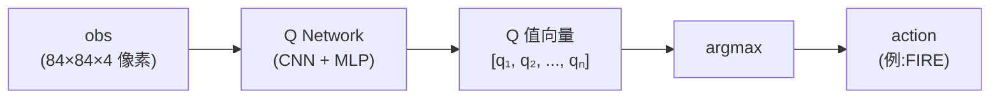

Q-net **只学一件事** —— "在当前 obs 下,每个动作的预期总奖励"。**它从不预测下一帧画面**。

**DQN 完整数据流**:

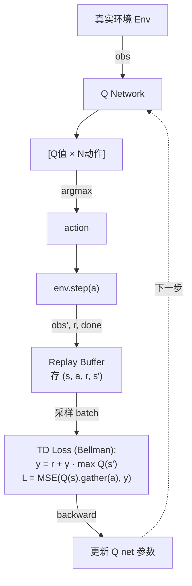

**特点**:**1 个网络,所有数据流经真实环境**。

**World Models 完整数据流**(4 个阶段):

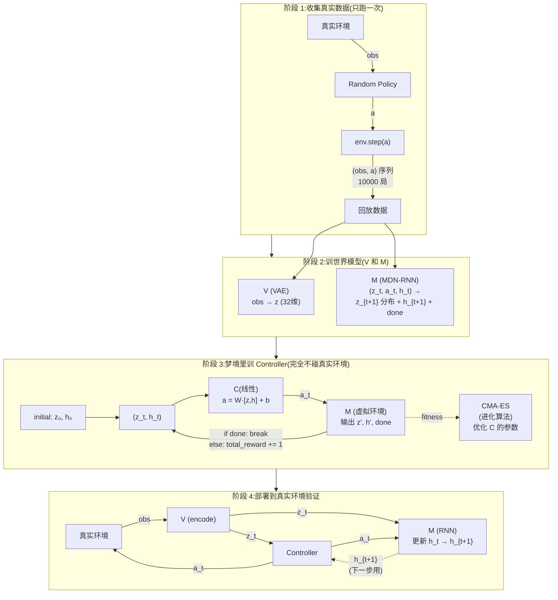

**核心洞察**:**Controller 在哪里训(梦境 vs 真实环境)** 才是 World Model 范式的灵魂,不是"多一个 M 网络"。

---

##### 细节 ②:z、h、o 三个"状态"概念精确区分

World Models 里有三个相关但角色完全不同的向量,容易混淆:

| 符号 | 名字 | 来源 | 维度(VizDoom) | 角色 |
|------|------|------|---------------|------|
| $o_t$ | **观察**(Observation) | 真实环境给的画面 | 64×64×3 | 真实世界的可见信号 |
| $z_t$ | **Latent**(潜变量) | VAE 把 $o_t$ 压缩 | 64 | **"当前帧的压缩表示"**(空间) |
| $h_t$ | **RNN Hidden State** | M(LSTM)内部维护 | 256 | **"历史 + 未来预期"的总结**(时间) |

**关键区分**:
- $z$ ≈ 看一张照片 —— 只知道场景长什么样
- $h$ ≈ 看一段视频前 5 秒 —— 能预测下 1 秒会发生什么
- **合在一起 $(z, h)$ 才能做正确决策**

**梦境一步的完整转移**:
```
(z_t, h_t, a_t) ──[M]──► (z_{t+1}, h_{t+1})
                          │           │
                     MDN sample     LSTM 更新
```

M **同时输出两个东西**:
1. $z_{t+1}$ 的高斯混合分布(用 MDN 采样得到下一帧的压缩表示)
2. $h_{t+1}$(LSTM 内部自然更新的新记忆向量)

**论文关键消融实验**(CarRacing):

| Controller 输入 | Score |
|-----------------|---:|
| 只用 $z$ | 632 ± 251 |
| **用 $z + h$** | **906 ± 21** ⭐ |

→ 加上 $h$ 大幅提升,证明 $h$ 携带了 $z$ 没有的"动力学信息"。**这条 $(z, h)$ 双路设计直接被 Dreamer 系的 RSSM 继承**。

---

##### 细节 ③:奖励 $\hat{r}_{t+1}$ 在梦里怎么产生?

这是个**特别反直觉的点** —— 直觉上 M 应该会预测 reward,但 **World Models 2018 在 VizDoom 上根本没显式预测连续 reward**。

**VizDoom Take Cover 的实际做法**:
```python
# M 的输出
M(z_t, a_t, h_t) → (π, μ, σ), h_{t+1}, done_logit
                       ↑           ↑          ↑
                  下一个 z 的分布   隐藏状态  是否结束的概率
# 注意:没有 reward head!
```

**奖励完全由 `done` 隐式推出**(因为 Take Cover 规则极简:存活+1):
```python
total_reward = 0
while True:
    a = C([z, h])
    (π, μ, σ), h, done_logit = M(z, a, h)
    z = sample_mdn(π, μ, σ, temperature=1.15)
    if sigmoid(done_logit) > random():
        break              # 死了,停止
    total_reward += 1      # 还活着,reward 隐式 +1
```

**CarRacing 的处理方式更"妥协"**(奖励复杂,梦里训不动):
- **没在梦里训 Controller**
- 而是把 V+M 训完后,**直接在真实环境**用 CMA-ES 训 C(z+h 作为特征)

| 任务 | 在梦里训 C? | reward 怎么来? |
|------|-----------|----------------|
| **VizDoom Take Cover** | ✅ 完全梦里训 | done 推出 +1 |
| **CarRacing** | ❌ 真实环境训 | 真实环境给 |

→ **"在梦里学"这个最炫的范式,Ha 2018 只在奖励规则极简的 VizDoom 上完整 demo 过**。这是论文一个**容易被忽略的局限**。

**Dreamer 系如何升级**:加一个 **reward head**(MLP),显式预测连续 reward:

```python
# Dreamer 的 World Model 输出
RSSM(s_t, a_t) → s_{t+1}, r̂_{t+1}, done
                     ↑          ↑          ↑
                 下一状态  预测奖励   是否结束

# 训练:用真实经验监督 reward head
loss_reward = MSE(reward_head(s_pred), batch.real_reward)

# 梦里 rollout 时累加 r̂
for t in range(H=15):
    a = actor(s)
    s, r_hat, done = world_model.step(s, a)
    total_value += γ**t * r_hat   # 用 r̂ 累积 return
```

→ 这才是 Dreamer 能跑通**通用任务**(DMC、Atari、Minecraft)的关键升级:**reward 不再依赖 done 推出,而是显式建模**。

---

##### 三个细节的相互关系

```
① 结构差异 ─► Controller 在梦里训(灵魂)
                    │
                    ▼
② z + h 双路 ─► 让 Controller 看到"空间 + 时间"完整状态
                    │
                    ▼
③ 奖励处理 ─► 用 done 隐式推(VizDoom)or 显式 reward head(Dreamer)
```

理解这三层细节后,即可:
- 看懂 Dreamer 系论文里 RSSM 为什么做成 `(h, z)` 双路
- 理解为什么 Dreamer 一定要加 reward head 才能扩展到通用任务
- 不会再把"World Model"误解为"只是多个网络的 model-free"

### 💭 理解思考

#### 贡献与历史地位

✅ **贡献**
1. 第一次系统性把 World Model 范式工程化(V+M+C 解耦)
2. 第一次证明纯 latent 梦境训练的 policy 可迁移真实环境
3. 概率性世界模型(MDN)预示了今天的随机生成模型
4. 进化算法 + 神经网络的优雅组合
5. 可视化和叙事极强,让无数研究者入坑

⚠️ **局限**
1. 三阶段独立训练,V 学的特征未必对决策最优(只为重建)
2. CarRacing / Doom 较简单
3. MDN-RNN 容量有限,长程预测会漂移
4. V 一旦训完就冻结,无法在线适应

🌳 **后续影响**
- **PlaNet (2019)**:V 和 M 合并到 RSSM,端到端训练
- **Dreamer v1/v2/v3**:latent 里做 actor-critic,替代进化
- **DreamerV3**:同一套超参解 150+ 任务,Minecraft 钻石
- **DIAMOND / Genie / Sora**:M 换成 diffusion / transformer

Dreamer 系完全是这篇论文的"亲儿子"。

#### 阅读建议

1. **先看交互式网站** <https://worldmodels.github.io/>(demo 都是动的,比论文快)
2. 论文不长(~25 页),但**附录极其详细**,值得细读
3. 重点关注:VAE latent 维度对比、MDN-RNN 温度 τ 作用、"在梦里训练"方法论
4. 代码:[estool](https://github.com/hardmaru/estool) · [WorldModelsExperiments](https://github.com/hardmaru/WorldModelsExperiments)

#### 一句话总结

> **第一次把"Agent 用想象力学习"从哲学变成可复现算法。每个模块都被后人替换了,但「感知—记忆—决策」三件套范式至今统治整个 model-based RL / world model 领域。**

<details>
<summary><b>📚 学习资源(展开)</b></summary>

**🎬 视频讲解**

作者本人:
- [**David Ha — NeurIPS 2018 Talk**](https://youtu.be/HzA8LRqhujk) ⭐ — 一作亲自讲,~30 分钟,信息量最大,**强烈推荐先看**
- David Ha 还有 Stanford / 各种 workshop 的版本,YouTube 搜 "David Ha World Models" 可找到

第三方解读:
- [**Two Minute Papers — "Google's New Dreaming AI"**](https://www.youtube.com/results?search_query=two+minute+papers+world+models) — 5 分钟科普,建立直觉
- [**Arxiv Insights — World Models**](https://www.youtube.com/results?search_query=arxiv+insights+world+models) — 10 分钟左右,讲得清晰
- [**Yannic Kilcher 频道**](https://www.youtube.com/@YannicKilcher) — 搜 "World Models",论文逐句过

**📝 英文图文解读**

- [**官方交互式网站**](https://worldmodels.github.io/) ⭐ — **最佳入门资源**,demo 都是动的,比读 PDF 强 10 倍
- [**Lilian Weng — RL 综述与相关博文**(Lil'Log)](https://lilianweng.github.io/tags/reinforcement-learning/) — RL 标签页,涵盖 policy gradient、exploration、meta-RL 等;Model-Based 部分散见于综述与 [A (Long) Peek into RL](https://lilianweng.github.io/posts/2018-02-19-rl-overview/)
- [**The Gradient**](https://thegradient.pub/) — 把 World Models 放进更大的 AI 叙事

**📝 中文解读**

- **机器之心**:[搜索 "World Models 大梦想家"](https://www.jiqizhixin.com/search?keywords=World%20Models) — 当年发表时有详细中文报道
- **PaperWeekly**:微信号 paperweekly,搜 "World Models" 论文导读
- **知乎**:
  - 搜索 "World Models Ha Schmidhuber" — 多篇高赞解读
  - 搜 "在梦中学习" / "世界模型 综述" 也能找到不错的笔记
- **B 站**:搜 "World Models 论文精读"、"李沐 强化学习" 系列也有相关内容
- **CSDN / 简书**:论文笔记很多,质量参差,挑收藏数 > 100 的看

**💻 代码与复现**

- [**hardmaru/WorldModelsExperiments**](https://github.com/hardmaru/WorldModelsExperiments) — 作者官方实现(TensorFlow,完整但较老)
- [**hardmaru/estool**](https://github.com/hardmaru/estool) — CMA-ES 实现(Controller 训练用)
- [**ctallec/world-models**](https://github.com/ctallec/world-models) ⭐ — **PyTorch 复现**,代码干净,推荐学习用
- [**zacwellmer/WorldModels**](https://github.com/zacwellmer/WorldModels) — 另一个简洁 PyTorch 版本

**🎓 课程**

- [**UC Berkeley CS 285: Deep RL**](https://rail.eecs.berkeley.edu/deeprlcourse/) — Sergey Levine,model-based RL 章节
- [**DeepMind x UCL RL Course**](https://www.deepmind.com/learning-resources/reinforcement-learning-lecture-series-2021) — model-based RL 专题
- [**Stanford CS 234: RL**](https://web.stanford.edu/class/cs234/)

**📚 延伸阅读**

前传(Schmidhuber 1990s 的思想源头):
- [Schmidhuber 1990 — *Making the World Differentiable*](http://people.idsia.ch/~juergen/FKI-126-90ocr.pdf)
- [Schmidhuber 1991 — *Curious Model-Building Control Systems*](http://people.idsia.ch/~juergen/curiositysab/curiositysab.html)

后续(读完 World Models 后立刻读):
- [PlaNet](https://arxiv.org/abs/1811.04551) — 端到端版本
- [DreamerV3](https://arxiv.org/abs/2301.04104) — 集大成者

**🎯 推荐学习顺序**

```
1. 先逛 worldmodels.github.io           (1 小时,体感)
2. 看 David Ha NeurIPS 2018 talk        (30 分钟,作者视角)
3. 读 Lil'Log [RL Overview](https://lilianweng.github.io/posts/2018-02-19-rl-overview/) (1 小时,数学梳理)
4. 跑一遍 ctallec/world-models 代码     (半天到一天,动手)
5. 通读论文 + 附录                       (1 天,细节)
6. 跳到 PlaNet / DreamerV3              (理解演化)
```

</details>

> 📁 配套素材已下载到 `asset/world-models-2018/`(架构图、VAE/MDN-RNN 示意图、CarRacing & Doom 演示视频)。图片来源:[worldmodels.github.io](https://worldmodels.github.io/),© Ha & Schmidhuber, 2018,仅作学习参考。


</details>

<details>
<summary><b>4.2 PlaNet (2019)</b></summary>

> **论文**:[arxiv.org/abs/1811.04551](https://arxiv.org/abs/1811.04551)(Hafner et al., ICML 2019)
> **代码**:<https://github.com/google-research/planet> · **项目页**:<https://planetrl.github.io/>
>
> **TL;DR**:**学一个端到端的 latent 世界模型(RSSM),用 CEM 在 latent 空间「想象」未来的 rollouts 来选择动作**。把 World Models 的「分阶段」打通成「端到端」,样本效率比 model-free 高 50 倍。

这篇论文是 Dreamer 系列的**直接前身**,Hafner 第一篇 model-based RL 工作。RSSM 双路 latent 架构在这里诞生,至今(2026)仍是 model-based RL 的标准。

<p align="center">
  <br/>
  <i>PlaNet 在 DeepMind Control Suite 上的实际表现(6 个连续控制任务,从像素输入直接学控制)</i>
</p>

### 📖 核心思想

#### 解决 World Models 的核心痛点

| World Models 的痛点 / 局限 | PlaNet 的回应 | 详见章节 |
|---|---|---|
| 形式化模糊,只隐式处理部分可观测性 | 显式建模为 **POMDP**,世界模型即学习该 POMDP 的动力学与观测函数 | §🧭 |
| V 和 M 分阶段独立训 → VAE 学的特征未必对决策有用 | **端到端联合训练**(encoder / transition / decoder / reward 共享一个 ELBO 损失) | §⚙️ |
| MDN-RNN 长程不稳,确定性记忆与随机性预测未解耦 | **RSSM**:确定性 GRU($h$) + 随机性高斯($s$) **双路并存**,区别于纯确定性 RNN 与纯随机性 SSM | §🧬 |
| 仅训单步预测,多步预测误差累积无显式约束 | **Latent overshooting**:在隐空间对所有跨度的多步预测施加 KL 正则,**无需解码回图像** | §🔭 |
| 一次性随机采集数据,无法随模型改善 | **在线数据采集**:边训边用当前模型 + 规划主动探索,数据分布随模型变好而改善 | §🚀 |
| 决策依赖 CMA-ES 进化出的 Controller,换任务需重训 | **无 Policy 网络**,直接用学到的世界模型 + **CEM 在 latent 中在线规划**(MPC) | §🎯 |
| 只在 Doom / CarRacing 这类玩具环境 demo | **DeepMind Control Suite**(6 个连续控制任务,像素输入) | §🧪 |

#### 关键创新对比

| 维度 | World Models (2018) | **PlaNet (2019)** | Dreamer (2020+) |
|------|--------------------|-----|---|
| 训练方式 | 三阶段独立 | **端到端 ELBO** | 端到端 |
| Latent 结构 | VAE 出 z + MDN-RNN 副产生 h(**分离**,分阶段训) | **(h, s) 作为统一 state**(**双路 RSSM**,联合训) | 同 PlaNet |
| z 学到什么 | 仅视觉重建(VAE 单独训) | **视觉重建 + 动力学预测**(KL 约束) | 同 PlaNet |
| 决策方式 | CMA-ES 训 Controller | **CEM 在线规划** | Actor-Critic + 解析梯度 |
| 主战场 | CarRacing / VizDoom | **DMC(6 任务)** | DMC / Atari / Minecraft |

> 💡 **注意**:World Models 的 M 内部**也有** LSTM 隐藏状态 h,但它只是"工作记忆"的副产品,与 VAE 的 z **分阶段训练、概念上分离**(z 只学重建,h 只辅助预测 z)。PlaNet 的 RSSM 才**第一次把 (h, s) 视为统一的环境状态**,联合训练,让 s 同时学到视觉和动力学信息 —— 这是 RSSM 真正的革命性所在。

### 🧭 PlaNet 的 POMDP 视角:问题定义 + 与 World Models 对照

#### 1. 问题定义

真实环境的"真实状态"是所有物体的位置、速度、质量、关节角度等;而 agent 拿到的只有 RGB 图像 —— 一帧静态图丢失了**速度、深度、遮挡背后的信息、数值精度**。所以**只要 agent 从像素学控制,问题就一定是 POMDP**,必须在内部维护一个 latent 表示来"补全"观测不到的部分。这件事是物理决定的,不是建模选择。

整个 RL 设置可以用最经典的**agent–environment 互动循环**来概括(Sutton & Barto 教科书第一张图):

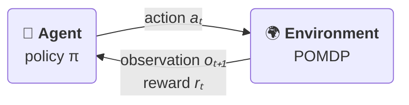

- **Environment**:输入 action,输出 (observation, reward)。背后是 POMDP 的 transition / observation / reward 三个函数
- **Agent**:输入 observation(+ 内部维护的 belief),输出 action

把这张图形式化,就是 PlaNet 论文 §2 写下的 POMDP 四件套:

<p align="center">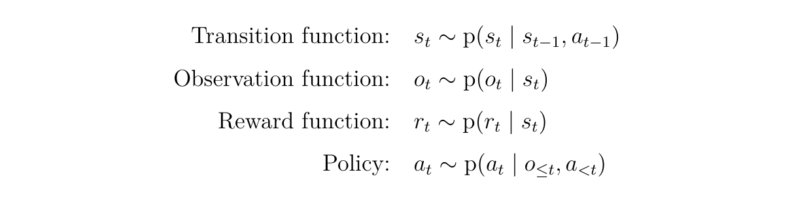</p>

- **Transition function**:真实环境的隐状态 $s_t$ 由前一步的状态和动作决定(随机)
- **Observation function**:agent 拿不到 $s_t$,只能拿到一帧观测 $o_t$(像素图像)—— 这就是"部分可观测"
- **Reward function**:奖励也只依赖隐状态 $s_t$,而不是直接由 agent 行为给出
- **Policy**:由于无法看到 $s_t$,policy 只能基于**历史观测和动作** $(o_{\le t}, a_{<t})$ 来决策

目标是学习一个策略,最大化期望累积回报 $\mathbb{E}\big[\sum_t r_t\big]$。

> 💡 **PlaNet 的特别之处**:它不**显式学习** policy,而是先学一个能模拟 POMDP 的世界模型(transition / observation / reward 三个网络),再在 latent 空间用 **CEM 实时规划** 当场算出 $a_t$ —— 等价于"world model + 规划器"代替了传统的 policy 网络。

**PlaNet agent 内部展开**:在标准 RL 循环图里,PlaNet 把右边 "Agent" 那个方块换成下面这套组合:

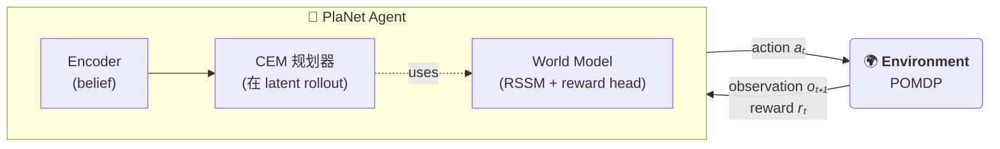

跟其它范式对比:

| 范式 | Agent 内部长什么样 |
|---|---|
| **经典 model-free RL**(DQN, PPO 等) | 一个 NN policy / Q 函数 |
| **World Models** | VAE encoder + MDN-RNN + 小 Controller(显式 policy) |
| **PlaNet** ⭐ | Encoder + RSSM 世界模型 + **CEM 规划器**(**没有 policy 网络**) |
| **Dreamer** | Encoder + RSSM 世界模型 + Actor + Critic |

#### 2. 架构对照 —— World Models 的"隐式" vs PlaNet 的"显式"

| POMDP 组件(理论) | World Models(隐式 / 不完整) | PlaNet(显式 / 1:1 对应) |
|---|---|---|
| **转移 T**: $p(s_t \mid s_{t-1}, a_{t-1})$ | MDN-RNN: $p(z_{t+1} \mid z_t, a_t, h_t)$ —— h 是旁路记忆,**"状态"到底是 z 还是 (z,h),论文从未明确** | RSSM(方程 4):论文原文 "splitting the state into a stochastic part $s_t$ and a deterministic part $h_t$",**状态被显式拆为($h_t$, $s_t$)两部分**,四个网络都以这一对变量为输入 —— 无歧义 |
| **观测 Z**: $p(o_t \mid s_t)$ | VAE Decoder: $p(o_t \mid z_t)$ —— **只是"给图像找压缩码"的副产品,不是 POMDP 的观测函数** | Decoder: $p(o_t \mid s_t)$ —— **就是 POMDP 的观测函数**,作为 ELBO 的一项被联合训 |
| **奖励 R**: $r(s_t)$ | ❌ **不存在**。reward 由真实环境给出(CarRacing 赛道判定 / Doom 存活判定) | Reward model: $\hat{r}(s_t)$,小 MLP —— 因为 CEM 在脑内 rollout 不接触真环境,**必须由模型自己预测奖励** |
| **Belief**: $b(s_t \mid o_{≤t}, a_{<t})$ | VAE encoder $q(z \mid o_t)$ **只看当前帧**,历史靠 MDN-RNN 的确定性 h 旁路;**[z,h] 从未被合成"对真实状态的概率 belief"** | Encoder/Posterior $q(s_t \mid h_t, o_t)$,其中 $h_t$ 携带历史 —— **真正的 POMDP belief**:高斯分布,通过 KL 拉向 prior |
| **训练目标**: max ln $p(o_{1:T}, r_{1:T} \mid a_{1:T})$ | **VAE 的 ELBO + MDN-RNN 的 NLL**,两段独立、分阶段训练 —— **从未合成"对 POMDP 联合似然的下界"** | **单一 ELBO**(对整段轨迹的对数似然下界),由变分推断从 POMDP 联合似然**自然推导**;重建 / reward / KL 在同一公式里,梯度协同 |

#### 3. 显式形式化的真正价值(不只是用词区别)

- 🎯 **Loss 有源头**:World Models = "VAE loss + MDN-RNN loss"两段独立;PlaNet = ELBO 一步推出。要加新约束(如 latent overshooting)时,可以沿着推导继续加,每一项都还有理论意义。
- 🎯 **职责可诊断**:Decoder 学坏 → 重建 loss 升;Transition 学坏 → KL 升,可定位。World Models 里 z 不好可能是 VAE 也可能是 MDN-RNN,因为职能没按 POMDP 拆开。
- 🎯 **模块松耦合,可只换一个组件**:Dreamer 1/2/3 完全复用 PlaNet 的 RSSM(POMDP 那 4 个组件不动),只把"CEM 规划"换成"Actor-Critic + 解析梯度"。这种"换决策层不换世界模型"的灵活性,没有 POMDP 形式化是做不出来的。
- 🎯 **可苹果对苹果比较**:所有 model-based RL 方法(POMCP / DVRL / SLAC / Dreamer ...)都能放在 POMDP 框架下比较 —— 你的 Z 怎么近似?belief 是什么形式?规划用什么算法?

#### 4. 一句话总结

> **World Models** 把"部分可观测"当成**需要绕过去的工程问题**(堆 VAE + RNN 凑表示)。
> **PlaNet** 把它当成**需要正面建模的科学问题**(写下 POMDP,所有架构和 loss 自然推导出来)。
>
> 同样的网络组件,前者是**工程拼装**,后者是**理论实现**。这正是 Dreamer 1/2/3 全都沿用 PlaNet 的形式化、而没人再回到 World Models 的三阶段范式的根本原因。

### ⚙️ 端到端联合训练:一个 ELBO 统管所有网络

#### 1. World Models 的问题:VAE 不知道 z 会被拿去干什么

World Models 用三阶段独立训练:Stage 1 训 VAE,Stage 2 冻住 VAE 训 MDN-RNN,Stage 3 冻住 V + M 进化 Controller。**每一阶段的 loss 只关心自己的目标,梯度不能反向流到上一阶段**。

**关键缺陷**:VAE 的训练目标只有"重建一帧图像"。如果某个视觉特征**对重建无关紧要**(比如球的速度 —— 单帧看不出),VAE 完全不会把它编进 z。等后续 MDN-RNN 想预测下一步状态时,**那些信息已经丢失了,根本补不回来**。

> 类比:让一个图像压缩专家压完图,再让一个物理学家从压缩码预测物体的运动 —— 压缩专家根本不知道物理学家需要"速度"这种东西。

##### PlaNet 怎么补上 $z$ 缺失的信息(对照预览)

| 信息类型 | World Models 的 $z$ | PlaNet 的 $s_t$ |
|---|---|---|
| 静态外观(颜色、形状) | ✅ 重建需要,会学到 | ✅ |
| 速度(两帧之差) | ❌ 单帧重建不需要,不学 | ✅ transition 需要预测下一帧,通过 KL 反推 |
| 与 reward 相关的特征 | ❌ 重建不需要,不学 | ✅ reward 项反推 |
| 物理规律(惯性、碰撞) | ❌ 不学 | ✅ transition 一致性反推 |

##### 副产物:可诊断 + 可扩展

- **诊断性**:decoder 学坏 → 重建 loss 升;transition 学坏 → KL 升 —— **能定位是哪个组件出问题**(World Models 里 z 不好可能是 VAE 也可能是 MDN-RNN,职能未拆开,定位困难)
- **可扩展性**:想加新约束(如 latent overshooting)直接在 ELBO 后面加项即可,**理论上有依据**(变分推导继续走),而不是 World Models 的"再拍个 loss 加权"

##### 一句话总结

> **World Models 的 VAE 不知道 z 会被拿去干什么 —— 它只想"重建好这一帧"。**
> **PlaNet 的 encoder 知道:我编出的 $s_t$ 会被 transition 滚向未来、被 reward 预测奖励、被 decoder 还原图像 —— 这三个下游任务的梯度会逼着我把对它们都有用的信息全塞进 $s_t$。**

#### 2. PlaNet 的解法:联合优化

##### 步骤1 - 起点:朴素的隐变量序列模型(Latent State-Space Model, SSM)

为了端到端地学一个能模拟 POMDP 的世界模型,最简单的形式就是一个**有隐变量的序列模型**:

<p align="center"></p>

> 📝 **符号约定**:本笔记用**直体 p**(如 $\mathrm{p}(s_t \mid \cdots)$)表示真实环境的分布(POMDP);用**斜体 p_$\theta$**(如 $p_\theta(s_t \mid \cdots)$)表示 PlaNet 学到的世界模型 —— 训练就是让 $p_\theta \approx \mathrm{p}$。**这一约定与 PlaNet 论文使用的符号习惯一致**。

##### 步骤2 - 推理的难题:真后验不可解 → variational encoder

要训练步骤1 的模型,理论上需要从**真后验** $p_\theta(s_{1:T} \mid o_{1:T}, a_{1:T})$ 采样隐状态轨迹,但这个后验**算不出来**。解法是引入一个**近似后验** $q$(也是 NN 参数化的)作为 **encoder**:

<p align="center">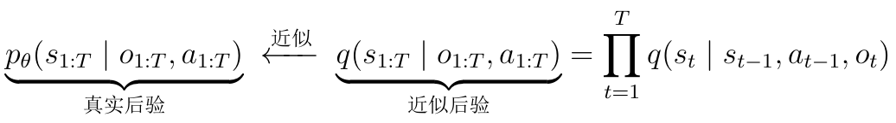</p>

<details>
<summary><b>这个分解怎么来的?</b> 链式法则 + filtering + Markov(点开展开)</summary>

**Step A — 链式法则(严格成立)**

任何联合分布都可以按时间顺序拆:

<p align="center">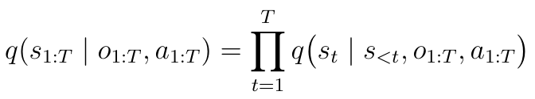</p>

到这里**没做任何近似**,纯粹是数学恒等式。

**Step B — filtering 近似(丢掉未来观测/动作)**

<p align="center">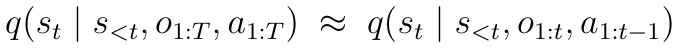</p>

**理由**:推理时(部署/规划)只能看到过去,本来就**没有未来 $o, a$**。训练时学到的 $q$ 必须和部署时用的 $q$ 是同一个 —— 如果训练时偷看未来,部署时根本拿不到。

| 方案 | 名字 | 适用场景 |
|---|---|---|
| 只看 $o_{\le t}$ | **filtering posterior** ⭐ | 推理时只能看过去,PlaNet 选这个 |
| 看完整 $o_{1:T}$ | **smoothing posterior** | 训练时是有完整轨迹的,能用更多信息估计 $s_t$ |

**Step C — Markov 近似(把所有过去都压进 $s_{t-1}$)**

<p align="center">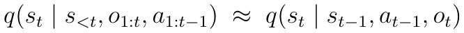</p>

**这一步同时做了两件事**(本质都是 Markov 充分性假设):

1. **丢掉远期 $s$ 历史**:$s_{<t-1}$ 在给定 $s_{t-1}$ 后不再有用 —— 因为生成模型本身是 Markov 的
2. **丢掉远期 obs/action 历史**:$o_{1:t-1}$ 和 $a_{1:t-2}$ 都被认为**已经压进了 $s_{t-1}$**,只留新增信息 $o_t$ 和 $a_{t-1}$

这是 PlaNet 做得**最大胆的一步** —— 它假设 $s_{t-1}$ 是对所有过去(包括 s 历史和 obs/action 历史)的**充分统计量**。

</details>

<details>
<summary><b>为什么真后验"算不出来" — 兼答 encoder 的真正作用</b>(点开展开)</summary>

**Bayes 拆分**

真后验由贝叶斯公式给出:

<p align="center">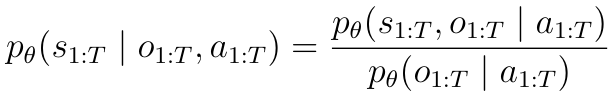</p>

问题不在分子(分子是模型联合分布,可以**直接写出**),问题在**分母** —— 这个 marginal likelihood 需要把所有可能的隐状态轨迹积掉:

<p align="center">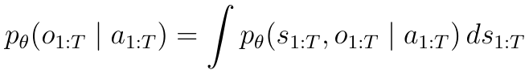</p>

但这里要小心:"能算"这个词本身就有歧义。

**"能算"其实是个模糊词**

机器学习里"能算 $p(x)$"至少有三层不同含义,**完全独立**:

| 能力 | 含义 | 举例 |
|---|---|---|
| **① Evaluate** | 给定具体 $x$,算出 $p(x)$ 的数值 | "$p(x=3)$ 等于多少" |
| **② Sample** | 产生符合分布的 $x$ | "请给我 100 个 $x \sim p$" |
| **③ Integrate** | 算积分 $\int p(x) dx$ 或期望 $\mathbb{E}_p[f]$ | "marginal / 后验" |

回到 PlaNet:

| 量 | ① Evaluate | ② Sample | ③ Integrate |
|---|---|---|---|
| 联合分布 $p_\theta(s, o \mid a)$(分子) | ✅ **能** | ✅(祖先采样) | ❌ |
| Marginal $p_\theta(o \mid a)$(分母) | ❌ **不能** | ✅(扔掉 s) | — |
| 真后验 $p_\theta(s \mid o, a)$ | ❌ | ❌ | — |
| 近似后验 $q_\phi(s \mid o, a)$ | ✅ | ✅ | — |

> ⭐ 关键:**分子能 ① evaluate,但不需要任何 encoder**。

**分子具体怎么"能算"(无需 encoder)**

这个分解不是数学硬推出来的,而是 **2 次链式法则 + 2 个图模型假设**。RSSM 的图结构是:

```
   a_0       a_1       a_2 ...
     ↘         ↘         ↘
  s_0 ─→ s_1 ─→ s_2 ─→ s_3 ...     (transition: 状态 Markov)
          ↓     ↓     ↓
          o_1   o_2   o_3            (observation: o_t 只看 s_t)
```

**Step 1 — 按"先 s 后 o"拆开**(chain rule,严格成立):

<p align="center"></p>

**Step 2 — 观测条件独立**(图模型假设:POMDP observation function):给定 $s_t$,$o_t$ 与其他变量都条件独立:

<p align="center">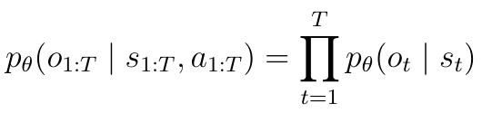</p>

**Step 3 — s 序列按时间拆**(chain rule,严格成立):

<p align="center"></p>

**Step 4 — Markov transition**(图模型假设:生成模型本身就是 Markov):给定 $s_{t-1}, a_{t-1}$,$s_t$ 与其他变量都条件独立:

<p align="center">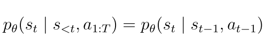</p>

**合起来**:Step 2 + Step 4 代回 Step 1,得到联合的完整因子化形式

<p align="center">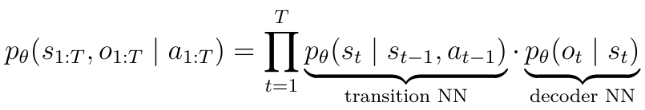</p>

| Step | 操作 | 类型 | 依据 |
|---|---|---|---|
| 1 | 联合 → s 部分 · o 部分 | chain rule | 概率恒等式 |
| 2 | $o_{1:T}$ 拆成 $\prod_t p(o_t \mid s_t)$ | **图模型假设** | 观测条件独立 |
| 3 | $s_{1:T}$ 按时间拆 | chain rule | 概率恒等式 |
| 4 | $s_t$ 简化到只依赖 $s_{t-1}, a_{t-1}$ | **图模型假设** | Markov transition |

> ⭐ 一句话:**分解形式不是推出来的,而是图模型的设计决定的**。链式法则只负责"按时间拆开",真正起作用的是 RSSM/POMDP 的 DAG 结构告诉我们"哪些条件可以丢"。不同的世界模型(Dreamer / Transformer WM / Diffusion WM)有不同的因子化,都遵循"先 chain rule 拆,再按图结构丢条件"的同一套流程。

每个因子都是高斯,均值/方差由 NN 给出:

- **Transition**:输入 $(s_{t-1}, a_{t-1})$ → NN 输出 $\mu, \sigma$ → $p_\theta(s_t \mid \cdots) = \mathcal{N}(s_t; \mu, \sigma^2)$
- **Decoder**:输入 $s_t$ → NN 输出像素均值 $\hat{o}_t$ → $p_\theta(o_t \mid s_t) = \mathcal{N}(o_t; \hat{o}_t, I)$

→ 给定 $(s_{1:T}, o_{1:T}, a_{1:T})$ 三元组,每个高斯因子代入数值就能算,**只需 forward pass 两个 NN,完全不需要 encoder**。

> 类比 VAE:给定 $(x, z)$ 你可以算 $p(x \mid z) p(z)$ —— 不需要 encoder。encoder 只在你想"从哪里得到 z"时才出现。

**分母为什么算不出来**

被积函数($=$ 分子)能算,但**积分本身没有闭式**。

- 高维:$s_t$ 维度约 30,序列长 $T$ 约 50 → 积分空间 1500 维
- 非线性:transition 是 NN,不再是线性高斯
- 蒙特卡洛估计**方差极大**(高维空间几乎采不到"对"的轨迹)

只有两种特殊情况能解析积出:

- ✅ **线性 + 高斯**:Kalman filter 的解析解
- ✅ **离散 + 小状态空间**:暴力穷举

PlaNet 两个都不满足,所以分母**只能近似**。

**那 encoder 究竟是干嘛用的?**

> 🔴 **encoder 解决的不是"分子能算",而是"训练时只有 o,没有 ground truth s,怎么训?"**

把"什么时候需要 $s$"的场景列出来:

| 场景 | 需要 encoder 吗? | 备注 |
|---|---|---|
| 给定 $(s, o, a)$ 评估分子 $p_\theta(s, o \mid a)$ | ❌ | $s$ 已经在手,代入即可 |
| 祖先采样一条想象轨迹 $(s, o)$ | ❌ | 从 prior 链式采:$s_t \sim p_\theta(\cdot \mid s_{t-1}, a)$ → $o_t \sim p_\theta(\cdot \mid s_t)$。CEM 规划就靠这个 |
| **训练:只有真实 $o$,反推 $s$** | ✅ **需要** | 这才是 encoder 的用武之地 |

训练数据是 $(o_{1:T}, a_{1:T})$,**没有 $s$ 的 ground truth**。我们想最大化 $\log p_\theta(o \mid a)$,但这个 log-likelihood 涉及分母那个积不出来的积分。走 ELBO:

<p align="center">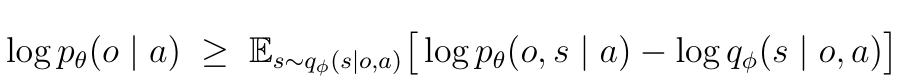</p>

这里 Monte Carlo 估计**需要从某个分布采 $s$**。选谁?

| 候选 | 能不能采? | 效果 |
|---|---|---|
| 真后验 $p_\theta(s \mid o, a)$ | ❌ 算不出 | — |
| Prior $\prod p_\theta(s_t \mid s_{t-1}, a)$ | ✅ 能 | 采到的 $s$ **跟 $o$ 完全无关**,方差爆炸 |
| **Encoder $q_\phi(s \mid o, a)$** | ✅ 能 | 从 $o$ 反向条件采,**这些 $s$ 已经"对应了"观测** ⭐ |

> 💡 **一句话**:**encoder 不是为了让分子可算,而是为了在不知道 $s$ 的情况下,通过采样估计 ELBO 这个能优化的目标**。

> 📝 类比 VAE 的 encoder 也是同一回事:静态 VAE 里,$x$ 是数据,$z$ 是隐变量,decoder $p(x \mid z)$ 能 evaluate、能 sample。但训练时给的是 $x$,要反推 $z$ → encoder $q(z \mid x)$ 出场。PlaNet 只是把它从"单张图像"推广到了"轨迹"。

</details>

##### 步骤3 - 共享 ELBO 联合训练所有网络

至此 4 个网络(encoder + transition + decoder + reward)全部到位。

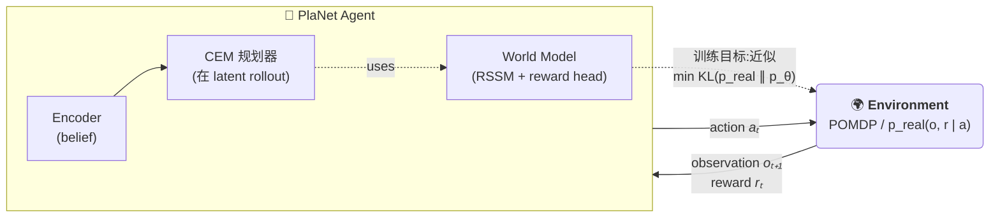

PlaNet 的本质就是让 world model $p_\theta(o, r \mid a)$ 在数据分布下**贴近真实环境** $p_{\text{real}}(o, r \mid a)$。三种等价表述:

<p align="center">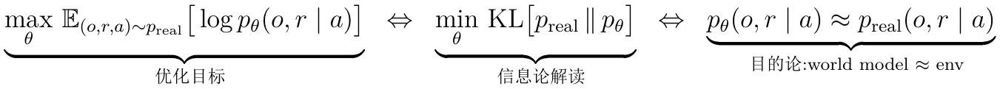</p>

| 角度 | 解读 |
|---|---|
| **① 优化** | 最大化数据在模型下的对数概率(MLE 的标准做法) |
| **② 信息论** | 最小化"真实环境分布"到"模型分布"的 KL 散度,渐进无偏 + 一致 |
| **③ 目的论** | **让 agent 内部的 world model 像真实环境** —— 三者数学上完全等价 |

> 💡 **注意**:"$\approx$"是 KL 意义下贴近,不是逐点相等。MLE 会**优先拟合高密度区域**(数据频繁出现的状态)、对低密度区域不太在意 —— 这正是 **model exploitation 问题**(CEM 找到 model 在罕见状态的 bug 后疯狂利用)的根源。

因此 **PlaNet 的训练目标就是最大化** 世界模型对真实数据的 log-likelihood:

<p align="center">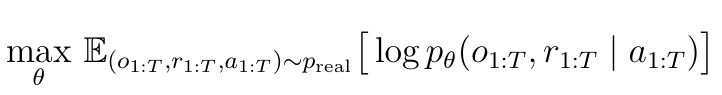</p>

<p align="center">
  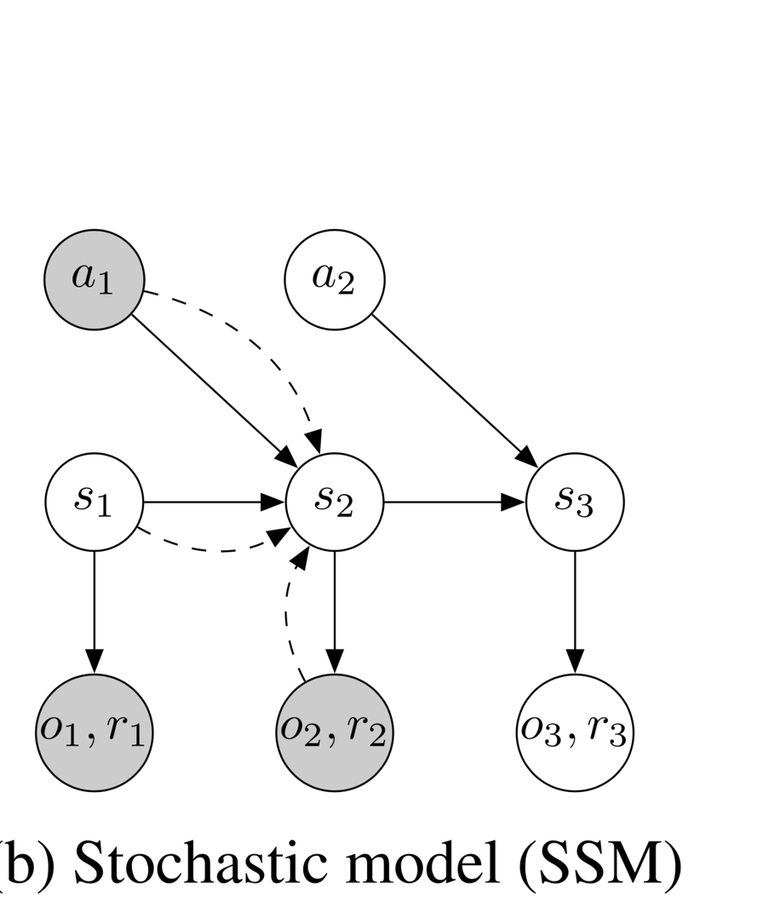<br/>
  <sub>↑ PlaNet 论文 Fig. 2(b):朴素 SSM 的图模型。圆圈 = 随机变量,实线 = 生成方向,虚线 = 推理方向。</sub>
</p>

然而这个$p_\theta(o_{1:T}, r_{1:T} \mid a_{1:T})$ **无法计算**(具体原因见展开)。

<details>
<summary><b>展开:为什么 marginal likelihood 算不出来</b></summary>

模型其实是定义在**带隐变量 $s$ 的生成模型**上(上图 的朴素 SSM):
<p align="center">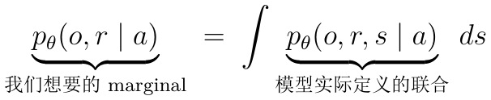</p>
根据步骤 2 折叠的section:
<p align="center">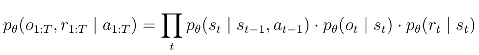</p>
**联合分布能算**(NN 前向),但**积掉 $s$ 没闭式解**, 这就是 marginal likelihood 算不出来的根本原因。

</details>

**ELBO 是它的一个能算的下界**， 具体来说:

<p align="center">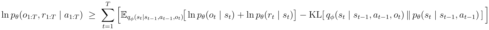</p>

把**外层"对真实数据求期望"** 和**内层 ELBO 下界** 拼起来,**同时把 encoder 参数 $\phi$ 也加入优化变量**,就得到 PlaNet 实际反传梯度的训练目标:

<p align="center">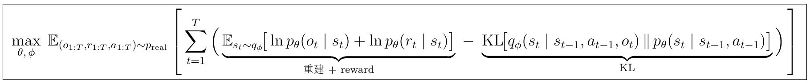</p>

<details>
<summary><b>推导:ELBO 是怎么来的(5 步)</b></summary>

**Step 1 — 引入 $q$(乘以 1)**

<p align="center">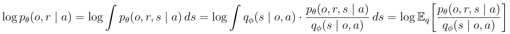</p>

**Step 2 — Jensen 不等式**(log 是凹函数,$\log \mathbb{E}[X] \geq \mathbb{E}[\log X]$):

<p align="center"></p>

右边就是 **ELBO** 的定义。

**Step 3 — 展开联合 $p$ 的因子化**(用前面推过的图模型分解 + reward 项):

<p align="center">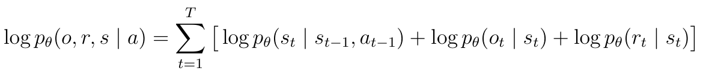</p>

**Step 4 — 展开 $q$ 的因子化**(用步骤2 推过的 chain rule + Markov + filtering):

<p align="center"></p>

**Step 5 — 合并 transition 项与 $q$ 项 → KL**

代回 ELBO(整体外面套 $\mathbb{E}_{q_\phi}$)后,每个 $t$ 的贡献是:

<p align="center">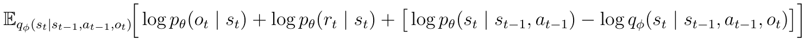</p>

其中最后两项在 $\mathbb{E}_{q_\phi(s_t)}$ 下正好是**负 KL 散度**:

<p align="center">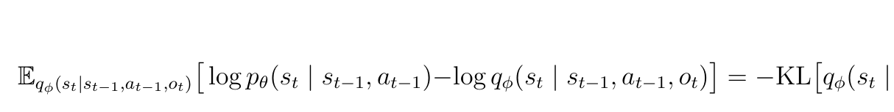</p>

合起来得到最终形式:

<p align="center">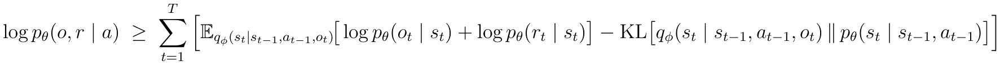</p>

**每一步用的"工具"**

| Step | 操作 | 工具 | 类型 |
|---|---|---|---|
| 1 | 乘 $q/q$ | 恒等式 | 数学 |
| 2 | $\log \mathbb{E}$ 换成 $\mathbb{E}\log$ | **Jensen 不等式** | 数学(凹函数性质) |
| 3 | 联合 $p$ 因子化 | RSSM 图模型(前面已推) | 模型设计 |
| 4 | 后验 $q$ 因子化 | 变分设计(步骤 2 已推) | 变分设计 |
| 5 | transition 项 + $q$ 项 合并 | KL 散度定义 | 数学 |

→ **数学只占 2 步(Jensen + KL 定义),其余 3 步全是"代入图模型告诉我们的形式"**。

</details>

三项 loss 都是在 $s_t \sim q_\phi(s_t \mid s_{t-1}, a_{t-1}, o_t)$ 下取期望(reparameterization),所以 **encoder 通过被采样出的 $s_t$ 进入前两项**,梯度沿 $s_t$ 反向流回 $\phi$:

| Loss 项(对 $s_t \sim q_\phi$ 取期望) | 梯度路径 | 反向告诉 encoder 什么 |
|---|---|---|
| 重建 $\ln p_\theta(o_t \mid s_t)$ | decoder → $s_t$ → encoder | "$s_t$ 要够还原图像" |
| reward $\ln p_\theta(r_t \mid s_t)$ | reward head → $s_t$ → encoder | "$s_t$ 要够预测奖励" |
| $\mathrm{KL}[q_\phi \,\|\, p_\theta]$ | 直接训 $q_\phi$ 和 transition $p_\theta$ | "$s_t$ 要让下一步可预测" |

**所有梯度通过 $s_t$ 互相传播** —— encoder 必须同时满足三个下游任务,任何一项 loss 不满足都会反向逼迫 encoder "再多塞点信息进 $s_t$"。

<details>
<summary><b>实现:怎么真的训这个 loss(伪代码 + 工程技巧)</b></summary>

理论上 ELBO 含 $\mathbb{E}_q$(对所有可能的 $s$ 轨迹积分),不可解。工程上用**单样本 + reparameterization** 估计:

```python
for batch in dataloader:
    o[1:T], a[1:T], r[1:T] = batch

    # 1. encoder 顺序采样一条 s 轨迹(重参数化)
    h, s = init_h, init_s
    s_seq, kl_terms = [], []
    for t in 1..T:
        h = GRU(h, s, a[t-1])                              # 确定性
        mu_q, sigma_q = encoder(h, o[t])                   # 后验参数
        mu_p, sigma_p = transition(h)                      # 先验参数(只用 h)
        s = mu_q + sigma_q * eps,   eps ~ N(0, I)         # 重参数化
        s_seq.append(s)
        kl_terms.append( KL_gaussian(mu_q, sigma_q, mu_p, sigma_p) )  # 闭式

    # 2. 算每一项 loss(用上一步采的 s)
    L_recon  = - sum( log p_decoder(o[t] | s_seq[t]) for t )
    L_reward = - sum( log p_reward(r[t] | s_seq[t]) for t )
    L_kl     = sum( kl_terms )

    L = L_recon + L_reward + L_kl
    L.backward()        # 梯度同时回传到 4 个网络
    optimizer.step()
```

**关键工程技巧**:

| 技巧 | 作用 |
|---|---|
| **Reparameterization** | $s = \mu + \sigma \epsilon$ 让梯度能流过采样 |
| **单样本估计** | 每条轨迹只采 1 次 $s$,靠 batch 平均降方差 |
| **KL 闭式** | 两边都是高斯 → KL 有解析式,不用再采样 |
| **梯度共享** | 同一个 $s$ 同时进入 3 个 loss,梯度自然在 encoder 上汇合 |

</details>


### 🧬 RSSM:双路 latent 架构

> RSSM(Recurrent State-Space Model)是 PlaNet 的核心架构 —— 把"确定性的 RNN 记忆"和"随机性的 SSM 不确定性"**缝合**在一起的双路 latent 动力学模型 → 将确定性记忆与随机性预测解耦 → 缓解world model里MDN-RNN 长程不稳的问题。

#### 问题:纯随机 SSM 的长程信息会被噪声冲掉

§⚙️ 端到端联合训练里给出的朴素 latent SSM,**所有信息都靠随机的 $s_t$ 在时间上传递**。但 $s_t$ 每步都要采样 —— **采样引入噪声**,长程信息很快被冲掉,模型记不住"5 步之前发生了什么"。

#### 解法:加 deterministic path → RSSM

加一条**纯确定性的并行通路** $h_t$,专门负责记忆 —— 完整 RSSM state 由确定性 $h_t$ 和随机性 $s_t$ 两部分组成:

<p align="center"></p>

| 变量 | 类型 | 由谁产生 | 角色 |
|------|------|---------|------|
| $h_t$ | **确定性** | GRU 的隐藏状态:$h_t = \mathrm{GRU}(h_{t-1},\, s_{t-1},\, a_{t-1})$ | **长程记忆**,稳定可靠 |
| $s_t$ | **随机性高斯** | Encoder 或 Prior 采样 | **捕捉不确定性 / 多模态未来** |

> 📝 **符号说明**:本笔记 PlaNet/RSSM 部分**沿用论文原符号** —— `s_t` 表示随机隐变量,`h_t` 表示 GRU 确定性记忆,完整 RSSM 状态写作 `(h_t, s_t)`(论文不引入独立"完整状态"符号)。后续 Dreamer 系列论文(V1/V2/V3)和它们的开源代码改用 `z_t = 随机部分、(h_t, z_t) = 完整状态` —— 看 Dreamer 时把 `z` 当我们的 `s` 即可,两者只差换名。

> 🔑 **架构关键约束(易漏)**:**所有关于 $o_t$ 的信息必须经过 encoder 的采样 $s_t$ 才能流到下游** —— $o_t$ 不能旁路注入 decoder / reward / transition。
> 否则 decoder 直接拿到 $o_t$ 重建,**走"确定性捷径"绕过 $s_t$**,latent 就学不到东西。所以 encoder 是唯一读 $o_t$ 的网络,decoder / reward / transition 全只读 $(h_t, s_t)$——这个不对称不是巧合,是设计约束(§🔧 细节 ① 子网络表里可见)。

**为什么必须双路?** 单路设计的两条死路:

| 单路设计 | 致命问题 |
|---|---|
| **纯确定性 RNN**(下图 (a)) | 没法表达噪声、多模态未来 |
| **纯随机 SSM**(下图 (b)) | 训练不稳,长程信息被采样噪声冲掉 |
| **双路 h + s**(下图 (c)) ⭐ | h 保稳定记忆,s 表达不确定性 —— 两者独立处理 |

→ 这就是 **RSSM** 名字的由来:**R**ecurrent NN(确定性)+ **S**tate-**S**pace **M**odel(随机)**缝合**起来,把「过去的稳定记忆」和「未来的不确定性」分到两个变量里独立处理。

<p align="center">
  <br/>
  <i>论文 Figure 2:三种动力学模型对比。<b>(a) RNN</b> 只有确定性 h / <b>(b) SSM</b> 只有随机 s / <b>(c) RSSM</b> h(方块)+ s(圆圈)并存,各司其职 —— PlaNet 的核心创新</i>
</p>

> 🔍 **怎么读图里的实线 vs 虚线?**(生成方向 vs 推理方向)
>
> | 方向 | 实线 / 虚线 | 数学对象 | 干什么 |
> |---|---|---|---|
> | **生成** | 实线(箭头从 $s$ 流向 $o$) | $p_\theta$ —— 模型分布 | "**模型描述世界怎么演化**":给定 $s$ 产生 $o, r$;给定 $(s_{t-1}, a_{t-1})$ 产生 $s_t$ |
> | **推理** | 虚线(箭头从 $o$ 反向流向 $s$) | $q_\phi$ —— encoder | "**给定 obs 反推 latent**":看到 $o_t$ 应该把它认成哪个 $s_t$ |
>
> **跟前面已经认识的网络对应**:
> - 实线 $s \to o$、$s \to r$ ⇔ **decoder / reward head** —— $p_\theta(o_t \mid h_t, s_t)$、$p_\theta(r_t \mid h_t, s_t)$
> - 实线 $s_{t-1}, a_{t-1} \to s_t$(RSSM 里通过 $h_t$ 汇总)⇔ **transition prior** —— $p_\theta(s_t \mid h_t)$
> - 虚线 $o_t \dashrightarrow s_t$ ⇔ **encoder posterior** —— $q_\phi(s_t \mid h_t, o_t)$
>
> **三种使用场景对应**:
>
> | 场景 | 用哪个方向 |
> |---|---|
> | **训练**(算 ELBO) | **两个都用** —— 虚线 encoder 推 $s$,实线 decoder 算 reconstruction |
> | **CEM 规划 / 想象未来** | **只用实线** —— 从当前 $(h_t, s_t)$ 出发沿 prior + decoder 想象 rollout,未来 obs 不存在,**不需要 encoder** |
> | **部署时编码当前帧** | **只用虚线** —— 把当前 obs 编码成 belief $s_t$,然后才有起点做规划 |
>
> → 这也呼应了前面 🔑 **关于 $o_t$ 的信息必须经过 encoder 的采样 $s_t$** 那条硬约束:obs 只能走**虚线**(推理,经 encoder)进入模型,不能旁路走生成方向直接跑到 decoder。

#### 对应的 ELBO 训练目标(RSSM 版)

只要把 §⚙️ Step 3 的 bare-SSM ELBO 里**两处条件机械替换**就得到 RSSM 版:

| 位置 | bare-SSM | RSSM |
|---|---|---|
| 过去信息载体 | $(s_{t-1}, a_{t-1})$ | $h_t$(GRU 已吸收) |
| decoder / reward 的输入 | 只看 $s_t$ | 看 $(h_t, s_t)$ |

四个网络相应变形:

| 网络 | bare-SSM | RSSM |
|---|---|---|
| Posterior (encoder) | $q_\phi(s_t \mid s_{t-1}, a_{t-1}, o_t)$ | $q_\phi(s_t \mid h_t, o_t)$ |
| Prior (transition) | $p_\theta(s_t \mid s_{t-1}, a_{t-1})$ | $p_\theta(s_t \mid h_t)$ |
| Decoder | $p_\theta(o_t \mid s_t)$ | $p_\theta(o_t \mid h_t, s_t)$ |
| Reward | $p_\theta(r_t \mid s_t)$ | $p_\theta(r_t \mid h_t, s_t)$ |

代回 ELBO,得到 **RSSM 实际反传梯度的训练目标**:

<p align="center">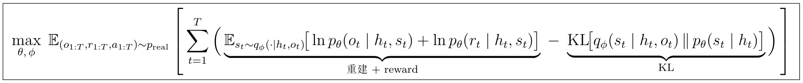</p>

约束:$h_t = f_\mathrm{GRU}(h_{t-1}, s_{t-1}, a_{t-1})$ —— 给定一条 $s$ 轨迹,$h$ 轨迹完全确定,**不参与积分**。

<details>
<summary><b>推导:RSSM ELBO 是怎么来的(沿用 §⚙️ Step 3 的 5 步,处处插入 $h_t$)</b></summary>

跟 bare-SSM 推导**结构完全一样** —— Steps 1-2 是任何 latent variable model 都要做的通用准备,Steps 3-5 把每个因子的条件换成 RSSM 的形式即可。

**Steps 1-2 — 引入 $q$ + Jensen 不等式**(与 §⚙️ Step 3 完全一致)

直接复用结论 —— 对任何 latent variable model,有:

<p align="center"></p>

只是这里 $p_\theta(o, r, s \mid a)$ 和 $q_\phi(s \mid o, a)$ 的具体形式不同 —— 下面 Step 3 / 4 给出 RSSM 的形式。

**Step 3 — 展开 RSSM 联合 $p$ 因子化**(代入 §🧬 RSSM 图模型 + reward 项):

<p align="center">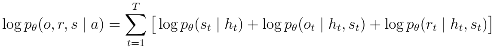</p>

每个因子都条件 $h_t$ —— 而 $h_t = f_\mathrm{GRU}(h_{t-1}, s_{t-1}, a_{t-1})$ 由 $(s_{<t}, a_{<t})$ 唯一确定,不参与积分。

**Step 4 — 展开 RSSM $q$ 因子化**(§🧬 解法子节给出的 encoder):

<p align="center">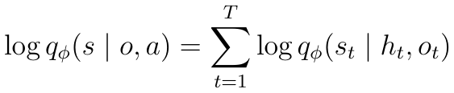</p>

→ 对比 bare-SSM 的 $q(s_t \mid s_{t-1}, a_{t-1}, o_t)$:这里 $(s_{t-1}, a_{t-1})$ 已被 $h_t$ 吸收。

**Step 5 — 合并 transition 项与 $q$ 项 → KL**

代回 ELBO(整体套 $\mathbb{E}_{q_\phi}$)后,每个 $t$ 的贡献:

<p align="center">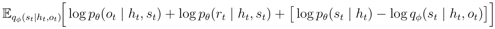</p>

其中最后两项在 $\mathbb{E}_{q_\phi(s_t \mid h_t, o_t)}$ 下正好是**负 KL 散度**:

<p align="center">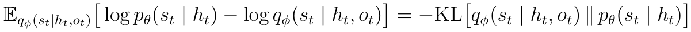</p>

合起来得到**最终形式(per-trajectory RSSM ELBO 下界)**:

<p align="center">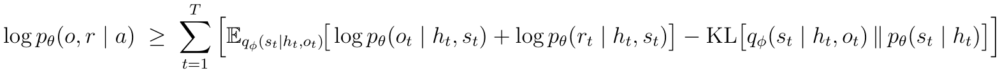</p>

→ 再套上外层 $\mathbb{E}_{(o, r, a) \sim p_\text{real}}$ 对真实数据求期望 + 最大化 $\max_{\theta, \phi}$,就是本子节正文 boxed 出来的训练目标。

**与 bare-SSM 推导的核心差异(机械替换)**:

| Step | bare-SSM 形式 | RSSM 形式 | 关键变化 |
|---|---|---|---|
| 1 | $\log \mathbb{E}_q[p/q]$ | 同 | 通用,不变 |
| 2 | Jensen → $\mathbb{E}_q[\log(p/q)]$ | 同 | 通用,不变 |
| 3 | $\prod_t p(s_t \mid s_{t-1}, a_{t-1}) \cdot p(o_t \mid s_t) \cdot p(r_t \mid s_t)$ | $\prod_t p(s_t \mid h_t) \cdot p(o_t \mid h_t, s_t) \cdot p(r_t \mid h_t, s_t)$ | 所有因子条件多 $h_t$ |
| 4 | $\prod_t q(s_t \mid s_{t-1}, a_{t-1}, o_t)$ | $\prod_t q(s_t \mid h_t, o_t)$ | $(s_{t-1}, a_{t-1})$ 被 $h_t$ 吸收 |
| 5 | $\mathrm{KL}[q(s_t \mid s_{t-1}, a_{t-1}, o_t) \,\|\, p(s_t \mid s_{t-1}, a_{t-1})]$ | $\mathrm{KL}[q(s_t \mid h_t, o_t) \,\|\, p(s_t \mid h_t)]$ | 同上 |

→ **数学完全没新东西,只是机械替换 "$(s_{t-1}, a_{t-1})$ → $h_t$"**。$h_t$ 确定性不参与积分,但因为它依赖 $s_{t-1}$,采样 $s$ 轨迹时 $h$ 轨迹要顺序计算出来(细节见 §⚙️ Step 3 折叠里的实现伪代码)。

</details>


### 🔭 Latent Overshooting:把 ELBO 推广到多步预测

> 对应 §4.2 痛点表里"仅训单步预测,多步预测误差累积无显式约束"的展开 —— **在 latent 空间对所有跨度的多步预测施加 KL 正则,无需解码回图像**。

#### 问题:RSSM ELBO 只对齐「相邻一步」,长程会漂移

§🧬 RSSM ELBO 的 KL 项是 $\mathrm{KL}[q_\phi(s_t \mid h_t, o_t) \,\|\, p_\theta(s_t \mid h_t)]$ —— 只让 **prior 单步预测 posterior**(只看「下一步」准不准)。

但 PlaNet 的 CEM 规划要在 latent 空间 rollout **$H = 12$ 步**,这 12 步的预测都得准:

- 单步精度高 ≠ 多步外推稳:transition 一步步累积误差
- prior 只见过 "$s_{t-1}, a_{t-1}$ 直接预测 $s_t$",**从来没被训练过 "$s_{t-3}$ 跨 3 步预测 $s_t$"**
- 结果:$H$ 越大,梦境里的 latent 离真实轨迹越远

→ 思路自然:**让 prior 的多步预测也被显式监督**。要"监督多步",先得说清"多步"在 RSSM 里到底怎么算 —— 这是后面所有候选方案的共同构件。

#### 共同构件:用 prior 滚 $d$ 步预测未来

RSSM 里 $s_t$ 由**两个**分布刻画,差别全在**是否看观测**:

| 名字 | 形式 | 何时用 | 看不看 $o$ |
|---|---|---|---|
| **posterior**(encoder) | $q_\phi(s_t \mid h_t, o_t)$ | 训练 / 编码当前帧 | **看** $o_t$ |
| **prior**(transition) | $p_\theta(s_t \mid h_t)$ | 想象未来 / 规划 | **不看** obs |

"**用 prior 滚 $d$ 步**"就是从某个起点 $(h_t, s_t)$ 出发,**全程不接触任何真实观测**,纯靠 prior 自回归地往前采 $d$ 步:

```python
# prior 路径(规划 / 想象未来,看不到 obs)
h, s = h_t, s_t                       # 起点(来自 posterior)
for k in 1..d:
    h = GRU(h, s, a[t+k-1])           # 用真实动作,推进确定性记忆
    mu_p, sigma_p = transition(h)     # prior 只吃 h, 不看 o!
    s = mu_p + sigma_p * eps,  eps ~ N(0, I)   # 重参数化采样
# 跑完得到 \hat h_{t+d}, \hat s_{t+d}
# —— 完全靠模型外推出来的"d 步后未来 latent"
```

作为对照,训练时 encoder **同样滚 $d$ 步**,但每一步都看真实观测:

```python
# encoder 路径(训练时,每步看到真实 o)
h, s = h_t, s_t                       # 起点(同上)
for k in 1..d:
    h = GRU(h, s, a[t+k-1])           # 同上
    mu_q, sigma_q = encoder(h, o[t+k]) # encoder 偷看真实 o_{t+k}!
    s = mu_q + sigma_q * eps,  eps ~ N(0, I)   # 重参数化采样
# 跑完得到 posterior 路径下 d 步后的 latent
```

两段**唯一的差别**就在采 $s$ 那一行:encoder 吃 $(h, o_{t+k})$,prior 只吃 $h$。这正好对应**规划时的实际行为** —— 未来观测还没发生,只能靠 prior。

→ 接下来两条候选路径都基于这同一个"滚 $d$ 步"操作,差别只在拿 $\hat s_{t+d}$ 干什么。

#### 错误路径:Observation Overshooting(代价过高)

最直接的想法:把滚出来的 $\hat s_{t+d}$ **解码回图像**,跟 $d$ 步后真实的观测算 reconstruction loss:

```
对每个时刻 t、每个跨度 d = 1, ..., D:
    1. 从 (h_t, s_t) 起, 用 prior 滚 d 步 → (\hat h_{t+d}, \hat s_{t+d})
    2. 用 decoder 重建: \hat o_{t+d} ~ p_θ(o | \hat h_{t+d}, \hat s_{t+d})
    3. 跟真实 o_{t+d} 算 reconstruction loss
合起来作为额外训练信号
```

直观很对 —— "想象出的画面"必须能对上"$d$ 步后实际看到的画面",长程预测就被监督到了。

**问题:贵到训不动。** decoder 是个反卷积大网络,每次 forward 输出 64×64×3 像素:

| 项目 | 标准 ELBO | Observation Overshooting |
|---|---|---|
| decoder 前向次数 | 每个时刻 1 次 | 每个 $(t, d)$ 对 1 次 → **$T \times D$ 次** |
| 总训练 cost | $\mathcal{O}(T \cdot \text{decoder})$ | $\mathcal{O}(T \cdot D \cdot \text{decoder})$ |
| $D = 50$ 时 | 可行 | cost 涨 ~50× → **跑不起** |

> 💡 $D$ = latent overshooting 的**最大预测跨度**—— 训练时强制模型预测准 1, 2, ..., $D$ 步之后的 latent。$D = 1$ 时退化回 §🧬 RSSM 原版 ELBO;PlaNet 实际用 $D = 50$,大致等于训练序列长度,基本"训练时所有可能的跨度都覆盖"。
>
> ⚠️ **别和 CEM 规划 horizon $H = 12$ 搞混**:$D$ 是**训练时**多步 KL 的最大跨度(离线正则强度);$H$ 是**部署时** CEM 向前 rollout 的步数(在线规划深度)。$D > H$ 是合理设计 —— 训练得越远,推理时才能规划得更远而不漂移。

#### PlaNet 的解法:Latent Overshooting(对齐在 latent 空间)

关键洞察:**不必把 $\hat s_{t+d}$ 解码回图像才能监督它** —— 直接在 latent 空间,让"滚出来的 multi-step prior" 跟 "encoder 在 $t$ 时刻看到 $o_t$ 后给出的 posterior" 算 KL 就够了:

> 从 $(s_{t-d}, h_{t-d})$ 出发,用 prior **自回归滚 $d$ 步**得到的分布 $\;\approx\;$ encoder 在 $t$ 时刻给出的 posterior $q_\phi(s_t \mid h_t, o_t)$

> 🔧 **$(s_{t-d}, h_{t-d})$ 哪来?** 训练时先沿整条轨迹**只跑一遍 encoder 路径**(共同构件那段伪代码),缓存所有时刻的 $(h_\tau, s_\tau)$。算 multi-step KL 时,起点 $(h_{t-d}, s_{t-d})$ 直接从这份**同一条 posterior 缓存里取切片** —— $d = D$ 就是取 $t - D$ 那个时刻的缓存;$t - d < 1$ 时跳过(序列开头 $D$ 步丢掉)。整条 encoder 路径**只跑一次**就完成所有 KL 项的输入准备,这也是下面"encoder 不被 $D$ 倍增"的实现依据。

把 Observation Overshooting 里"解码 + pixel loss"这步**换成"latent 空间高斯 KL"**,代价模型立刻变干净。**关键在两点**:

1. **encoder / decoder 都不会被 $D$ 倍增**
   - **encoder 不倍增**:KL 求和 $\sum_{d=1}^{D} \mathrm{KL}[q_\phi(s_t \mid h_t, o_t) \,\|\, p_\theta^{(d)}(s_t \mid s_{t-d}, h_{t-d}, a_{t-d:t-1})]$ 里,**只有 prior 那一边随 $d$ 变,posterior 那一边压根不带 $d$** → 同一个 $q_\phi(s_t \mid h_t, o_t)$ 在 $D$ 个 KL 项里逻辑上复用,encoder 总调用次数还是 $T$,不是 $T \times D$
   - **decoder 不倍增**:latent overshooting **只改 KL 项,完全不碰 reconstruction 项** → reconstruction 还是 $\sum_t \log p_\theta(o_t \mid h_t, s_t)$,每 $t$ 解码一次,跟 $d$ 没关系
2. **多出来的 $D$ 倍开销都在"廉价侧"**
   - **transition** 是个小 MLP(参数比 encoder / decoder 少 1-2 数量级,每次 forward 几乎瞬时)
   - **高斯 KL** 有**闭式解**(两边都是 $\mathcal{N}(\mu, \sigma^2)$ 代入公式几个数乘加),几乎不算"成本"

按组件拆开三种方案的训练 cost:

| 组件 | 标准 RSSM ELBO | Observation Overshooting | Latent Overshooting |
|---|---|---|---|
| **encoder**(CNN,重) | $O(T)$ | $O(T)$ | $O(T)$ |
| **decoder**(反卷积,重) | $O(T)$ | $O(T \cdot D)$ ← **杀手** | $O(T)$ ← 不变 ⭐ |
| **transition**(小 MLP) | $O(T)$ | $O(T \cdot D)$ | $O(T \cdot D)$ |
| **每步 loss 评估** | 1 次像素 MSE | 像素 MSE × $D$ | **高斯 KL 闭式** × $D$ |
| **$D = 50$ 可行性** | (是 baseline) | ❌ 算不起 | ✅ 几乎不增成本 ⭐ |

总训练 cost 大致是 $C_{\text{encoder}}\cdot T + C_{\text{decoder}}\cdot T + C_{\text{transition}}\cdot T\cdot D + \varepsilon$ —— 前两项(**重的**)不变,后两项虽然乘了 $D$ 但每次便宜得多,**绝对值意义上几乎看不见**。这正是 PlaNet 真正用的 Latent Overshooting,**让 $D = 50$ 这种大跨度成为可能**。

<p align="center">
  <br/>
  <i>论文 Figure 3:三种训练目标对比。<b>(a) 标准 ELBO</b> 只在相邻时间步约束(1-step KL,易长程漂移)/ <b>(b) Observation Overshooting</b> 跨多步重建观察(精度高但代价大)/ <b>(c) Latent Overshooting</b> ⭐ 在 latent 空间跨多步对齐 prior 和 posterior 的 KL —— 平衡了准确性和计算成本</i>
</p>

#### 对应的 ELBO 训练目标(Latent Overshooting 版)

只要把 §🧬 RSSM ELBO 里**单一的 1 步 KL** 替换成**所有 $d$-步 KL 的加权和**(重建 + reward 项不动):

| 位置 | RSSM ELBO | Latent Overshooting 版 |
|---|---|---|
| KL 项 | $\mathrm{KL}[q_\phi(s_t \mid h_t, o_t) \,\|\, p_\theta(s_t \mid h_t)]$(只 1 步) | $\sum_{d=1}^{D} \alpha_d \cdot \mathrm{KL}[q_\phi(s_t \mid h_t, o_t) \,\|\, p_\theta^{(d)}(s_t \mid s_{t-d}, h_{t-d}, a_{t-d:t-1})]$(对齐 1..$D$ 步) |
| 多步 prior $p_\theta^{(d)}$ 怎么来 | 不需要 | 从 $(s_{t-d}, h_{t-d})$ 起,**用 prior 自回归滚 $d$ 步**到 $s_t$(就是上面"共同构件"那段) |
| 重建 / reward 项 | 不变 | 不变(latent overshooting **只动 KL**) |
| 权重 $\alpha_d$ | — | 论文用 $\alpha_d = 1/D$ 等权 |

代回得到 **Latent Overshooting 实际反传梯度的训练目标**:

<p align="center">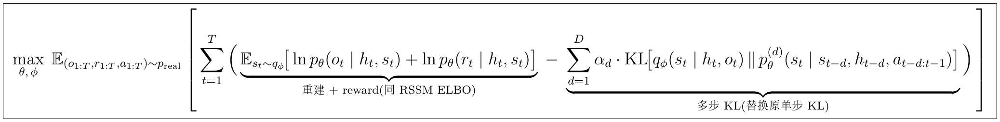</p>

#### 实验效果(详见 §🧪)

- 只用 1 步 KL(标准 ELBO)→ 短程预测可以,**长程严重漂移**
- 加入 $D = 50$ 步 overshooting → **长程预测显著稳定**

→ 这是 PlaNet **长程稳定性的关键**。但 **DreamerV1 简化为只用单步 KL + critic 估剩值,效果反而更好** —— 把"长程外推靠 model"这件事让位给"长程价值估计靠 critic",更符合 RL 的思路。这也是 PlaNet 之后的演化方向。


### 🚀 训练 PlaNet:Model Fitting + Data Collection 交替

> 前面几章把组件单独讲完了 —— §⚙️ 给了 ELBO、§🧬 给了 RSSM 双路 latent、§🔭 给了 latent overshooting。本章把它们**串成一个能跑的训练流程**:RSSM 怎么从随机初始化变成一个能预测环境的世界模型。

#### 1. 系统数据流(俯瞰图) ↔ 论文 Algorithm 1 对照

整个 PlaNet 系统由两个相互推动的循环组成 —— **训练**(真实环境 → Buffer → RSSM)和**部署**(RSSM → CEM → 真实环境)—— 通过一条 replay buffer 串起来。下面把**鸟瞰数据流**(左)和**论文 Algorithm 1**(右)摆在一起对照:

<table>
<tr>
<td valign="middle" width="55%">

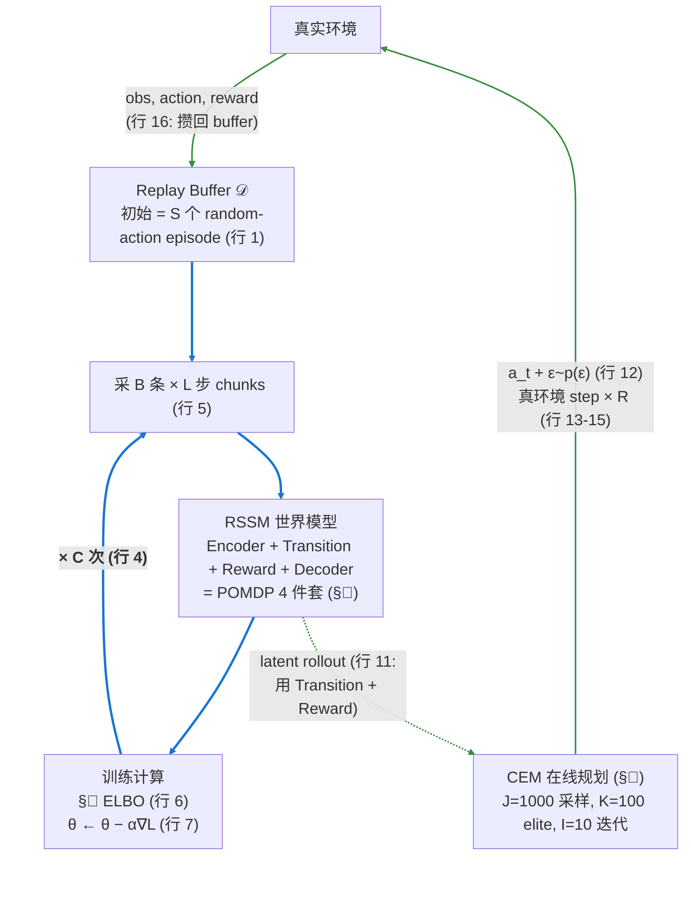

<p align="center"><i>↑ 系统鸟瞰图:每条边的注解都给出对应 Algorithm 1 的行号</i></p>

</td>
<td valign="middle" width="45%" align="center">


<p align="center"><i>↑ 论文 Algorithm 1: Deep Planning Network<br/>(左图边上的"行 X"对应这里的行号)</i></p>

</td>
</tr>
</table>

> 🎨 **蓝实线 = A · Model fitting**(论文 Algorithm 1 行 4-7,含 C 次迭代回边);**绿实线 = B · Data collection**(论文行 1, 11-16);**绿虚线 = 在 latent 空间 rollout,不接触真环境**。所有"行 X"对应右侧 Algorithm 1 的行号。

→ **本章详解左半圈**(训练:Replay Buffer 怎么训出 RSSM),**§🎯 详解右半圈**(部署:RSSM 怎么经 CEM 挑出 $a_t$)。

#### 2. 训练循环:Model Fitting + Data Collection 交替

PlaNet 训练**不是"一次性把数据集训完"** —— 数据本身就是 agent 跑出来的,所以它跟 RL 一样要 **训模型 ↔ 收集数据 交替**(详见上面 #### 1 右侧 Algorithm 1 的两个内层 for 循环):

**两个内层 loop 是交替的**,这跟"先收一大堆数据,再训模型"的 supervised 设定不同:

- **A 阶段(行 4-7)** 用当前 buffer 把模型再训 $C$ 步,loss 用 §🔭 给的 **Latent Overshooting ELBO**(论文行 6 的 "Equation 8") —— **模型变好**
- **B 阶段(行 8-16)** 用更好的模型 + CEM 跑一条新 episode —— **数据变好**(覆盖更"有意义"的状态);其中行 10 的 "infer belief from history" 实际是 §🧬 RSSM 双路:先 $h_t = f_\mathrm{GRU}(h_{t-1}, s_{t-1}, a_{t-1})$,再 $s_t \sim q_\phi(s_t \mid h_t, o_t)$
- 两个 loop 互为输入,模型和数据**共同迭代收敛**

关键超参(论文 DMC 默认值):

| 超参 | 含义 | 典型值 |
|---|---|---|
| $S$ | seed episodes(初始随机数据)| 5 |
| $C$ | 每轮模型更新次数 | 100 |
| $B$ | 训练 batch 大小 | 50 |
| $L$ | 训练 chunk 长度 | 50 |
| $R$ | action repeat(同一动作发几次) | 2 ~ 4(任务相关) |
| $\alpha$ | learning rate | $10^{-3}$ |

> 💡 跟 model-free RL 的对比:DQN / PPO 一边 collect data 一边 update policy,但**没有显式的 model**;PlaNet 同样 collect ↔ update 交替,只是更新的对象是**世界模型**而不是 policy,再由 CEM 在 model 里**临时规划出 policy**。


### 🎯 部署 PlaNet:Receding-Horizon MPC + CEM 在线规划

> PlaNet **从头到尾都没有 actor / policy 网络** —— 不管是训练期 §🚀 行 11 的 data collection,还是训练完之后的部署,每一个动作都靠 **CEM 在 latent 空间实时规划**得出。本章先讲 §1 这个 CEM 内核,再讲 §2 把它套进 receding-horizon MPC 循环里**部署**怎么用。这条"没有 policy 网络、一切靠规划"的路线是 PlaNet 跟 Dreamer 系列(actor-critic)最大的区别,也是 PlaNet 最大的工程包袱(详见 §1 单步计算量分析)。

#### 1. CEM 内核:plan_action 怎么挑动作

CEM(Cross-Entropy Method)= **在动作序列空间做"采样 → 选 elite → 更新分布"的迭代搜索**。PlaNet **不学 policy 网络**,每次需要决定一个动作(训练期 collect data、部署期实际控制)都**实时跑这个搜索**:

<p align="center"></p>

##### 🖼️ 直观看一眼:CEM 怎么收敛?

<p align="center">
  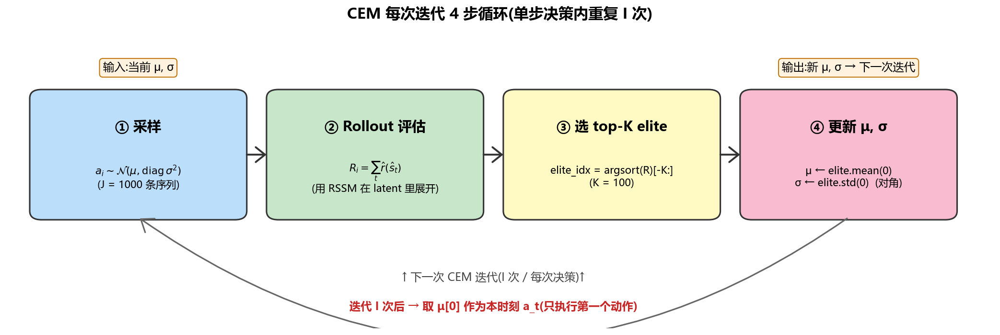<br/>
  <i>CEM 单次"决策"内重复 I 次的 4 步循环:① 从 $\mathcal{N}(\mu, \mathrm{diag}\,\sigma^2)$ 采 J 条候选动作序列 → ② 用 RSSM 在 latent 里 rollout,累积预测奖励 → ③ 选 top-K elite → ④ 用 elite 的元素级均值/方差更新分布。迭代 I 次后,把 μ 的第一个动作 $\mu[0]$ 作为本时刻的 $a_t$,下一时刻重新规划。</i>
</p>

<p align="center">
  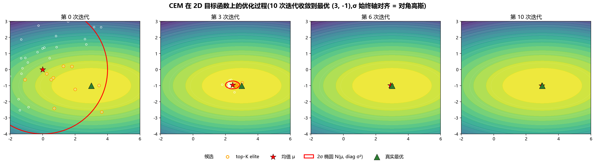<br/>
  <i>CEM 在 2D 目标函数 $f(x,y) = -((x-3)^2 + 5(y+1)^2)$ 上的优化过程。绿色三角是真实最优 (3, −1),红星是当前均值 μ,**红色椭圆是 $\mathcal{N}(\mu, \mathrm{diag}\,\sigma^2)$ 的 2σ 范围**(始终轴对齐 —— 这就是"对角高斯"的视觉特征),白点是 J 个候选,橙色圈是 top-K elite。10 次迭代收敛到最优。</i>
</p>

> 🆚 **对比 §🚀 World Models 的 CMA-ES**:同一个反馈搜索框架(采样 → 选 elite → 更新),但 **CMA-ES 学的是完整协方差矩阵 Σ**,椭圆可以**旋转**对齐目标函数的方向(看 [CMA-ES 演化图](#part-1cma-es-是什么--三句话原理)第 3、8 代红色椭圆已经倾斜);而 **CEM 只学每个维度独立的 σ**(对角高斯,椭圆始终轴对齐)。**CEM 更简单 / 更快**(没有 $\mathcal{O}(d^2)$ 协方差更新),但在强相关维度上效率不如 CMA-ES。PlaNet 选 CEM 不是因为它更好,而是因为**每个 time step 都要现场跑一次,必须便宜**(I=10 × J=1000 × H=12 = 12 万次 transition forward),CEM 的"对角假设 + 元素级更新"刚好把每次迭代压到最低成本。

##### 算法实现:plan_action

```python
def plan_action(world_model, current_state):
    # 维护一个动作序列分布:每步独立高斯
    μ = zeros(H, action_dim)        # H = 12 步规划 horizon
    σ = ones(H, action_dim)

    for iteration in range(I):       # I = 10 次 CEM 迭代
        # 1. 采样 J 个候选动作序列(J = 1000)
        action_seqs = sample_normal(μ, σ, J)

        # 2. 用世界模型 rollout 每个序列,累积奖励
        returns = []
        for seq in action_seqs:
            h, s = current_state
            R = 0
            for t in range(H):
                h, s = world_model.transition_step(h, s, seq[t])  # 用 prior, 不看 obs
                R += world_model.reward(h, s)
            returns.append(R)

        # 3. 选 top-K(K = 100)elite
        elite_idx = argsort(returns)[-K:]
        elite_seqs = action_seqs[elite_idx]

        # 4. 用 elite 的均值方差更新分布
        μ = elite_seqs.mean(axis=0)
        σ = elite_seqs.std(axis=0)

    return μ[0]   # 只执行第一个动作,下一步重新规划
```

**关键参数**:

| 参数 | 值 | 含义 |
|---|---|---|
| $H$(规划 horizon) | 12 | 想象 12 步未来 |
| $J$(候选序列数) | 1000 | 每代采 1000 个序列 |
| $K$(elite 数) | 100 | 选 top-100 |
| $I$(CEM 迭代次数) | 10 | 收敛迭代 10 次 |

**单步计算量**:$10 \times 1000 \times 12 = 12$ 万次 transition 前向 —— GPU 上几十毫秒可完成,但**真机机器人实时控制吃力**。这是 PlaNet 被 Dreamer 取代的核心原因之一(Dreamer 训 actor 网络,部署时一次 forward 就出 action,**省掉整个 CEM 规划循环**)。

<p align="center">
  <br/>
  <i>论文 Figure 4:CEM 在 latent 空间规划示意。从当前 state 出发,在 latent 里 rollout 多条 trajectory(各代候选动作序列),用 RSSM 预测累积奖励,选 elite 更新动作分布,迭代收敛 —— <b>全程不碰真实环境</b></i>
</p>

#### 2. 部署循环:Receding-Horizon MPC

把 §1 的 CEM 内核套进**真实控制循环**,部署时每个 time step 走三步,构成标准的 **receding-horizon MPC** 循环:

| 步骤 | 在做什么 | 用到哪个组件 |
|---|---|---|
| ① **Observe** | 把当前观测 $o_t$ 和历史一起送入 encoder,得到 belief $q_\phi(s_t \mid h_t, o_t)$ | Encoder + RSSM 的 $h_t$ |
| ② **Predict & Plan** | 从 belief 出发,**调用 §1 的 `plan_action`**(CEM 在 latent 里 rollout 1000 条候选 × 迭代 10 次),选累积 reward 最高的序列 | Transition + Reward(在 latent 里跑,**不接触真环境**) |
| ③ **Act** | 只执行最优序列的**第一个动作** $a_t$,然后回到 ① 重新规划 | — |

> ⚠️ **关键:每一步都重新规划**,不复用上一步的剩余序列 —— 这是 MPC 与开环控制的本质区别(因为执行 $a_t$ 后会拿到新观测 $o_{t+1}$,这条新信息会让规划得到更好的结果)。

**Action Repeat (R) trick**

实现中 PlaNet 把每个动作 $a_t$ **重复执行 $R$ 次**(DMC 上典型 $R = 2 \sim 4$):

- 把 $R$ 步的 reward 累加,作为该决策的 "effective reward"
- 把第 $R$ 步的观测作为下一时刻的 $o_{t+1}$

**作用**:把规划长度从原始 50 步**有效压缩 $R$ 倍**(压到 12 ~ 25 步),让 CEM 在计算上可行,同时保持物理时间分辨率。这是一个**论文不强调、但代码必有**的工程实践 —— 后续 Dreamer 系列也都沿用。

> 💡 **训练 vs 部署 ── 同一个 CEM 内核被复用两次**:训练期 §🚀 Algorithm 1 行 11 调 `plan_action` 收集新数据;部署期外层套一个 MPC observe-plan-act 循环,同样调 `plan_action`。区别只在外层 — 训练期最终把动作送回真环境后还要 `D ← D ∪ {…}` 攒回 buffer,部署期单纯一遍接一遍执行。


### 🧪 关键实验

#### 在 DeepMind Control Suite(像素输入)击败 model-free 50×

| Algorithm | 达到固定性能所需样本数 | 类型 |
|-----------|-----------------------|------|
| A3C | 50 M 帧 | model-free |
| D4PG | 100 M 帧 | model-free SOTA |
| **PlaNet** | **2 M 帧** | **model-based** ⭐ |

→ **样本效率提升 50× 量级**,首次让 model-based RL 在像素任务上**全面碾压 model-free**。

<p align="center">
  <br/>
  <i>论文 Table 1:PlaNet 用 <b>2000 episodes</b> 达到 D4PG <b>100,000 episodes</b> 的性能,各任务样本效率提升 11×~180×</i>
</p>

#### 关键消融

**RSSM 双路的必要性**:
- 只用 deterministic h(纯 RNN)→ 表达不了不确定性,中等性能
- 只用 stochastic s(纯 VAE-RNN)→ **训不动**,长期信息被噪声冲掉
- **h + s 双路** → **最好** ⭐

<p align="center">
  <br/>
  <i>论文 Figure 5:RSSM 消融实验。<b>蓝色 = PlaNet (h+s 双路)</b>,红色 = 纯 deterministic,绿色 = 纯 stochastic。在所有 6 个任务上,纯 RNN 和纯 VAE-RNN 都明显差于双路 RSSM</i>
</p>

**Latent overshooting 的作用**:
- 只用 1 步 KL → 短程预测可以,长程严重漂移
- 加入 D=50 步 overshooting → **长程预测显著稳定**

**世界模型 vs 真模拟器(质量上限对比)**:
- CEM + **真模拟器**(oracle,上限) → 最好
- CEM + **PlaNet 世界模型** → **仅略低于 oracle**

→ 这条对比是**对世界模型质量最直接的证据**:PlaNet 学到的 latent 动力学好到让"脑内规划"几乎等于"真环境规划"。如果世界模型差,这两条曲线会有数量级的差距。

**规划 horizon H 的影响**:
- H=1 → 退化成贪心,差
- **H=12 → 甜点** ⭐
- H=50 → 模型误差累积,反而变差

→ "**世界模型不能想太远**" 是 model-based RL 的永恒痛点。

### 🔧 实现细节深入

#### 细节 ①:四个子网络的角色

| 网络 | 形式 | 何时使用 |
|------|------|---------|
| **Encoder**(Posterior) | $q(s_t \mid h_t, o_t)$ | **训练时**:看到真实 obs,出后验 s |
| **Transition**(Prior) | $p(s_t \mid h_t)$ | **规划时 / 想象时**:不看 obs 也能预测 s ⭐ |
| **Reward** | $p(r_t \mid h_t, s_t)$ | 预测奖励(规划时累加 return) |
| **Decoder** | $p(o_t \mid h_t, s_t)$ | 重建 obs(**仅训练辅助**,部署不用) |

🔑 **核心机制**:**训练时用 Encoder 的后验 s(有 obs 监督),规划时用 Transition 的 prior s(没有 obs)** —— 这就是 RSSM 能"在 latent 空间想象未来"的关键。

#### 细节 ②:端到端 ELBO 损失

PlaNet 把 World Models 三阶段独立训练的 V 和 M **合并成一个目标**:

<p align="center"></p>

三个分量同时优化:
- **重建项**:让 decoder 能从 (h, s) 重建 obs(类似 VAE)
- **奖励项**:让 reward head 能预测真实奖励
- **KL 项**:让 posterior `q(s|h, o)` 接近 prior `p(s|h)`(VAE 风格正则)

→ 一个梯度同时优化 4 个子网络,**特征自动对决策有用**(不像 World Models 的 V 只学重建)。

#### CEM vs CMA-ES(World Models 用的)

| 维度 | CMA-ES (World Models) | CEM (PlaNet) |
|------|----------------------|--------------|
| 优化对象 | **Controller 的参数 $\theta$** | **动作序列 $a_{1:H}$** |
| 何时优化 | **训练时**,优化好之后部署 | **每步实时**(在线规划) |
| 协方差自适应 | 是($\Sigma$) | 否(每步独立高斯) |
| 是否需要 actor 网络 | 是(线性 controller) | **否!** |

### 💭 理解思考

#### 贡献与历史地位

✅ **贡献**

1. **RSSM 双路 latent** —— 现代 model-based RL 的标准架构,被 Dreamer V1/V2/V3 全部继承
2. **端到端 ELBO 训世界模型** —— 替代了 World Models 的分阶段,后续无数工作沿用
3. **Latent overshooting** —— 长程稳定性技巧
4. **DMC 上 50× 样本效率** —— 首次让 model-based 在视觉控制上完胜 model-free
5. **代码开源** —— 后续 Dreamer 系的基线

⚠️ **局限**(直接催生 Dreamer)

1. **CEM 在线规划巨慢** —— 每步 12 万次前向,真机机器人实时控制吃力
2. **没法学到隐式的长期策略** —— 规划只能想 12 步,长程任务表现差
3. **只能解连续控制** —— CEM 对离散动作处理不优雅
4. **仍有 model exploitation** —— 比 World Models 用 $\tau$ 防御更弱

🌳 **后续影响**

- **DreamerV1 (2020)**:CEM → actor-critic + 解析梯度反传,**推理快几十倍 + 性能更好**
- **DreamerV2 (2021)**:RSSM 的 z 改成离散 categorical,攻克 Atari
- **DreamerV3 (2023)**:同一架构 + symlog 归一化,150+ 任务通用
- **MuZero 系**:借鉴 RSSM 思路 + MCTS 搜索
- **TWM / IRIS / DIAMOND**:RSSM 的 transformer / diffusion 变体

#### 演化脉络

```
World Models (2018)
        │ 三阶段独立 / VAE + MDN-RNN / CMA-ES
        ▼
PlaNet (2019)           ← 我们在这里
        │ 端到端 / RSSM 双路 / CEM 在线规划
        ▼
Dreamer V1 (2020)
        │ 同 RSSM / Actor-Critic 替代 CEM / 解析梯度
        ▼
Dreamer V2/V3 (2021–2023)
        │ 离散 z / symlog / 通用 150+ 任务
```

#### 阅读建议

1. **先看项目页 demo**:<https://planetrl.github.io/>(2 分钟,体感)
2. **读论文 Section 3-4**(RSSM 架构 + ELBO 损失)
3. 跳过实现细节,直接跑官方代码 cartpole-swingup(半天)
4. 想深入再读 Section 5(latent overshooting)
5. **立刻跳到 DreamerV1**(自然演化)

#### 一句话总结

> **PlaNet = 端到端的 RSSM 世界模型 + CEM 在线规划。它把 World Models 的分阶段训练打通成端到端,引入了「确定性 h + 随机性 s」双路 latent 架构(被后续所有 Dreamer 沿用,只是 Dreamer 把 s 改名叫 z),在 DMC 上首次让 model-based RL 在像素任务上 50× 完胜 model-free。但 CEM 在线规划巨慢,直接催生了 DreamerV1 用 actor-critic + 解析梯度反传取代。**

### 📚 学习资源

**🎬 视频讲解**
- [**Yannic Kilcher — PlaNet paper review**](https://www.youtube.com/results?search_query=yannic+kilcher+planet) — 论文逐句过
- [**Hafner 在 Google AI Blog 的官方介绍**](https://blog.research.google/2019/02/introducing-planet-deep-planning.html)

**💻 代码与复现**
- [**google-research/planet**](https://github.com/google-research/planet) — 官方 TensorFlow 实现
- [**Kaixhin/PlaNet**](https://github.com/Kaixhin/PlaNet) ⭐ — PyTorch 复现,推荐学习用
- [**cross32768/PlaNet_PyTorch**](https://github.com/cross32768/PlaNet_PyTorch) — 另一个 PyTorch 版本

**📝 中文解读**
- 知乎搜索 "PlaNet 解读" / "Hafner RSSM"
- PaperWeekly 微信号搜 "PlaNet"

**📚 延伸阅读**
- 前传:[World Models (2018)](https://arxiv.org/abs/1803.10122) ← 必读前置
- 后续:[DreamerV1 (2020)](https://arxiv.org/abs/1912.01603) ← 必读
- DMC 环境:[dm_control](https://github.com/google-deepmind/dm_control)

</details>

<details>
<summary><b>4.3 Dreamer v1 / v2 / v3 (2020–2023)</b></summary>

> **论文**:[DreamerV1](https://arxiv.org/abs/1912.01603) · [DreamerV2](https://arxiv.org/abs/2010.02193) · [**DreamerV3**](https://arxiv.org/abs/2301.04104)
>
> **要点**:目前 RL 派最强基线。引入「在想象里训 actor-critic + 解析梯度反传」范式。**V3 一定要读** —— 同一组超参跑通 150+ 任务,Minecraft 钻石(从零)。

_📝 详细精读待补充_

</details>

<details>
<summary><b>4.4 GAIA-1 (Wayve, 2023)</b></summary>

> **论文**:[arxiv.org/abs/2309.17080](https://arxiv.org/abs/2309.17080) · **官方 blog**:<https://wayve.ai/thinking/scaling-gaia-1/>
>
> **要点**:自动驾驶 world model。Wayve 用 GAIA 生成驾驶视频,作为 corner case 增强数据。

_📝 详细精读待补充_

</details>

<details>
<summary><b>4.5 Genie / Genie 2 (DeepMind, 2024)</b></summary>

> **论文**:[Genie](https://arxiv.org/abs/2402.15391) · **Genie 2 blog**:<https://deepmind.google/discover/blog/genie-2-a-large-scale-foundation-world-model/>
>
> **要点**:可交互生成环境。从互联网视频学到 action-conditioned 世界,无需游戏引擎即可生成可交互世界。

_📝 详细精读待补充_

</details>

<details>
<summary><b>4.6 Sora 技术报告 (OpenAI, 2024)</b></summary>

> **技术报告**:<https://openai.com/index/video-generation-models-as-world-simulators/>
>
> **要点**:把视频生成视作 world simulator 的论述。把这个概念推成顶流,资本和媒体快速跟进。

_📝 详细精读待补充_

</details>

<details>
<summary><b>4.7 V-JEPA / V-JEPA 2 (Meta / LeCun)</b></summary>

> **论文**:[V-JEPA](https://arxiv.org/abs/2404.08471) · [V-JEPA 2 官方页](https://ai.meta.com/vjepa/) · [I-JEPA](https://arxiv.org/abs/2301.08243)
>
> **要点**:非生成式、predictive embedding 路线。LeCun 力推的「反 Sora」方案 —— 不预测像素,只预测抽象表征。

_📝 详细精读待补充_

</details>

<details>
<summary><b>4.8 其他值得关注</b></summary>

- [**1X World Model**](https://www.1x.tech/discover/1x-world-model)(人形机器人,1X Technologies)
- [**Oasis**](https://oasis-model.github.io/)(Decart,实时 Minecraft 生成)
- [**DIAMOND**](https://arxiv.org/abs/2405.12399)(NeurIPS 2024,[代码](https://github.com/eloialonso/diamond)) — Atari 视觉效果惊艳,代码干净,适合作为生成式 world model 的入门复现

</details>


---

## 五、参考资料汇总
<details>
<summary><b>5.1 动手实践</b></summary>

最小成本跑通:
```bash
# Dreamer v3 官方实现
pip install dreamerv3
# 或 clone: https://github.com/danijar/dreamerv3
```
- 先在 [`CartPole`](https://gymnasium.farama.org/environments/classic_control/cart_pole/) / [`Crafter`](https://github.com/danijar/crafter) 上跑通 Dreamer v3
- 再试 [`MineRL`](https://github.com/minerllabs/minerl) 或 [Atari 100k](https://github.com/google-research/rliable)
- 生成式方向可以玩 [**Genie 开源复现**](https://github.com/1x-technologies/1xgpt) 或 [**DIAMOND**](https://github.com/eloialonso/diamond)(Atari 视觉效果惊艳,代码干净)

</details>

<details>
<summary><b>5.2 理论基础补齐</b></summary>

- **变分推断 / VAE**(latent 建模)— [Kingma 原论文](https://arxiv.org/abs/1312.6114) · [Lil'Log 教程](https://lilianweng.github.io/posts/2018-08-12-vae/)
- **RNN / Transformer / SSM(Mamba)**(时序动力学)— [Mamba 论文](https://arxiv.org/abs/2312.00752)
- **Diffusion models**(生成派必备)— [DDPM](https://arxiv.org/abs/2006.11239) · [Lil'Log diffusion 综述](https://lilianweng.github.io/posts/2021-07-11-diffusion-models/)
- **Model-based RL 基础** — [Sutton & Barto《Reinforcement Learning》第 8 章(免费 PDF)](http://incompleteideas.net/book/RLbook2020.pdf)

</details>


<details>
<summary><b>5.3 核心读物</b></summary>

- [**A Path Towards Autonomous Machine Intelligence**](https://openreview.net/pdf?id=BZ5a1r-kVsf) — Yann LeCun 白皮书,JEPA 世界观
- [**Danijar Hafner 个人主页**](https://danijar.com/) — Dreamer 系列作者,代码、论文、讲座齐全
- [Meta AI Blog: V-JEPA](https://ai.meta.com/blog/v-jepa-yann-lecun-ai-model-video-joint-embedding-predictive-architecture/)

</details>

<details>
<summary><b>5.4 综述论文</b></summary>

- [*World Models for Autonomous Driving: A Survey*](https://arxiv.org/abs/2403.02622) (2024)
- [*A Survey of World Models for Autonomous Driving*](https://arxiv.org/abs/2501.11260) (2025)
- [*General World Models: A Survey*](https://arxiv.org/abs/2405.03520) (2024)

</details>

<details>
<summary><b>5.5 Blog & 资源汇总</b></summary>

- [**Lil'Log**](https://lilianweng.github.io/) — Lilian Weng,有 RL/世界模型相关综述
- [**The Gradient**](https://thegradient.pub/)
- [**Awesome-World-Model**](https://github.com/LMD0311/Awesome-World-Model) — GitHub 上持续更新的资源汇总

</details>

---

_最后更新:2026-05-03_
